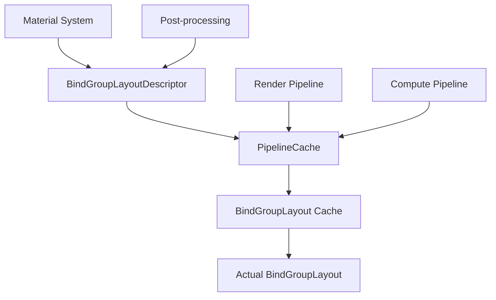

+++
title = "#21205 Add BindGroupLayout caching via descriptors"
date = "2025-10-17T00:00:00"
draft = false
template = "pull_request_page.html"
in_search_index = true

[taxonomies]
list_display = ["show"]

[extra]
current_language = "en"
available_languages = {"en" = { name = "English", url = "/pull_request/bevy/2025-10/pr-21205-en-20251017" }, "zh-cn" = { name = "中文", url = "/pull_request/bevy/2025-10/pr-21205-zh-cn-20251017" }}
labels = ["A-Rendering", "C-Code-Quality"]
+++

# Title

## Basic Information
- **Title**: Add BindGroupLayout caching via descriptors
- **PR Link**: https://github.com/bevyengine/bevy/pull/21205
- **Author**: Zeophlite
- **Status**: MERGED
- **Labels**: A-Rendering, C-Code-Quality, S-Ready-For-Review
- **Created**: 2025-09-25T06:32:20Z
- **Merged**: 2025-10-17T01:21:32Z
- **Merged By**: alice-i-cecile

## Description Translation
# Objective

- Defer creating `BindGroupLayout` by using a `BindGroupLayoutDescriptor` and cache the results
- Unblocks `bevy_material` (render-less material definitions)
- Blocked by https://github.com/bevyengine/bevy/pull/21533

## Solution

- Reviewers, look at first commit for mechanism, and following for usage

## Testing

- CI

## The Story of This Pull Request

This PR addresses a fundamental optimization in Bevy's rendering system by introducing a caching mechanism for BindGroupLayout creation. The core problem was that BindGroupLayouts were being created immediately and repeatedly throughout the codebase, leading to redundant GPU resource allocation and initialization overhead.

The solution centers around introducing a `BindGroupLayoutDescriptor` struct that encapsulates the information needed to create a BindGroupLayout, then deferring the actual creation until needed and caching the results. This approach transforms what was previously an immediate creation pattern into a lazy, cached pattern that significantly reduces redundant resource allocation.

The implementation required changes across nearly the entire rendering codebase, affecting 63 files in the crates directory. The key technical insight was that `BindGroupLayoutDescriptor` could serve as a lightweight, hashable representation of BindGroupLayout requirements, while the actual WGPU resource creation could be deferred and managed centrally through the existing `PipelineCache` system.

From an architectural perspective, this change introduces a clear separation between the description of resource requirements and their actual allocation. The `BindGroupLayoutDescriptor` contains only the label and entries, making it cheap to create and store compared to the actual GPU resource. The `PipelineCache` now maintains a dedicated cache for BindGroupLayouts, keyed by their descriptors, ensuring that identical layouts are only created once.

The impact of these changes is substantial. By eliminating redundant BindGroupLayout creation, the system reduces GPU memory usage and initialization overhead. More importantly, this change enables future work on render-less material definitions in `bevy_material` by providing a more flexible and cache-friendly way to manage binding layouts.

One of the key engineering decisions was to integrate the caching directly into the existing `PipelineCache` rather than creating a separate cache system. This leverages existing infrastructure and ensures that BindGroupLayout lifetimes are properly managed alongside pipelines. The implementation also maintains backward compatibility by preserving the same API surface for most use cases, with the main change being that bind group creation now requires access to the pipeline cache.

The changes demonstrate a clear pattern for optimizing GPU resource management in graphics engines: describe resources declaratively, defer creation until needed, and cache aggressively. This approach aligns with modern graphics API best practices and sets the foundation for more advanced material and rendering features in Bevy.

## Visual Representation



## Key Files Changed

### `crates/bevy_render/src/render_resource/pipeline_cache.rs` (+53/-2)
This file contains the core caching mechanism implementation. The key change is the addition of a `BindGroupLayoutCache` that stores BindGroupLayouts keyed by their descriptors.

```rust
// New cache structure
#[derive(Default)]
struct BindGroupLayoutCache {
    bgls: HashMap<BindGroupLayoutDescriptor, BindGroupLayout>,
}

// New method in PipelineCache
pub fn get_bind_group_layout(
    &self,
    bind_group_layout_descriptor: &BindGroupLayoutDescriptor,
) -> BindGroupLayout {
    self.bindgroup_layout_cache
        .lock()
        .unwrap()
        .get(&self.device, bind_group_layout_descriptor.clone())
}
```

### `crates/bevy_render/src/render_resource/pipeline.rs` 
Introduced the `BindGroupLayoutDescriptor` struct that replaces direct `BindGroupLayout` usage in pipeline descriptors:

```rust
// New descriptor type
#[derive(Clone, Debug, PartialEq, Eq, Hash, Default)]
pub struct BindGroupLayoutDescriptor {
    pub label: Option<Cow<'static, str>>,
    pub entries: Vec<BindGroupLayoutEntry>,
}

// Updated pipeline descriptors
pub struct RenderPipelineDescriptor {
    pub layout: Vec<BindGroupLayoutDescriptor>,
    // ...
}

pub struct ComputePipelineDescriptor {
    pub layout: Vec<BindGroupLayoutDescriptor>,
    // ...
}
```

### `crates/bevy_pbr/src/material.rs` (+85/-61)
Updated the material system to use descriptors and pipeline cache:

```rust
// Before: Immediate BindGroupLayout creation
let material_layout = M::bind_group_layout(render_device);

// After: Descriptor-based with caching
let material_layout = M::bind_group_layout_descriptor(render_device);
let actual_material_layout = pipeline_cache.get_bind_group_layout(&material_layout);
```

### `crates/bevy_pbr/src/render/mesh_bindings.rs` (+47/-35)
Updated mesh binding layouts to use descriptors:

```rust
// Before: Direct layout creation
pub fn model_only(&self, render_device: &RenderDevice, model: &BindingResource) -> BindGroup {
    render_device.create_bind_group(
        "model_only_mesh_bind_group",
        &self.model_only,
        &[entry::model(0, model.clone())],
    )
}

// After: Using pipeline cache
pub fn model_only(
    &self,
    render_device: &RenderDevice,
    pipeline_cache: &PipelineCache,
    model: &BindingResource,
) -> BindGroup {
    render_device.create_bind_group(
        "model_only_mesh_bind_group",
        &pipeline_cache.get_bind_group_layout(&self.model_only),
        &[entry::model(0, model.clone())],
    )
}
```

### `crates/bevy_anti_alias/src/smaa/mod.rs` (+54/-40)
Updated anti-aliasing system to use the new descriptor pattern:

```rust
// Before: Immediate layout creation
let postprocess_bind_group_layout = render_device.create_bind_group_layout(
    "SMAA postprocess bind group layout",
    &BindGroupLayoutEntries::sequential(/* ... */),
);

// After: Descriptor creation  
let postprocess_bind_group_layout = BindGroupLayoutDescriptor::new(
    "SMAA postprocess bind group layout",
    &BindGroupLayoutEntries::sequential(/* ... */),
);
```

## Further Reading

- [WebGPU Bind Group Layout Documentation](https://gpuweb.github.io/gpuweb/#gpubindgrouplayout)
- [Bevy Render Pipeline Documentation](https://docs.rs/bevy_render/latest/bevy_render/render_resource/struct.RenderPipeline.html)
- [GPU Resource Management Patterns](https://github.com/gfx-rs/wgpu/wiki/Resource-Management)
- [Descriptor-Based Resource Management in Modern Graphics APIs](https://alain.xyz/blog/descriptor-management)