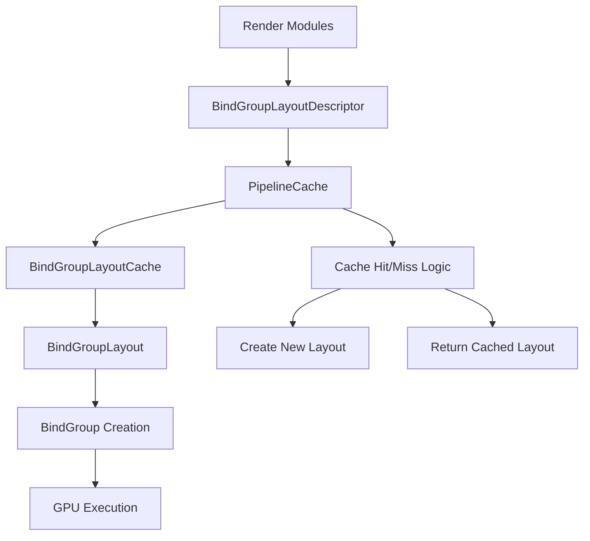

+++
title = "#21205 Add BindGroupLayout caching via descriptors"
date = "2025-10-17T00:00:00"
draft = false
template = "pull_request_page.html"
in_search_index = false

[extra]
current_language = "zh-cn"
available_languages = {"en" = { name = "English", url = "/pull_request/bevy/2025-10/pr-21205-en-20251017" }, "zh-cn" = { name = "中文", url = "/pull_request/bevy/2025-10/pr-21205-zh-cn-20251017" }}
labels = ["A-Rendering", "C-Code-Quality"]
+++

# Title

## Basic Information
- **Title**: Add BindGroupLayout caching via descriptors
- **PR Link**: https://github.com/bevyengine/bevy/pull/21205
- **Author**: Zeophlite
- **Status**: MERGED
- **Labels**: A-Rendering, C-Code-Quality, S-Ready-For-Final-Review
- **Created**: 2025-09-25T06:32:20Z
- **Merged**: 2025-10-17T01:21:32Z
- **Merged By**: alice-i-cecile

## Description Translation

# 目标

- 通过使用 `BindGroupLayoutDescriptor` 延迟创建 `BindGroupLayout` 并缓存结果
- 为 `bevy_material`（无渲染材质定义）解锁
- 被 https://github.com/bevyengine/bevy/pull/21533 阻塞

## 解决方案

- 审阅者，请查看第一个提交了解机制，后续提交了解用法

## 测试

- CI

## The Story of This Pull Request

### 问题和背景

在 Bevy 的渲染系统中，`BindGroupLayout` 是描述着色器资源绑定布局的关键对象。在之前的实现中，各个渲染模块直接创建 `BindGroupLayout` 对象，这导致了几个问题：

1. **重复创建**：相同的布局可能被多次创建，浪费 GPU 资源
2. **创建时机过早**：布局在初始化阶段就被创建，即使可能永远不会被使用
3. **缺乏缓存**：没有统一的机制来复用相同的布局

这些问题在大型项目中尤其明显，因为可能会有大量相似的材质和渲染管线，导致不必要的 `BindGroupLayout` 创建。

### 解决方案方法

开发者采用了描述符模式来解决这个问题。核心思路是：

1. **延迟创建**：将 `BindGroupLayout` 的实际创建推迟到真正需要时
2. **描述符抽象**：引入 `BindGroupLayoutDescriptor` 来描述布局需求，而不是直接创建布局对象
3. **集中缓存**：在 `PipelineCache` 中统一管理和缓存布局

这种方法的优势在于：
- 减少了重复的布局创建
- 按需创建，避免不必要的初始化开销
- 提供了统一的缓存机制

### 实现细节

实现的核心是在 `PipelineCache` 中添加了 `BindGroupLayoutCache`：

```rust
#[derive(Default)]
struct BindGroupLayoutCache {
    bgls: HashMap<BindGroupLayoutDescriptor, BindGroupLayout>,
}

impl BindGroupLayoutCache {
    fn get(
        &mut self,
        render_device: &RenderDevice,
        descriptor: BindGroupLayoutDescriptor,
    ) -> BindGroupLayout {
        self.bgls
            .entry(descriptor)
            .or_insert_with_key(|descriptor| {
                render_device.create_bind_group_layout(
                    descriptor.label.as_ref().map(Cow::as_ref),
                    &descriptor.entries,
                )
            })
            .clone()
    }
}
```

这个缓存使用 `BindGroupLayoutDescriptor` 作为键，确保相同的描述符只会创建一个实际的 `BindGroupLayout`。

在整个代码库中，原来的 `BindGroupLayout` 类型被替换为 `BindGroupLayoutDescriptor`：

```rust
// 修改前
pub struct CasPipeline {
    texture_bind_group: BindGroupLayout,
    // ...
}

// 修改后  
pub struct CasPipeline {
    texture_bind_group: BindGroupLayoutDescriptor,
    // ...
}
```

在需要实际使用布局的地方，通过 `PipelineCache` 获取：

```rust
let bind_group = render_device.create_bind_group(
    "cas_bind_group",
    &pipeline_cache.get_bind_group_layout(&sharpening_pipeline.texture_bind_group),
    &BindGroupEntries::sequential((
        view_target.source,
        &sharpening_pipeline.sampler,
    )),
);
```

### 技术洞察

这个实现展示了几个重要的软件工程原则：

1. **缓存模式**：通过描述符哈希来识别和复用相同的资源
2. **延迟初始化**：只在真正需要时才创建昂贵的 GPU 资源
3. **关注点分离**：将布局描述（什么）和实际创建（如何）分离

性能考虑：
- 减少了 GPU 内存使用
- 降低了驱动开销
- 提高了大型应用的启动速度

架构影响：
- 统一了布局创建路径
- 为未来的优化（如布局合并）奠定了基础

### 影响

这个改动带来了显著的改进：

1. **性能提升**：减少了重复的 `BindGroupLayout` 创建
2. **内存优化**：相同的布局现在会被复用
3. **代码质量**：提供了更清晰的抽象层次

更重要的是，这个改动为 `bevy_material` 的无渲染材质定义铺平了道路，这是实现更灵活材质系统的关键一步。

技术教训：
- 对于昂贵的 GPU 资源，应该采用描述符+缓存的模式
- 延迟创建可以显著改善应用启动性能
- 统一的资源管理机制比分散的创建更易于优化

## Visual Representation



## Key Files Changed

### `crates/bevy_render/src/render_resource/pipeline_cache.rs` (+53/-2)

这是核心改动所在，添加了 `BindGroupLayout` 缓存机制：

```rust
// 新增的缓存结构
#[derive(Default)]
struct BindGroupLayoutCache {
    bgls: HashMap<BindGroupLayoutDescriptor, BindGroupLayout>,
}

// 新增的公共接口
impl PipelineCache {
    pub fn get_bind_group_layout(
        &self,
        bind_group_layout_descriptor: &BindGroupLayoutDescriptor,
    ) -> BindGroupLayout {
        self.bindgroup_layout_cache
            .lock()
            .unwrap()
            .get(&self.device, bind_group_layout_descriptor.clone())
    }
}
```

### `crates/bevy_render/src/render_resource/pipeline.rs` (+17/-0)

定义了 `BindGroupLayoutDescriptor` 结构：

```rust
#[derive(Clone, Debug, PartialEq, Eq, Hash, Default)]
pub struct BindGroupLayoutDescriptor {
    pub label: Option<Cow<'static, str>>,
    pub entries: Vec<BindGroupLayoutEntry>,
}

impl BindGroupLayoutDescriptor {
    pub fn new(label: impl Into<Cow<'static, str>>, entries: &[BindGroupLayoutEntry]) -> Self {
        Self {
            label: Some(label.into()),
            entries: entries.into(),
        }
    }
}
```

### `crates/bevy_pbr/src/meshlet/resource_manager.rs` (+91/-82)

展示了从直接使用 `BindGroupLayout` 到使用描述符的转换：

```rust
// 修改前
pub clear_visibility_buffer_bind_group_layout: BindGroupLayout,

// 修改后
pub clear_visibility_buffer_bind_group_layout: BindGroupLayoutDescriptor,

// 创建方式修改
// 修改前
let layout = render_device.create_bind_group_layout("name", &entries);

// 修改后  
let layout = BindGroupLayoutDescriptor::new("name", &entries);
```

### `crates/bevy_pbr/src/render/gpu_preprocess.rs` (+85/-61)

展示了在使用时如何通过缓存获取实际布局：

```rust
// 修改前
let bind_group = render_device.create_bind_group(
    "name",
    &pipeline.bind_group_layout,
    &entries,
);

// 修改后
let bind_group = render_device.create_bind_group(
    "name",
    &pipeline_cache.get_bind_group_layout(&pipeline.bind_group_layout),
    &entries,
);
```

### `crates/bevy_pbr/src/render/mesh_bindings.rs` (+47/-35)

材质系统中的布局管理：

```rust
// 布局定义从 BindGroupLayout 改为 BindGroupLayoutDescriptor
pub struct MeshLayouts {
    pub model_only: BindGroupLayoutDescriptor,
    pub lightmapped: BindGroupLayoutDescriptor,
    // ...
}

// 使用时的修改
pub fn model_only(
    &self,
    render_device: &RenderDevice,
    pipeline_cache: &PipelineCache,
    model: &BindingResource,
) -> BindGroup {
    render_device.create_bind_group(
        "model_only_mesh_bind_group",
        &pipeline_cache.get_bind_group_layout(&self.model_only),
        &[entry::model(0, model.clone())],
    )
}
```

## Further Reading

- [WebGPU Bind Group Layouts](https://gpuweb.github.io/gpuweb/#bind-group-layouts) - WebGPU 标准的绑定组布局规范
- [Descriptor Pattern](https://en.wikipedia.org/wiki/Descriptor_pattern) - 描述符模式的设计模式说明
- [Resource Caching in Graphics](https://developer.nvidia.com/blog/introduction-cuda-cache/) - NVIDIA 关于 GPU 资源缓存的介绍
- [Bevy Material System](https://bevyengine.org/learn/book/next/materials/) - Bevy 材质系统文档