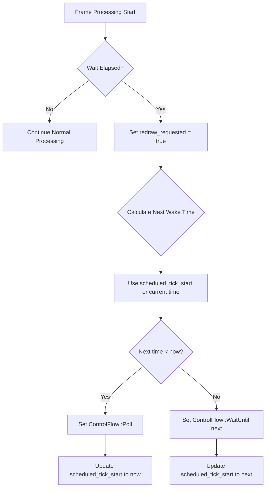

+++
title = "#21295 fix updatemode::reactive"
date = "2025-10-01T00:00:00"
draft = false
template = "pull_request_page.html"
in_search_index = true

[taxonomies]
list_display = ["show"]

[extra]
current_language = "en"
available_languages = {"en" = { name = "English", url = "/pull_request/bevy/2025-10/pr-21295-en-20251001" }, "zh-cn" = { name = "中文", url = "/pull_request/bevy/2025-10/pr-21295-zh-cn-20251001" }}
labels = ["C-Bug", "A-Windowing", "D-Modest"]
+++

# Title
fix updatemode::reactive

## Basic Information
- **Title**: fix updatemode::reactive
- **PR Link**: https://github.com/bevyengine/bevy/pull/21295
- **Author**: robtfm
- **Status**: MERGED
- **Labels**: C-Bug, A-Windowing, S-Ready-For-Final-Review, D-Modest
- **Created**: 2025-09-30T12:51:08Z
- **Merged**: 2025-10-01T19:54:59Z
- **Merged By**: alice-i-cecile

## Description Translation

# Objective

`WinitSettings::update_mode` setting `UpdateMode::Reactive` is documented as setting the time "from the start of one update to the next". currently it sets the winit wake time to the wait time after the start of the current tick, which shifts each frame by whatever additional latency exists before the frame is triggered. 
also, redraws only seem to trigger every 2 wakeups.

in wasm this is the only way to cap framerates below default refresh-rate (on native we can just sleep), but this issue manifests on both native and wasm.

## Solution

solve 1 by recording scheduled start time and setting the next wakeup as scheduled + wait time.
solve 2 by setting redraw_requested explicitly when wait time elapses

## Testing

```rs
const FPS: u32 = 10;

#[wasm_bindgen]
pub fn engine_run() {
    #[cfg(target_arch="wasm32")]
    let _ = console_log::init_with_level(log::Level::Info);
    App::new()
        .insert_resource(WinitSettings {
            focused_mode: UpdateMode::Reactive {
                wait: Duration::from_micros((1.0 / (FPS as f32) * 1000000.0) as u64),
                react_to_device_events: false,
                react_to_user_events: false,
                react_to_window_events: false,
            },
            unfocused_mode: UpdateMode::Reactive {
                wait: Duration::from_micros((1.0 / (FPS as f32) * 1000000.0) as u64),
                react_to_device_events: false,
                react_to_user_events: false,
                react_to_window_events: false,
            },
            ..Default::default()
        })
        .add_plugins(DefaultPlugins)
        .add_plugins(FrameTimeDiagnosticsPlugin::default())
        .add_plugins(LogDiagnosticsPlugin::default())
        .run();
}
```

## The Story of This Pull Request

The PR addresses a fundamental timing issue in Bevy's `UpdateMode::Reactive` implementation. The core problem was that the reactive update mode, designed to maintain consistent frame timing, was accumulating latency drift due to an incorrect timing calculation approach.

The original implementation calculated the next wake time by taking the current frame's start time and adding the wait duration. This approach created a cascading latency effect where any delay in frame processing would shift all subsequent frames. In practice, this meant that setting a target frame rate of 10 FPS could result in actual frame rates significantly lower than intended, as each frame's start time drifted further from the ideal schedule.

Additionally, there was a secondary issue where redraws would only occur every second wakeup, effectively halving the frame rate in some scenarios. This was particularly problematic for WebAssembly targets where reactive mode is the primary method for frame rate limiting below the browser's default refresh rate.

The solution implements a more sophisticated timing mechanism that tracks the scheduled start time for each frame rather than relying on the actual start time of the previous frame. By maintaining a `scheduled_tick_start` field, the system can calculate the next wake time as `scheduled + wait` instead of `actual_start + wait`, preventing latency accumulation.

The implementation also explicitly sets `redraw_requested = true` when the wait time elapses, ensuring consistent frame rendering on every scheduled interval rather than every other wakeup. This change directly addresses the frame skipping behavior observed in the original implementation.

For edge cases where the system falls behind schedule, the code includes logic to handle missed frames by switching to `ControlFlow::Poll` mode until the system catches up, then resuming the scheduled timing.

## Visual Representation



## Key Files Changed

### `crates/bevy_winit/src/state.rs` (+21/-5)

This file contains the core implementation changes for fixing the reactive update mode timing.

**Key Changes:**

1. **Added scheduled_tick_start field** to track ideal frame timing:
```rust
/// time at which next tick is scheduled to run when `update_mode` is [`UpdateMode::Reactive`]
scheduled_tick_start: Option<Instant>,
```

2. **Enhanced reactive mode timing logic** to use scheduled timing:
```rust
UpdateMode::Reactive { wait, .. } => {
    // Set the next timeout, starting from the instant we were scheduled to begin
    if self.wait_elapsed {
        self.redraw_requested = true;

        let begin_instant = self.scheduled_tick_start.unwrap_or(begin_frame_time);
        if let Some(next) = begin_instant.checked_add(wait) {
            let now = Instant::now();
            if next < now {
                // request next redraw as soon as possible if we are already past the next scheduled frame start time
                event_loop.set_control_flow(ControlFlow::Poll);
                self.scheduled_tick_start = Some(now);
            } else {
                event_loop.set_control_flow(ControlFlow::WaitUntil(next));
                self.scheduled_tick_start = Some(next);
            }
        }
    }
}
```

3. **Reset scheduling on mode changes** to maintain consistency:
```rust
// reset the scheduled start time
self.scheduled_tick_start = None;
```

## Further Reading

- [Bevy Winit Integration Documentation](https://docs.rs/bevy_winit/latest/bevy_winit/) - Details on how Bevy integrates with the winit windowing library
- [winit ControlFlow Documentation](https://docs.rs/winit/latest/winit/event_loop/enum.ControlFlow.html) - Explanation of different control flow modes
- [Frame Rate Limiting Techniques](https://gafferongames.com/post/fix_your_timestep/) - Classic article on game loop timing and frame rate control
- [WebAssembly Timing Considerations](https://developer.mozilla.org/en-US/docs/Web/API/Window/requestAnimationFrame) - Browser animation timing APIs relevant to WebAssembly targets

# Full Code Diff
```diff
diff --git a/crates/bevy_winit/src/state.rs b/crates/bevy_winit/src/state.rs
index 0eef31fb96640..e0981eff792b3 100644
--- a/crates/bevy_winit/src/state.rs
+++ b/crates/bevy_winit/src/state.rs
@@ -94,6 +94,8 @@ pub(crate) struct WinitAppRunnerState<T: Message> {
             ),
         >,
     )>,
+    /// time at which next tick is scheduled to run when `update_mode` is [`UpdateMode::Reactive`]
+    scheduled_tick_start: Option<Instant>,
 }
 
 impl<M: Message> WinitAppRunnerState<M> {
@@ -125,6 +127,7 @@ impl<M: Message> WinitAppRunnerState<M> {
             raw_winit_events: Vec::new(),
             _marker: PhantomData,
             message_writer_system_state,
+            scheduled_tick_start: None,
         }
     }
 
@@ -650,6 +653,8 @@ impl<M: Message> WinitAppRunnerState<M> {
             self.redraw_requested = true;
             // Consider the wait as elapsed since it could have been cancelled by a user event
             self.wait_elapsed = true;
+            // reset the scheduled start time
+            self.scheduled_tick_start = None;
 
             self.update_mode = update_mode;
         }
@@ -690,11 +695,22 @@ impl<M: Message> WinitAppRunnerState<M> {
                 }
             }
             UpdateMode::Reactive { wait, .. } => {
-                // Set the next timeout, starting from the instant before running app.update() to avoid frame delays
-                if let Some(next) = begin_frame_time.checked_add(wait)
-                    && self.wait_elapsed
-                {
-                    event_loop.set_control_flow(ControlFlow::WaitUntil(next));
+                // Set the next timeout, starting from the instant we were scheduled to begin
+                if self.wait_elapsed {
+                    self.redraw_requested = true;
+
+                    let begin_instant = self.scheduled_tick_start.unwrap_or(begin_frame_time);
+                    if let Some(next) = begin_instant.checked_add(wait) {
+                        let now = Instant::now();
+                        if next < now {
+                            // request next redraw as soon as possible if we are already past the next scheduled frame start time
+                            event_loop.set_control_flow(ControlFlow::Poll);
+                            self.scheduled_tick_start = Some(now);
+                        } else {
+                            event_loop.set_control_flow(ControlFlow::WaitUntil(next));
+                            self.scheduled_tick_start = Some(next);
+                        }
+                    }
                 }
             }
         }
```