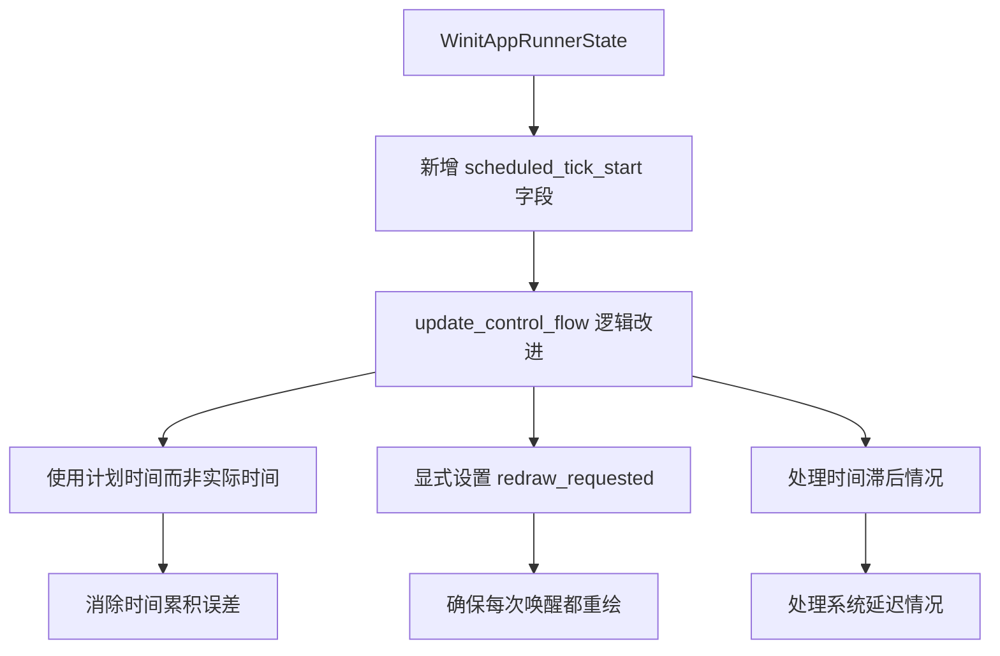

+++
title = "#21295 fix updatemode::reactive"
date = "2025-10-01T00:00:00"
draft = false
template = "pull_request_page.html"
in_search_index = false

[extra]
current_language = "zh-cn"
available_languages = {"en" = { name = "English", url = "/pull_request/bevy/2025-10/pr-21295-en-20251001" }, "zh-cn" = { name = "中文", url = "/pull_request/bevy/2025-10/pr-21295-zh-cn-20251001" }}
labels = ["C-Bug", "A-Windowing", "D-Modest"]
+++

# Title

## Basic Information
- **Title**: fix updatemode::reactive
- **PR Link**: https://github.com/bevyengine/bevy/pull/21295
- **Author**: robtfm
- **Status**: MERGED
- **Labels**: C-Bug, A-Windowing, S-Ready-For-Final-Review, D-Modest
- **Created**: 2025-09-30T12:51:08Z
- **Merged**: 2025-10-01T19:54:59Z
- **Merged By**: alice-i-cecile

## Description Translation
**目标**

`WinitSettings::update_mode` 设置 `UpdateMode::Reactive` 的文档说明是将时间设置为"从一次更新的开始到下一次更新的开始"。当前实现将 winit 唤醒时间设置为当前 tick 开始后的等待时间，这会导致每一帧都因为帧触发前的额外延迟而产生偏移。
此外，重绘似乎每 2 次唤醒才触发一次。

在 wasm 中，这是唯一能够将帧率限制在默认刷新率以下的方法（在原生平台上我们可以直接使用 sleep），但这个问题在原生和 wasm 平台上都会出现。

**解决方案**

通过记录计划开始时间并将下一次唤醒时间设置为计划开始时间 + 等待时间来解决第一个问题。
通过等待时间过去时显式设置 redraw_requested 来解决第二个问题。

**测试**

```rs
const FPS: u32 = 10;

#[wasm_bindgen]
pub fn engine_run() {
    #[cfg(target_arch="wasm32")]
    let _ = console_log::init_with_level(log::Level::Info);
    App::new()
        .insert_resource(WinitSettings {
            focused_mode: UpdateMode::Reactive {
                wait: Duration::from_micros((1.0 / (FPS as f32) * 1000000.0) as u64),
                react_to_device_events: false,
                react_to_user_events: false,
                react_to_window_events: false,
            },
            unfocused_mode: UpdateMode::Reactive {
                wait: Duration::from_micros((1.0 / (FPS as f32) * 1000000.0) as u64),
                react_to_device_events: false,
                react_to_user_events: false,
                react_to_window_events: false,
            },
            ..Default::default()
        })
        .add_plugins(DefaultPlugins)
        .add_plugins(FrameTimeDiagnosticsPlugin::default())
        .add_plugins(LogDiagnosticsPlugin::default())
        .run();
}
```

## The Story of This Pull Request

这个 PR 修复了 Bevy 引擎中 `UpdateMode::Reactive` 模式的两个核心问题。问题的本质在于帧率控制的实现逻辑存在偏差，导致实际帧率与预期不符，特别是在 WebAssembly (WASM) 环境中，这个问题尤为关键。

**问题分析**

第一个问题是时间累积误差。当前的 `Reactive` 模式实现将下一次唤醒时间设置为当前帧开始时间加上等待间隔，这在理论上应该产生稳定的帧率。但实际上，由于帧处理本身需要时间，如果设置 60FPS（每帧约 16.67ms），但帧处理耗时 2ms，那么实际的时间间隔就变成了 18.67ms，导致帧率下降到约 53FPS。这种误差会不断累积，造成帧率不稳定。

第二个问题是重绘触发机制。在某些情况下，重绘请求每两次唤醒才触发一次，这意味着即使应用已经准备好渲染，系统也可能跳过一帧，进一步加剧了帧率不准确的问题。

**解决方案实现**

PR 作者采用了两个关键的技术改进来解决这些问题。

首先，在 `WinitAppRunnerState` 结构中新增了 `scheduled_tick_start` 字段来跟踪计划的帧开始时间：

```rust
/// time at which next tick is scheduled to run when `update_mode` is [`UpdateMode::Reactive`]
scheduled_tick_start: Option<Instant>,
```

这个字段在状态初始化时设置为 `None`，在模式切换时重置为 `None`，确保时间基准的正确性。

核心的改进在 `update_control_flow` 方法中。原来的实现很简单：

```rust
// 之前的实现
if let Some(next) = begin_frame_time.checked_add(wait)
    && self.wait_elapsed
{
    event_loop.set_control_flow(ControlFlow::WaitUntil(next));
}
```

新的实现更加精确和健壮：

```rust
// 新的实现
if self.wait_elapsed {
    self.redraw_requested = true;

    let begin_instant = self.scheduled_tick_start.unwrap_or(begin_frame_time);
    if let Some(next) = begin_instant.checked_add(wait) {
        let now = Instant::now();
        if next < now {
            // 如果已经超过计划的下一个帧开始时间，立即请求重绘
            event_loop.set_control_flow(ControlFlow::Poll);
            self.scheduled_tick_start = Some(now);
        } else {
            event_loop.set_control_flow(ControlFlow::WaitUntil(next));
            self.scheduled_tick_start = Some(next);
        }
    }
}
```

这个改进有几个关键点：

1. **使用计划时间而非实际时间**：不再使用当前帧的实际开始时间，而是使用计划的开始时间来计算下一次唤醒，避免了时间累积误差。

2. **显式设置重绘请求**：当等待时间过去时，强制设置 `redraw_requested = true`，确保每次等待周期结束后都会触发重绘。

3. **处理时间滞后**：如果系统已经超过了计划的下一帧开始时间，立即切换到 `Poll` 模式请求尽快重绘，并将当前时间作为新的基准。

**技术考虑**

这个解决方案特别考虑了 WASM 环境的限制。在原生平台上，可以通过线程 sleep 来精确控制帧率，但在 WASM 中，`setTimeout` 是唯一可用的节流机制。因此，在 WASM 环境中，精确的帧率控制更加重要，而这个修复确保了 `Reactive` 模式在不同平台上的一致性。

**影响评估**

这个修复对于需要精确控制帧率的应用非常重要，特别是在以下场景：
- 游戏需要稳定的 30FPS 或 60FPS 渲染
- 需要节流性能的省电模式
- 需要帧率一致性的基准测试

通过消除时间累积误差和确保每次等待周期都触发重绘，这个 PR 显著提高了 `UpdateMode::Reactive` 模式的可靠性和准确性。

## Visual Representation



## Key Files Changed

**crates/bevy_winit/src/state.rs** (+21/-5)

这个文件包含了所有的核心修改：

1. **新增状态字段**：
```rust
// 新增字段：记录 Reactive 模式下下一个 tick 的计划开始时间
scheduled_tick_start: Option<Instant>,
```

2. **初始化字段**：
```rust
// 在构造函数中初始化
message_writer_system_state,
scheduled_tick_start: None,  // 新增
```

3. **模式切换时重置**：
```rust
// 当 update_mode 改变时重置计划时间
self.scheduled_tick_start = None;
```

4. **核心算法改进**：
```rust
// 原来的简单实现被替换为更精确的逻辑
UpdateMode::Reactive { wait, .. } => {
    if self.wait_elapsed {
        self.redraw_requested = true;  // 确保重绘触发

        let begin_instant = self.scheduled_tick_start.unwrap_or(begin_frame_time);
        if let Some(next) = begin_instant.checked_add(wait) {
            let now = Instant::now();
            if next < now {
                // 处理延迟情况
                event_loop.set_control_flow(ControlFlow::Poll);
                self.scheduled_tick_start = Some(now);
            } else {
                // 正常情况下的精确调度
                event_loop.set_control_flow(ControlFlow::WaitUntil(next));
                self.scheduled_tick_start = Some(next);
            }
        }
    }
}
```

这些修改共同解决了帧率控制的准确性和重绘触发可靠性问题。

## Further Reading

- [Bevy 引擎官方文档](https://bevyengine.org/learn/)
- [Winit 事件循环控制流文档](https://docs.rs/winit/latest/winit/event_loop/enum.ControlFlow.html)
- [WebAssembly 定时器机制](https://developer.mozilla.org/en-US/docs/Web/API/setTimeout)
- [游戏引擎帧率控制模式](https://gameprogrammingpatterns.com/game-loop.html)

# Full Code Diff
diff --git a/crates/bevy_winit/src/state.rs b/crates/bevy_winit/src/state.rs
index 0eef31fb96640..e0981eff792b3 100644
--- a/crates/bevy_winit/src/state.rs
+++ b/crates/bevy_winit/src/state.rs
@@ -94,6 +94,8 @@ pub(crate) struct WinitAppRunnerState<T: Message> {
             ),
         >,
     )>,
+    /// time at which next tick is scheduled to run when `update_mode` is [`UpdateMode::Reactive`]
+    scheduled_tick_start: Option<Instant>,
 }
 
 impl<M: Message> WinitAppRunnerState<M> {
@@ -125,6 +127,7 @@ impl<M: Message> WinitAppRunnerState<M> {
             raw_winit_events: Vec::new(),
             _marker: PhantomData,
             message_writer_system_state,
+            scheduled_tick_start: None,
         }
     }
 
@@ -650,6 +653,8 @@ impl<M: Message> WinitAppRunnerState<M> {
             self.redraw_requested = true;
             // Consider the wait as elapsed since it could have been cancelled by a user event
             self.wait_elapsed = true;
+            // reset the scheduled start time
+            self.scheduled_tick_start = None;
 
             self.update_mode = update_mode;
         }
@@ -690,11 +695,22 @@ impl<M: Message> WinitAppRunnerState<M> {
                 }
             }
             UpdateMode::Reactive { wait, .. } => {
-                // Set the next timeout, starting from the instant before running app.update() to avoid frame delays
-                if let Some(next) = begin_frame_time.checked_add(wait)
-                    && self.wait_elapsed
-                {
-                    event_loop.set_control_flow(ControlFlow::WaitUntil(next));
+                // Set the next timeout, starting from the instant we were scheduled to begin
+                if self.wait_elapsed {
+                    self.redraw_requested = true;
+
+                    let begin_instant = self.scheduled_tick_start.unwrap_or(begin_frame_time);
+                    if let Some(next) = begin_instant.checked_add(wait) {
+                        let now = Instant::now();
+                        if next < now {
+                            // request next redraw as soon as possible if we are already past the next scheduled frame start time
+                            event_loop.set_control_flow(ControlFlow::Poll);
+                            self.scheduled_tick_start = Some(now);
+                        } else {
+                            event_loop.set_control_flow(ControlFlow::WaitUntil(next));
+                            self.scheduled_tick_start = Some(next);
+                        }
+                    }
                 }
             }
         }