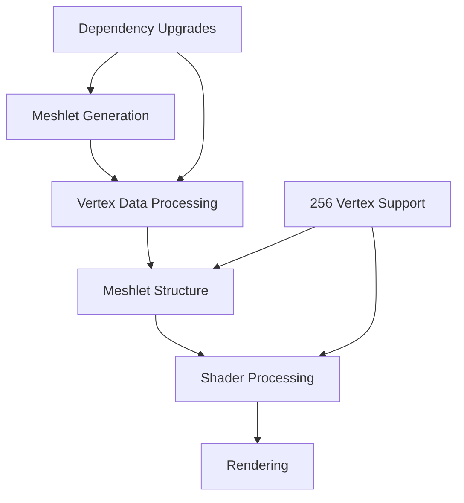

+++
title = "#21301 Virtual geometry: Upgrade deps, allow 256 vertices"
date = "2025-10-27T00:00:00"
draft = false
template = "pull_request_page.html"
in_search_index = true

[taxonomies]
list_display = ["show"]

[extra]
current_language = "en"
available_languages = {"en" = { name = "English", url = "/pull_request/bevy/2025-10/pr-21301-en-20251027" }, "zh-cn" = { name = "中文", url = "/pull_request/bevy/2025-10/pr-21301-zh-cn-20251027" }}
labels = ["A-Rendering", "C-Usability"]
+++

# Virtual geometry: Upgrade deps, allow 256 vertices

## Basic Information
- **Title**: Virtual geometry: Upgrade deps, allow 256 vertices
- **PR Link**: https://github.com/bevyengine/bevy/pull/21301
- **Author**: JMS55
- **Status**: MERGED
- **Labels**: A-Rendering, C-Usability
- **Created**: 2025-09-30T19:04:56Z
- **Merged**: 2025-10-27T05:09:18Z
- **Merged By**: alice-i-cecile

## Description Translation
Some small work on virtual geometry.

Some other improvements we should do in the future for the builder code:

* meshopt_computeSphereBounds instead of merge_spheres
* Permissive simplification
* Faster vertex locking, copying https://github.com/zeux/meshoptimizer/pull/961
* Try out meshopt's clusterizer/partitioner instead of using metis

## The Story of This Pull Request

This PR addresses two main technical improvements to Bevy's virtual geometry system: dependency upgrades and increasing the maximum vertex count per meshlet from 255 to 256.

The core problem was that meshlets were limited to 255 vertices due to using a `u8` field for vertex count storage. This limitation was artificial and prevented more efficient meshlet packing. Additionally, the mesh optimization dependencies were outdated, missing performance improvements and API updates.

The solution involved carefully modifying the data structures and algorithms to support 256 vertices while maintaining backward compatibility through asset versioning. The key insight was storing `vertex_count - 1` in the `u8` field, allowing representation of 1-256 vertices (0-255 in the field). This required coordinated changes across Rust code, shader code, and dependency versions.

In the implementation, the meshlet structure was modified to store `vertex_count_minus_one` instead of `vertex_count`:

```rust
// Before:
pub vertex_count: u8,

// After:  
pub vertex_count_minus_one: u8,
```

This change propagated through the entire pipeline. The meshlet generation code was updated to use the new 256-vertex limit:

```rust
// Changed from 255 to 256
let meshlet = build_meshlets(meshlet_indices, vertices, 256, 128, 0.0);
```

The shader code required corresponding adjustments to reconstruct the actual vertex count:

```wgsl
// Before:
return extractBits((*meshlet).packed_a, 0u, 8u);

// After:
return extractBits((*meshlet).packed_a, 0u, 8u) + 1u;
```

Dependency upgrades were straightforward but important for performance and maintenance:

```toml
# Before:
meshopt = { version = "0.4.1", optional = true }
metis = { version = "0.2", optional = true }

# After:
meshopt = { version = "0.6.2", optional = true }
metis = { version = "0.2.2", optional = true }
```

The API changes in meshopt 0.6.2 allowed simplification of vertex remapping code. The old approach using `generate_vertex_remap_multi` was replaced with the more efficient `generate_position_remap`:

```rust
// Before:
let (position_only_vertex_count, position_only_vertex_remap) = generate_vertex_remap_multi(
    vertices.vertex_count,
    &[VertexStream::new_with_stride::<Vec3, _>(
        vertex_buffer.as_ptr(),
        vertex_stride,
    )],
    Some(&indices),
);

// After:
let position_only_vertex_remap = generate_position_remap(&vertices);
```

This change eliminated the need to track `position_only_vertex_count` separately, simplifying several function signatures and reducing code complexity throughout the meshlet generation pipeline.

The impact is significant for virtual geometry rendering. The increased vertex limit allows better triangle packing in meshlets, reducing the total number of meshlets needed for complex meshes and improving rendering performance. The dependency upgrades provide access to recent optimizations and bug fixes in the underlying mesh optimization libraries.

## Visual Representation



## Key Files Changed

### `crates/bevy_pbr/src/meshlet/from_mesh.rs` (+11/-29)
This file contains the core meshlet generation logic. The changes focused on upgrading meshopt API usage and supporting 256 vertices per meshlet.

**Key changes:**
- Replaced `generate_vertex_remap_multi` with `generate_position_remap`
- Removed `position_only_vertex_count` parameter from multiple functions
- Updated meshlet building to support 256 vertices
- Increased quantized positions array size from 255 to 256

```rust
// Before:
let meshlet = build_meshlets(meshlet_indices, vertices, 255, 128, 0.0);

// After:
let meshlet = build_meshlets(meshlet_indices, vertices, 256, 128, 0.0);
```

### `crates/bevy_pbr/Cargo.toml` (+3/-3)
Updated dependency versions to leverage latest optimizations and features.

```toml
# Before:
meshopt = { version = "0.4.1", optional = true }
metis = { version = "0.2", optional = true }

# After:
meshopt = { version = "0.6.2", optional = true }
metis = { version = "0.2.2", optional = true }
```

### `crates/bevy_pbr/src/meshlet/asset.rs` (+3/-3)
Updated meshlet asset structure and version to support the new vertex counting scheme.

```rust
// Before:
pub const MESHLET_MESH_ASSET_VERSION: u64 = 2;
pub vertex_count: u8,

// After:
pub const MESHLET_MESH_ASSET_VERSION: u64 = 3;
pub vertex_count_minus_one: u8,
```

### `crates/bevy_pbr/src/meshlet/meshlet_bindings.wgsl` (+1/-1)
Updated shader code to reconstruct actual vertex count from stored value.

```wgsl
// Before:
return extractBits((*meshlet).packed_a, 0u, 8u);

// After:
return extractBits((*meshlet).packed_a, 0u, 8u) + 1u;
```

### `crates/bevy_pbr/src/meshlet/visibility_buffer_software_raster.wgsl` (+1/-1)
Increased workgroup vertex storage to accommodate 256 vertices.

```wgsl
// Before:
var<workgroup> viewport_vertices: array<vec3f, 255>;

// After:
var<workgroup> viewport_vertices: array<vec3f, 256>;
```

## Further Reading

- [Mesh Optimization Library Documentation](https://github.com/zeux/meshoptimizer)
- [Virtual Geometry Systems Overview](https://advances.realtimerendering.com/s2021/Karis_Nanite_SIGGRAPH_Advances_2021_final.pdf)
- [Bevy Meshlet Rendering Documentation](https://bevyengine.org/learn/advanced-topics/meshlets/)