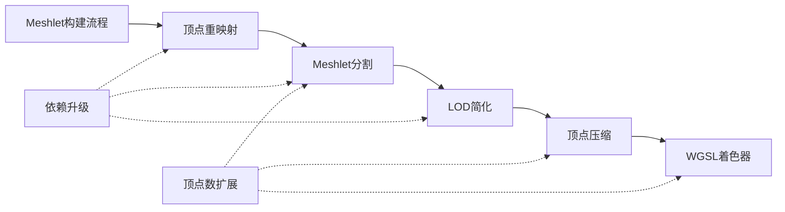

+++
title = "#21301 Virtual geometry: Upgrade deps, allow 256 vertices"
date = "2025-10-27T00:00:00"
draft = false
template = "pull_request_page.html"
in_search_index = false

[extra]
current_language = "zh-cn"
available_languages = {"en" = { name = "English", url = "/pull_request/bevy/2025-10/pr-21301-en-20251027" }, "zh-cn" = { name = "中文", url = "/pull_request/bevy/2025-10/pr-21301-zh-cn-20251027" }}
labels = ["A-Rendering", "C-Usability"]
+++

# Title

## Basic Information
- **Title**: Virtual geometry: Upgrade deps, allow 256 vertices
- **PR Link**: https://github.com/bevyengine/bevy/pull/21301
- **Author**: JMS55
- **Status**: MERGED
- **Labels**: A-Rendering, C-Usability
- **Created**: 2025-09-30T19:04:56Z
- **Merged**: 2025-10-27T05:09:18Z
- **Merged By**: alice-i-cecile

## Description Translation
对虚拟几何体进行了一些小改进。

未来我们应该对构建器代码进行的一些其他改进：

* 使用 meshopt_computeSphereBounds 替代 merge_spheres
* 宽松简化（Permissive simplification）
* 更快的顶点锁定，复制 https://github.com/zeux/meshoptimizer/pull/961
* 尝试使用 meshopt 的 clusterizer/partitioner 替代 metis

## The Story of This Pull Request

这个PR主要解决两个技术问题：升级虚拟几何体相关的依赖版本，以及将每个meshlet的最大顶点数从255扩展到256。这些改进虽然看似简单，但在虚拟几何体系统中具有实际意义。

### 问题背景与约束

在虚拟几何体系统中，meshlet是网格的基本构建块。原来的实现有几个限制：

1. **依赖版本过时**：使用的meshopt、metis等库版本较旧，可能缺少性能优化和新功能
2. **顶点数量限制**：每个meshlet最多只能包含255个顶点，这是由u8数据类型的限制决定的
3. **API变化**：新版本的meshopt库改变了部分API，需要相应调整

这些限制影响了系统的灵活性和性能。特别是255个顶点的限制，在某些情况下可能导致meshlet划分不够高效。

### 解决方案设计

开发者采取了渐进式的改进策略：

1. **依赖升级**：将meshopt从0.4.1升级到0.6.2，metis从0.2升级到0.2.2
2. **编码优化**：通过存储`vertex_count_minus_one`（顶点数减一）来在u8类型中容纳256个顶点
3. **API适配**：更新代码以适应新版本meshopt的API变化

### 技术实现细节

最核心的改动是在顶点计数存储方式上。原来直接存储顶点数量：

```rust
// 之前
pub vertex_count: u8,
```

现在改为存储顶点数减一：

```rust
// 之后
pub vertex_count_minus_one: u8,
```

这种编码技巧允许在保持u8类型的同时支持0-256的范围，因为`vertex_count_minus_one`存储0-255对应实际的1-256个顶点。

在WGSL着色器代码中，相应的解码逻辑也进行了更新：

```wgsl
// 之前
return extractBits((*meshlet).packed_a, 0u, 8u);

// 之后
return extractBits((*meshlet).packed_a, 0u, 8u) + 1u;
```

另一个重要变化是meshlet构建时的顶点数限制：

```rust
// 之前
let meshlet = build_meshlets(meshlet_indices, vertices, 255, 128, 0.0);

// 之后
let meshlet = build_meshlets(meshlet_indices, vertices, 256, 128, 0.0);
```

在API适配方面，使用了新的`generate_position_remap`函数替代原来的多流版本：

```rust
// 之前
let (position_only_vertex_count, position_only_vertex_remap) = generate_vertex_remap_multi(...);

// 之后
let position_only_vertex_remap = generate_position_remap(&vertices);
```

### 性能与兼容性考虑

这个PR考虑了向后兼容性，通过增加资产版本号来标记格式变化：

```rust
pub const MESHLET_MESH_ASSET_VERSION: u64 = 3;  // 从2升级到3
```

所有相关的缓冲区大小也都相应调整，比如将`quantized_positions`数组从255扩展到256个元素，确保系统能够处理新增的顶点容量。

### 实际影响

这些改动虽然不大，但具有实际价值：
- 每个meshlet可以多容纳一个顶点，可能在某些情况下减少meshlet总数
- 更新的依赖可能带来性能改进和bug修复
- 保持了代码的现代性和可维护性

## Visual Representation



## Key Files Changed

### `crates/bevy_pbr/src/meshlet/from_mesh.rs` (+11/-29)
这是主要的逻辑文件，包含了meshlet构建的核心算法。

**关键改动：**
```rust
// 使用新的顶点重映射API
// 之前：
let (position_only_vertex_count, position_only_vertex_remap) = generate_vertex_remap_multi(...);

// 之后：
let position_only_vertex_remap = generate_position_remap(&vertices);

// 扩展meshlet顶点限制
// 之前：
let meshlet = build_meshlets(meshlet_indices, vertices, 255, 128, 0.0);

// 之后：
let meshlet = build_meshlets(meshlet_indices, vertices, 256, 128, 0.0);

// 更新顶点计数存储方式
// 之前：
vertex_count: meshlet.vertex_count as u8,

// 之后：
vertex_count_minus_one: (meshlet.vertex_count - 1) as u8,
```

### `crates/bevy_pbr/Cargo.toml` (+3/-3)
依赖版本升级，确保使用最新的功能和优化。

```toml
# 之前：
range-alloc = { version = "0.1.3", optional = true }
meshopt = { version = "0.4.1", optional = true }
metis = { version = "0.2", optional = true }

# 之后：
range-alloc = { version = "0.1", optional = true }
meshopt = { version = "0.6.2", optional = true }
metis = { version = "0.2.2", optional = true }
```

### `crates/bevy_pbr/src/meshlet/asset.rs` (+3/-3)
更新meshlet数据结构和资产版本。

```rust
// 资产版本升级
// 之前：
pub const MESHLET_MESH_ASSET_VERSION: u64 = 2;

// 之后：
pub const MESHLET_MESH_ASSET_VERSION: u64 = 3;

// 顶点计数字段重命名和语义变更
// 之前：
pub vertex_count: u8,

// 之后：
pub vertex_count_minus_one: u8,
```

### WGSL着色器文件
更新顶点计数解码逻辑和缓冲区大小。

`meshlet_bindings.wgsl`:
```wgsl
// 之前：
return extractBits((*meshlet).packed_a, 0u, 8u);

// 之后：
return extractBits((*meshlet).packed_a, 0u, 8u) + 1u;
```

`visibility_buffer_software_raster.wgsl`:
```wgsl
// 之前：
var<workgroup> viewport_vertices: array<vec3f, 255>;

// 之后：
var<workgroup> viewport_vertices: array<vec3f, 256>;
```

## Further Reading

- [Mesh Optimization Library (meshopt)](https://github.com/zeux/meshoptimizer) - 用于网格优化的库
- [Virtual Geometry Concepts](https://advances.realtimerendering.com/s2020/RenderingDoomEternal.pdf) - 虚拟几何体技术概述
- [Bevy Meshlet Documentation](https://github.com/bevyengine/bevy/tree/main/crates/bevy_pbr/src/meshlet) - Bevy引擎中meshlet实现的文档