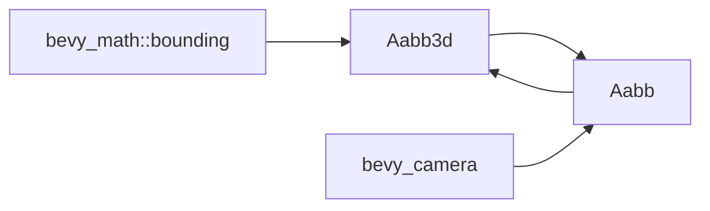

+++
title = "#21307 Add From impls for Aabb and Aabb3d"
date = "2025-10-01T00:00:00"
draft = false
template = "pull_request_page.html"
in_search_index = true

[taxonomies]
list_display = ["show"]

[extra]
current_language = "en"
available_languages = {"en" = { name = "English", url = "/pull_request/bevy/2025-10/pr-21307-en-20251001" }, "zh-cn" = { name = "中文", url = "/pull_request/bevy/2025-10/pr-21307-zh-cn-20251001" }}
labels = ["D-Trivial", "A-Rendering"]
+++

# Title
Add From impls for Aabb and Aabb3d

## Basic Information
- **Title**: Add From impls for Aabb and Aabb3d
- **PR Link**: https://github.com/bevyengine/bevy/pull/21307
- **Author**: atlv24
- **Status**: MERGED
- **Labels**: D-Trivial, A-Rendering, S-Ready-For-Final-Review
- **Created**: 2025-09-30T23:43:22Z
- **Merged**: 2025-10-01T00:29:07Z
- **Merged By**: alice-i-cecile

## Description Translation
# Objective

- i want to write functions that are generic over aabb type by taking impl Into<Aabb> as a parameter

## Solution

- impl From

## Testing

- 

## The Story of This Pull Request

This PR addresses a straightforward but practical need in the Bevy engine's type system - enabling seamless conversion between different AABB (Axis-Aligned Bounding Box) types. The core issue was that developers couldn't write functions that were generic over AABB types using Rust's `Into<Aabb>` trait bound, because the necessary conversion implementations were missing.

The problem manifests when working with Bevy's rendering system, where both `Aabb` (from `bevy_camera`) and `Aabb3d` (from `bevy_math::bounding`) types are used for bounding volume calculations. Without bidirectional conversion capabilities, developers had to manually convert between these types, creating boilerplate code and reducing code reusability.

The solution approach is classic Rust type system design: implement the `From` trait for both conversion directions. This enables the use of `Into<Aabb>` trait bounds in function parameters, allowing functions to accept either type transparently. The implementation follows Rust's zero-cost abstraction principle - these conversions are compile-time resolved and have no runtime overhead.

Looking at the implementation, we can see the conversion logic is mathematically straightforward. Converting from `Aabb3d` to `Aabb` extracts the center point and half extents:

```rust
impl From<Aabb3d> for Aabb {
    fn from(aabb: Aabb3d) -> Self {
        Self {
            center: aabb.center(),
            half_extents: aabb.half_size(),
        }
    }
}
```

The reverse conversion from `Aabb` to `Aabb3d` reconstructs the bounding box using the min and max points:

```rust
impl From<Aabb> for Aabb3d {
    fn from(aabb: Aabb) -> Self {
        Self {
            min: aabb.min(),
            max: aabb.max(),
        }
    }
}
```

These implementations are mathematically sound because both types represent the same geometric concept - an axis-aligned bounding box in 3D space. The `Aabb3d` stores the box as min/max points, while `Aabb` stores it as center/half-extents, but they're mathematically equivalent representations.

The technical insight here is about leveraging Rust's trait system for API ergonomics. By implementing `From`, we automatically get the corresponding `Into` implementations, which enables the desired `impl Into<Aabb>` parameter pattern. This pattern is widely used in Rust for creating flexible APIs that accept multiple input types.

The impact of this change is primarily on code quality and developer experience. Functions can now be written more generically:

```rust
fn process_bounds<T: Into<Aabb>>(bounds: T) {
    let aabb: Aabb = bounds.into();
    // process the AABB
}
```

This function can now accept either `Aabb` or `Aabb3d` instances without the caller needing to perform explicit conversions. It reduces boilerplate and makes the API more intuitive for users who might be working with different bounding volume types in different parts of their codebase.

## Visual Representation



## Key Files Changed

**File: `crates/bevy_camera/src/primitives.rs`**

This file contains the core camera-related primitives in Bevy, including the `Aabb` type used for frustum culling and camera calculations.

**Changes:**
- Added import for `Aabb3d` and `BoundingVolume` from `bevy_math::bounding`
- Implemented bidirectional `From` conversions between `Aabb` and `Aabb3d`

**Code Implementation:**
```rust
// Before: No conversion implementations existed

// After: Added bidirectional conversions
impl From<Aabb3d> for Aabb {
    fn from(aabb: Aabb3d) -> Self {
        Self {
            center: aabb.center(),
            half_extents: aabb.half_size(),
        }
    }
}

impl From<Aabb> for Aabb3d {
    fn from(aabb: Aabb) -> Self {
        Self {
            min: aabb.min(),
            max: aabb.max(),
        }
    }
}
```

These changes enable seamless interoperability between the camera-specific `Aabb` type and the more general `Aabb3d` type from the math module, supporting the PR's objective of writing generic functions that work with either AABB representation.

## Further Reading

- [Rust `From` and `Into` traits documentation](https://doc.rust-lang.org/std/convert/trait.From.html)
- [Bevy Engine Bounding Volumes](https://bevyengine.org/learn/quick-start/3d/bounding-volumes/)
- [Rust Trait Bounds and Generic Functions](https://doc.rust-lang.org/book/ch10-02-traits.html#traits-as-parameters)