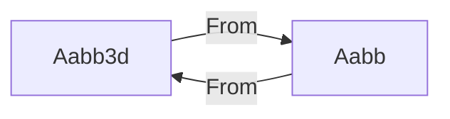

+++
title = "#21307 Add From impls for Aabb and Aabb3d"
date = "2025-10-01T00:00:00"
draft = false
template = "pull_request_page.html"
in_search_index = false

[extra]
current_language = "zh-cn"
available_languages = {"en" = { name = "English", url = "/pull_request/bevy/2025-10/pr-21307-en-20251001" }, "zh-cn" = { name = "中文", url = "/pull_request/bevy/2025-10/pr-21307-zh-cn-20251001" }}
+++

# Add From impls for Aabb and Aabb3d

## Basic Information
- **标题**: Add From impls for Aabb and Aabb3d
- **PR 链接**: https://github.com/bevyengine/bevy/pull/21307
- **作者**: atlv24
- **状态**: 已合并
- **标签**: D-Trivial, A-Rendering, S-Ready-For-Final-Review
- **创建时间**: 2025-09-30T23:43:22Z
- **合并时间**: 2025-10-01T00:29:07Z
- **合并者**: alice-i-cecile

## 描述翻译
# 目标

- 我希望编写能够通过接收 `impl Into<Aabb>` 参数来对 aabb 类型进行泛型处理的函数

## 解决方案

- 实现 From trait

## 测试

- 

## 该 Pull Request 的故事

这个 PR 解决了一个在 Bevy 游戏引擎中处理不同轴对齐边界框（AABB）类型时的互操作性问题。问题的核心在于代码中存在两个相似的 AABB 类型：`Aabb` 和 `Aabb3d`，但它们之间缺乏直接的转换机制。

**问题背景**
在 Bevy 的相机模块中，`Aabb` 结构体用于表示相机相关的边界框，而 `Aabb3d` 是数学模块中的通用 3D 边界框类型。开发者想要编写能够接受这两种类型的泛型函数，但缺乏直接的转换实现使得这种泛型处理变得困难。

**解决方案方法**
开发者采用了 Rust 标准库中的 `From` trait 来解决这个问题。通过为两种类型相互实现 `From` trait，可以启用 `Into` trait 的自动实现，这正是 Rust 中处理类型转换的惯用方法。

**实现细节**
在 `crates/bevy_camera/src/primitives.rs` 文件中添加了两个关键的转换实现：

第一个实现允许从 `Aabb3d` 转换到 `Aabb`：
```rust
impl From<Aabb3d> for Aabb {
    fn from(aabb: Aabb3d) -> Self {
        Self {
            center: aabb.center(),
            half_extents: aabb.half_size(),
        }
    }
}
```

这个实现通过调用 `Aabb3d` 的方法来获取中心点和半尺寸，然后构造 `Aabb` 实例。

第二个实现处理反向转换：
```rust
impl From<Aabb> for Aabb3d {
    fn from(aabb: Aabb) -> Self {
        Self {
            min: aabb.min(),
            max: aabb.max(),
        }
    }
}
```

这里使用了 `Aabb` 的 `min()` 和 `max()` 方法来构造 `Aabb3d`。

**技术洞察**
这种实现方式遵循了 Rust 的零成本抽象原则 - 转换在编译时就被内联，运行时没有额外开销。同时，通过使用标准 trait，代码保持了良好的可读性和可维护性。

**影响**
这个简单的改动为开发者提供了重要的灵活性。现在可以编写这样的函数：
```rust
fn process_aabb<T: Into<Aabb>>(aabb: T) {
    let aabb: Aabb = aabb.into();
    // 处理逻辑
}
```

该函数可以接受 `Aabb`、`Aabb3d` 或任何其他可以转换为 `Aabb` 的类型，大大提高了代码的复用性和灵活性。

## 可视化表示



## 关键文件更改

**文件**: `crates/bevy_camera/src/primitives.rs` (+22/-1)

这个文件包含了相机相关的图元定义。主要的改动是添加了两个 `From` trait 的实现，使 `Aabb` 和 `Aabb3d` 能够相互转换。

关键代码改动：
```rust
// 新增的转换实现
impl From<Aabb3d> for Aabb {
    fn from(aabb: Aabb3d) -> Self {
        Self {
            center: aabb.center(),
            half_extents: aabb.half_size(),
        }
    }
}

impl From<Aabb> for Aabb3d {
    fn from(aabb: Aabb) -> Self {
        Self {
            min: aabb.min(),
            max: aabb.max(),
        }
    }
}
```

这些实现与文件中已存在的其他转换实现（如从 `Sphere` 到 `Aabb` 的转换）保持一致的模式。

## 进一步阅读

- [Rust 标准库 - From 和 Into traits](https://doc.rust-lang.org/std/convert/trait.From.html)
- [Bevy 引擎的边界体积系统](https://docs.rs/bevy/latest/bevy/math/bounding/index.html)
- [Rust 的零成本抽象原则](https://blog.rust-lang.org/2015/05/11/traits.html)

# 完整代码差异
```diff
diff --git a/crates/bevy_camera/src/primitives.rs b/crates/bevy_camera/src/primitives.rs
index 52149613385b5..e7f7526dce6ac 100644
--- a/crates/bevy_camera/src/primitives.rs
+++ b/crates/bevy_camera/src/primitives.rs
@@ -1,7 +1,10 @@
 use core::borrow::Borrow;
 
 use bevy_ecs::{component::Component, entity::EntityHashMap, reflect::ReflectComponent};
-use bevy_math::{Affine3A, Mat3A, Mat4, Vec3, Vec3A, Vec4, Vec4Swizzles};
+use bevy_math::{
+    bounding::{Aabb3d, BoundingVolume},
+    Affine3A, Mat3A, Mat4, Vec3, Vec3A, Vec4, Vec4Swizzles,
+};
 use bevy_mesh::{Mesh, VertexAttributeValues};
 use bevy_reflect::prelude::*;
 
@@ -132,6 +135,24 @@ impl Aabb {
     }
 }
 
+impl From<Aabb3d> for Aabb {
+    fn from(aabb: Aabb3d) -> Self {
+        Self {
+            center: aabb.center(),
+            half_extents: aabb.half_size(),
+        }
+    }
+}
+
+impl From<Aabb> for Aabb3d {
+    fn from(aabb: Aabb) -> Self {
+        Self {
+            min: aabb.min(),
+            max: aabb.max(),
+        }
+    }
+}
+
 impl From<Sphere> for Aabb {
     #[inline]
     fn from(sphere: Sphere) -> Self {
```