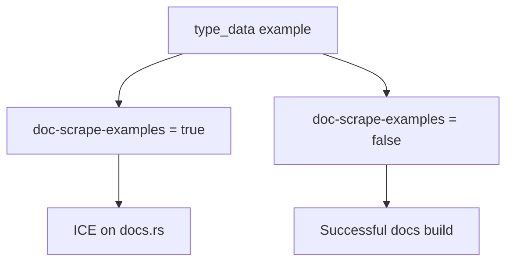

+++
title = "#21308 Exclude ICEing example from doc scrape"
date = "2025-10-01T00:00:00"
draft = false
template = "pull_request_page.html"
in_search_index = true

[taxonomies]
list_display = ["show"]

[extra]
current_language = "en"
available_languages = {"en" = { name = "English", url = "/pull_request/bevy/2025-10/pr-21308-en-20251001" }, "zh-cn" = { name = "中文", url = "/pull_request/bevy/2025-10/pr-21308-zh-cn-20251001" }}
labels = ["C-Docs", "D-Trivial", "C-Examples"]
+++

# Title: Exclude ICEing example from doc scrape

## Basic Information
- **Title**: Exclude ICEing example from doc scrape
- **PR Link**: https://github.com/bevyengine/bevy/pull/21308
- **Author**: janhohenheim
- **Status**: MERGED
- **Labels**: C-Docs, D-Trivial, C-Examples, S-Ready-For-Final-Review
- **Created**: 2025-09-30T23:47:55Z
- **Merged**: 2025-10-01T00:38:48Z
- **Merged By**: alice-i-cecile

## Description Translation
This PR disables doc scraping for the `type_data` example because it causes an Internal Compiler Error (ICE) on docs.rs.

## The Story of This Pull Request

This PR addresses a specific build problem in the Bevy engine's documentation pipeline. The issue was straightforward: the `type_data` example in the reflection system was causing an Internal Compiler Error (ICE) when docs.rs attempted to build and scrape documentation examples.

The problem occurred because docs.rs has specific build constraints and compiler configurations that differ from local development environments. When the documentation generation process attempted to scrape and compile the `type_data` example, it encountered a compiler crash. This type of issue is particularly problematic because it blocks the entire documentation build process.

The solution implemented here is a targeted workaround. Rather than modifying the example code itself, which might be complex and require deeper investigation into the root cause of the ICE, the approach was to simply exclude this specific example from the doc scraping process. This is achieved by setting `doc-scrape-examples = false` for the problematic example configuration in Cargo.toml.

From a technical perspective, this change uses Rust's Cargo manifest configuration to control documentation behavior. The `doc-scrape-examples` flag determines whether an example should be included when generating documentation. By setting this to false, the example will still be available for manual testing and execution, but won't be processed during documentation generation on docs.rs.

The implementation is minimal and surgical - a single configuration change with an explanatory comment. The comment "Causes an ICE on docs.rs" provides clear context for future maintainers about why this example is excluded from doc scraping. This approach balances immediate problem resolution with maintainability, as the comment documents the rationale without requiring complex code changes.

This type of fix is common in large Rust projects where different build environments (local development vs. CI/CD vs. docs.rs) can expose edge cases in compiler behavior. The solution demonstrates practical problem-solving: when faced with a blocking issue in a specific environment, sometimes the most efficient approach is to work around the problematic configuration rather than attempting to fix the underlying compiler issue.

## Visual Representation



## Key Files Changed

### `Cargo.toml` (+2/-1)

This file contains the project configuration and example definitions for the Rust package. The change modifies the configuration for the `type_data` example to prevent it from being included in documentation scraping.

```toml
# File: Cargo.toml
# Before:
[[example]]
name = "type_data"
path = "examples/reflection/type_data.rs"
doc-scrape-examples = true

# After:
[[example]]
name = "type_data"
path = "examples/reflection/type_data.rs"
# Causes an ICE on docs.rs
doc-scrape-examples = false
```

The key changes are:
1. Added a comment explaining why the configuration is being changed
2. Changed `doc-scrape-examples` from `true` to `false`
3. This prevents the example from causing compiler errors during documentation generation on docs.rs

## Further Reading

- [Rust Internal Compiler Errors (ICE)](https://doc.rust-lang.org/nightly/rustc/bug-reporting.html)
- [Cargo Configuration for Examples](https://doc.rust-lang.org/cargo/reference/cargo-targets.html#examples)
- [Bevy Engine Documentation](https://bevyengine.org/learn/)
- [docs.rs Build Process](https://docs.rs/about)

# Full Code Diff
```
diff --git a/Cargo.toml b/Cargo.toml
index dbf0401117928..72c321d5717bd 100644
--- a/Cargo.toml
+++ b/Cargo.toml
@@ -2715,7 +2715,8 @@ wasm = false
 [[example]]
 name = "type_data"
 path = "examples/reflection/type_data.rs"
-doc-scrape-examples = true
+# Causes an ICE on docs.rs
+doc-scrape-examples = false
 
 [package.metadata.example.type_data]
 name = "Type Data"
```