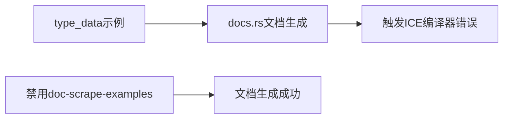

+++
title = "#21308 Exclude ICEing example from doc scrape"
date = "2025-10-01T00:00:00"
draft = false
template = "pull_request_page.html"
in_search_index = false

[extra]
current_language = "zh-cn"
available_languages = {"en" = { name = "English", url = "/pull_request/bevy/2025-10/pr-21308-en-20251001" }, "zh-cn" = { name = "中文", url = "/pull_request/bevy/2025-10/pr-21308-zh-cn-20251001" }}
labels = ["C-Docs", "D-Trivial", "C-Examples"]
+++

# Title

## Basic Information
- **Title**: Exclude ICEing example from doc scrape
- **PR Link**: https://github.com/bevyengine/bevy/pull/21308
- **Author**: janhohenheim
- **Status**: MERGED
- **Labels**: C-Docs, D-Trivial, C-Examples, S-Ready-For-Final-Review
- **Created**: 2025-09-30T23:47:55Z
- **Merged**: 2025-10-01T00:38:48Z
- **Merged By**: alice-i-cecile

## Description Translation
此PR从文档抓取中排除了导致ICE（Internal Compiler Error，内部编译器错误）的示例。

## The Story of This Pull Request

这是一个关于构建系统问题的简单修复。开发团队发现名为"type_data"的示例在docs.rs文档生成过程中会导致内部编译器错误（ICE）。ICE是Rust编译器中的严重错误，通常表明编译器本身存在问题而非代码逻辑错误。

当docs.rs尝试抓取示例代码生成文档时，"type_data"示例触发了编译器崩溃。这种问题会阻塞整个文档生成流程，导致其他开发者和用户无法访问最新的API文档。

解决方案很直接：通过将`doc-scrape-examples`标志从`true`改为`false`，告诉构建系统跳过这个特定示例的文档抓取。这样既避免了编译器崩溃，又保持了示例本身的可用性 - 开发者仍然可以通过`cargo run --example type_data`手动运行这个示例。

这种配置调整是Rust生态系统中处理编译器兼容性问题的常见做法。当特定代码片段与文档生成工具链存在兼容性问题时，排除这些片段是保持整体构建稳定的有效策略。

代码中的注释"# Causes an ICE on docs.rs"清晰地记录了问题的根源，为未来的维护者提供了重要上下文。这种文档实践对于长期项目维护很有价值。

从技术角度看，这个修改体现了防御性编程的思想：当遇到无法立即修复的根本性问题时（这里是编译器bug），采取最小化的规避措施来保证核心功能的可用性。

## Visual Representation



## Key Files Changed

**Cargo.toml** (+2/-1)

这个文件包含了Rust项目的配置信息，包括示例的构建和文档生成设置。

修改前：
```toml
[[example]]
name = "type_data"
path = "examples/reflection/type_data.rs"
doc-scrape-examples = true
```

修改后：
```toml
[[example]]
name = "type_data"
path = "examples/reflection/type_data.rs"
# Causes an ICE on docs.rs
doc-scrape-examples = false
```

关键变化：
1. 添加了注释说明问题的原因
2. 将`doc-scrape-examples`标志从`true`改为`false`
3. 这个修改阻止了docs.rs在构建文档时尝试处理这个特定示例

## Further Reading

- [Rust Internal Compiler Errors (ICE)](https://doc.rust-lang.org/stable/rustc/bug-reporting.html#internal-compiler-errors-ices)
- [Cargo Workspace Configuration](https://doc.rust-lang.org/cargo/reference/workspaces.html)
- [docs.rs Build Process](https://docs.rs/about)
- [Rust Documentation Comments](https://doc.rust-lang.org/rustdoc/how-to-write-documentation.html)

# Full Code Diff
diff --git a/Cargo.toml b/Cargo.toml
index dbf0401117928..72c321d5717bd 100644
--- a/Cargo.toml
+++ b/Cargo.toml
@@ -2715,7 +2715,8 @@ wasm = false
 [[example]]
 name = "type_data"
 path = "examples/reflection/type_data.rs"
-doc-scrape-examples = true
+# Causes an ICE on docs.rs
+doc-scrape-examples = false
 
 [package.metadata.example.type_data]
 name = "Type Data"