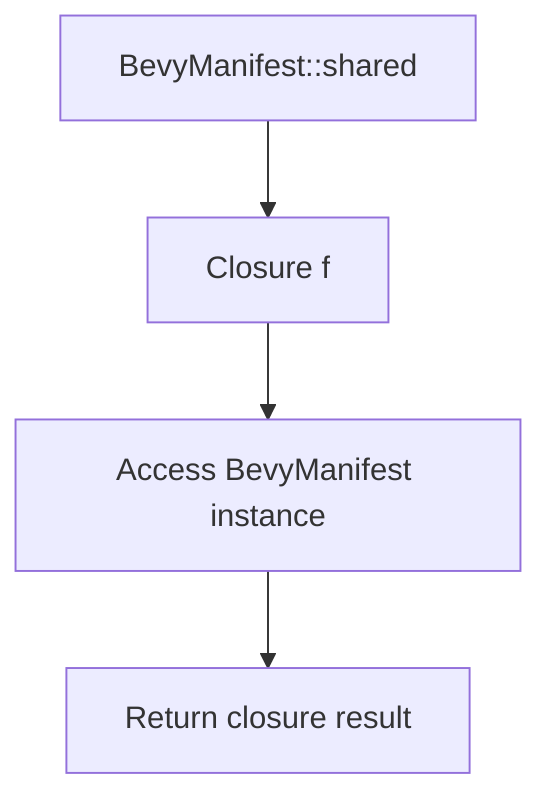

+++
title = "#21312 Fix documentation for shared method in BevyManifest"
date = "2025-10-01T00:00:00"
draft = false
template = "pull_request_page.html"
in_search_index = true

[taxonomies]
list_display = ["show"]

[extra]
current_language = "en"
available_languages = {"en" = { name = "English", url = "/pull_request/bevy/2025-10/pr-21312-en-20251001" }, "zh-cn" = { name = "中文", url = "/pull_request/bevy/2025-10/pr-21312-zh-cn-20251001" }}
labels = ["C-Docs", "D-Trivial", "D-Macros"]
+++

# Fix documentation for shared method in BevyManifest

## Basic Information
- **Title**: Fix documentation for shared method in BevyManifest
- **PR Link**: https://github.com/bevyengine/bevy/pull/21312
- **Author**: samoylovfp
- **Status**: MERGED
- **Labels**: C-Docs, D-Trivial, S-Ready-For-Final-Review, D-Macros
- **Created**: 2025-10-01T06:27:32Z
- **Merged**: 2025-10-01T19:24:25Z
- **Merged By**: alice-i-cecile

## Description Translation
Follow up to #20630.

## The Story of This Pull Request

This pull request addresses a documentation issue in the Bevy engine's macro utilities. The problem was straightforward but important: the documentation for the `shared` method in `BevyManifest` incorrectly described what the method actually does.

The original documentation stated that the method "Returns a global shared instance of the [`BevyManifest`] struct." However, looking at the actual implementation, this wasn't accurate. The method doesn't return the instance directly - instead, it accepts a closure and calls that closure with a reference to the shared instance.

This type of documentation mismatch can cause confusion for developers trying to use the API. When documentation doesn't match the actual behavior, developers may write code based on the documentation that won't compile, or they might misunderstand how to properly use the method.

The solution was simple but important: update the documentation to accurately reflect the method's behavior. The new documentation now states: "Calls `f` with a global shared instance of the [`BevyManifest`] struct." This precisely describes what the method does - it doesn't return the instance, but rather calls the provided function with access to the instance.

This pattern is common in Rust for managing shared resources, where you want to ensure proper synchronization and lifetime management. By using a closure-based approach, the implementation can guarantee that the RwLock is properly handled and that the borrowed reference doesn't outlive its intended scope.

The change is minimal - just a single line in the documentation comment - but it significantly improves the accuracy and usefulness of the API documentation. This helps prevent developer confusion and makes the codebase more maintainable.

## Visual Representation



## Key Files Changed

**File:** `crates/bevy_macro_utils/src/bevy_manifest.rs`

This file contains the `BevyManifest` struct and its implementation. The change fixes the documentation for the `shared` method to accurately describe its behavior.

**Before:**
```rust
/// Returns a global shared instance of the [`BevyManifest`] struct.
pub fn shared<R>(f: impl FnOnce(&BevyManifest) -> R) -> R {
```

**After:**
```rust
/// Calls `f` with a global shared instance of the [`BevyManifest`] struct.
pub fn shared<R>(f: impl FnOnce(&BevyManifest) -> R) -> R {
```

The change updates the documentation to correctly state that the method calls the provided closure with the shared instance, rather than returning the instance directly.

## Further Reading

- [Rust Documentation Guidelines](https://rust-lang.github.io/rfcs/1574-more-api-documentation-conventions.html)
- [Closures in Rust](https://doc.rust-lang.org/book/ch13-01-closures.html)
- [RwLock documentation](https://doc.rust-lang.org/std/sync/struct.RwLock.html)