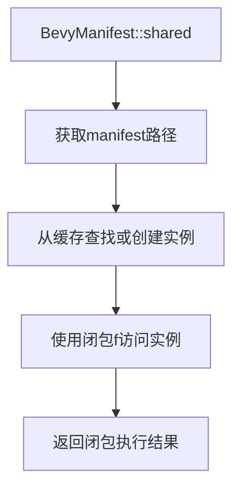

+++
title = "#21312 Fix documentation for shared method in BevyManifest"
date = "2025-10-01T00:00:00"
draft = false
template = "pull_request_page.html"
in_search_index = false

[extra]
current_language = "zh-cn"
available_languages = {"en" = { name = "English", url = "/pull_request/bevy/2025-10/pr-21312-en-20251001" }, "zh-cn" = { name = "中文", url = "/pull_request/bevy/2025-10/pr-21312-zh-cn-20251001" }}
labels = ["C-Docs", "D-Trivial", "D-Macros"]
+++

# Fix documentation for shared method in BevyManifest

## Basic Information
- **Title**: Fix documentation for shared method in BevyManifest
- **PR Link**: https://github.com/bevyengine/bevy/pull/21312
- **Author**: samoylovfp
- **Status**: MERGED
- **Labels**: C-Docs, D-Trivial, S-Ready-For-Final-Review, D-Macros
- **Created**: 2025-10-01T06:27:32Z
- **Merged**: 2025-10-01T19:24:25Z
- **Merged By**: alice-i-cecile

## Description Translation
这是对 #20630 的后续跟进。

## The Story of This Pull Request

这个PR解决了一个文档准确性问题。开发者在查看`BevyManifest::shared`方法的文档时，发现文档描述与实际行为不符。

问题的核心在于文档错误地声称该方法"返回"一个全局共享的`BevyManifest`实例，而实际上该方法接受一个闭包函数，并用共享实例调用这个闭包。这种差异虽然微小，但对于依赖准确文档来理解API行为的开发者来说会造成困惑。

从技术实现来看，`BevyManifest::shared`方法的设计采用了访问者模式(visitor pattern)：

```rust
pub fn shared<R>(f: impl FnOnce(&BevyManifest) -> R) -> R {
    static MANIFESTS: RwLock<BTreeMap<PathBuf, BevyManifest>> = RwLock::new(BTreeMap::new());
    let manifest_path = Self::get_manifest_path();
    // ... 实现细节
}
```

该方法使用静态的`RwLock`来管理线程安全的`BevyManifest`实例缓存，然后通过闭包参数`f`来让调用者访问这个共享实例。这种模式在Rust中很常见，因为它可以避免直接返回引用带来的生命周期问题。

修复方案很简单但很重要：将文档从"返回一个全局共享实例"改为"用全局共享实例调用`f`"。这个修改确保了文档准确反映了方法的行为，避免了潜在的误解。

对于使用这个API的开发者来说，准确的文档意味着他们能正确理解如何与`BevyManifest`交互。错误的文档可能导致开发者尝试直接存储返回的引用，而这在Rust的所有权系统下是不允许的。

这个修改虽然只有一行，但体现了良好软件工程实践中的文档维护重要性。准确的文档对于开源项目尤其关键，因为它帮助贡献者快速理解代码行为，减少学习成本。

## Visual Representation



## Key Files Changed

**crates/bevy_macro_utils/src/bevy_manifest.rs** (+1/-1)

这个文件包含了唯一的修改，修正了`shared`方法的文档注释：

```rust
// Before:
/// Returns a global shared instance of the [`BevyManifest`] struct.

// After:
/// Calls `f` with a global shared instance of the [`BevyManifest`] struct.
```

这个修改确保了文档准确描述了方法的行为，避免了开发者对API的误解。

## Further Reading

- [Rust Documentation Guidelines](https://rust-lang.github.io/rfcs/1574-more-api-documentation-conventions.html)
- [Visitor Pattern in Rust](https://rust-unofficial.github.io/patterns/patterns/behavioural/visitor.html)
- [Bevy Engine Documentation Standards](https://github.com/bevyengine/bevy/blob/main/CONTRIBUTING.md#documenting-your-code)