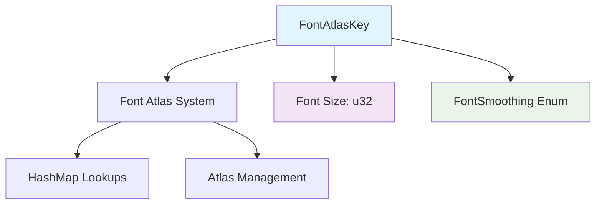

+++
title = "#21315 Derive `Copy` and `Clone` for `FontAtlasKey`"
date = "2025-10-05T00:00:00"
draft = false
template = "pull_request_page.html"
in_search_index = true

[taxonomies]
list_display = ["show"]

[extra]
current_language = "en"
available_languages = {"en" = { name = "English", url = "/pull_request/bevy/2025-10/pr-21315-en-20251005" }, "zh-cn" = { name = "中文", url = "/pull_request/bevy/2025-10/pr-21315-zh-cn-20251005" }}
labels = ["D-Trivial", "A-Text"]
+++

# Title

## Basic Information
- **Title**: Derive `Copy` and `Clone` for `FontAtlasKey`
- **PR Link**: https://github.com/bevyengine/bevy/pull/21315
- **Author**: ickshonpe
- **Status**: MERGED
- **Labels**: D-Trivial, A-Text, S-Needs-Review
- **Created**: 2025-10-01T08:40:05Z
- **Merged**: 2025-10-05T09:59:25Z
- **Merged By**: mockersf

## Description Translation
# Objective

For convenience, need to collect some.

## The Story of This Pull Request

This PR addresses a straightforward but practical limitation in the Bevy engine's text rendering system. The issue centered around the `FontAtlasKey` struct, which serves as an identifier for font atlases based on font size and smoothing method. The problem was that this key type lacked the `Copy` and `Clone` traits, making it cumbersome to work with in common scenarios.

The core issue emerged when developers needed to use `FontAtlasKey` values in collections or pass them around without consuming ownership. Without `Copy` and `Clone`, each use of a `FontAtlasKey` required either moving ownership (which isn't always desirable) or manually reconstructing the key from its components. This created unnecessary friction in code that deals with font management.

The solution approach was simple and effective: derive the `Copy` and `Clone` traits for `FontAtlasKey`. This decision was well-justified because the struct contains only primitive data - a `u32` representing the font size and a `FontSmoothing` enum. Both of these components are themselves `Copy` types, making `FontAtlasKey` a natural candidate for these traits.

From an implementation perspective, this change required minimal modification. The `FontAtlasKey` struct was already designed as a simple value type with two fields. Adding `Copy` and `Clone` to the derive macro was a safe operation because:
- The struct contains no heap-allocated resources
- Both field types (`u32` and `FontSmoothing`) implement `Copy` and `Clone`
- The struct has no lifetime parameters or complex ownership semantics

The technical insight here is that `FontAtlasKey` functions as a pure value type - it's essentially a composite key used for hash map lookups in the font atlas system. Value types like this benefit significantly from being `Copy` because it eliminates ownership concerns when using them as keys or in data structures.

The impact of this change is primarily ergonomic. Code that works with font atlases can now:
- Store `FontAtlasKey` values in collections without ownership issues
- Pass keys by value without explicit cloning
- Use keys in pattern matching and other contexts that expect `Copy` types

This aligns with Rust's philosophy of making safe, efficient operations ergonomic while requiring explicit handling for operations that involve ownership transfer or resource allocation.

## Visual Representation



## Key Files Changed

### `crates/bevy_text/src/font_atlas_set.rs` (+1/-1)

This file contains the font atlas management system for Bevy's text rendering. The change modifies the `FontAtlasKey` struct definition to include `Copy` and `Clone` traits.

**Before:**
```rust
#[derive(Debug, Hash, PartialEq, Eq)]
pub struct FontAtlasKey(pub u32, pub FontSmoothing);
```

**After:**
```rust
#[derive(Debug, Hash, PartialEq, Eq, Copy, Clone)]
pub struct FontAtlasKey(pub u32, pub FontSmoothing);
```

The change adds `Copy` and `Clone` to the derive macro, enabling the struct to be copied implicitly and cloned explicitly. This is particularly useful because `FontAtlasKey` is used as a key in hash maps throughout the font system, and being able to copy these keys simplifies many operations.

## Further Reading

- [Rust Book: Derivable Traits](https://doc.rust-lang.org/book/appendix-03-derivable-traits.html) - Explanation of common derivable traits including `Copy` and `Clone`
- [Rust Reference: The Copy Trait](https://doc.rust-lang.org/std/marker/trait.Copy.html) - Official documentation for the `Copy` trait
- [Bevy Text Rendering Documentation](https://docs.rs/bevy_text/latest/bevy_text/) - Bevy's text rendering system documentation

## Full Code Diff
```diff
diff --git a/crates/bevy_text/src/font_atlas_set.rs b/crates/bevy_text/src/font_atlas_set.rs
index b1d70ea7e66f3..6290ded290a05 100644
--- a/crates/bevy_text/src/font_atlas_set.rs
+++ b/crates/bevy_text/src/font_atlas_set.rs
@@ -43,7 +43,7 @@ pub fn remove_dropped_font_atlas_sets(
 /// Identifies a font size and smoothing method in a [`FontAtlasSet`].
 ///
 /// Allows an `f32` font size to be used as a key in a `HashMap`, by its binary representation.
-#[derive(Debug, Hash, PartialEq, Eq)]
+#[derive(Debug, Hash, PartialEq, Eq, Copy, Clone)]
 pub struct FontAtlasKey(pub u32, pub FontSmoothing);
 
 /// A map of font sizes to their corresponding [`FontAtlas`]es, for a given font face.
```