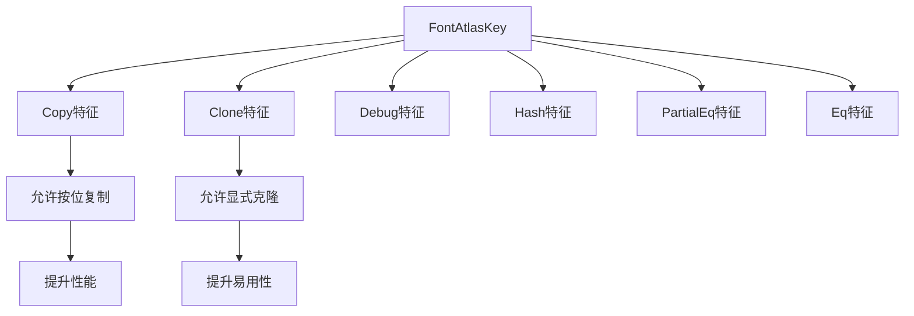

+++
title = "#21315 Derive `Copy` and `Clone` for `FontAtlasKey"
date = "2025-10-05T00:00:00"
draft = false
template = "pull_request_page.html"
in_search_index = false

[extra]
current_language = "zh-cn"
available_languages = {"en" = { name = "English", url = "/pull_request/bevy/2025-10/pr-21315-en-20251005" }, "zh-cn" = { name = "中文", url = "/pull_request/bevy/2025-10/pr-21315-zh-cn-20251005" }}
+++

# Derive `Copy` and `Clone` for `FontAtlasKey`

## Basic Information
- **标题**: Derive `Copy` and `Clone` for `FontAtlasKey`
- **PR链接**: https://github.com/bevyengine/bevy/pull/21315
- **作者**: ickshonpe
- **状态**: 已合并
- **标签**: D-Trivial, A-Text, S-Needs-Review
- **创建时间**: 2025-10-01T08:40:05Z
- **合并时间**: 2025-10-05T09:59:25Z
- **合并者**: mockersf

## 描述翻译
### Objective

为了便利性，需要收集一些。

## 这个Pull Request的故事

这个PR的故事很简单，但体现了Rust语言中一个常见的工程实践：为合适的类型自动派生(derive)特征(trait)。

**问题背景**

在Bevy引擎的文本渲染系统中，`FontAtlasKey`结构体用于标识字体图集集合中的字体大小和平滑方法。这个结构体包含两个字段：一个表示字体大小的`u32`，和一个表示字体平滑方法的`FontSmoothing`枚举。在修改之前，这个结构体只派生了`Debug`、`Hash`、`PartialEq`和`Eq`特征。

```rust
// 修改前：
#[derive(Debug, Hash, PartialEq, Eq)]
pub struct FontAtlasKey(pub u32, pub FontSmoothing);
```

在实际使用中，开发者可能需要复制或克隆`FontAtlasKey`实例。例如，当需要在不同的数据结构之间传递这个键，或者需要创建它的副本用于缓存或其他目的时。由于没有实现`Copy`和`Clone`特征，开发者必须手动处理这些情况，这增加了代码的复杂性和出错的可能性。

**解决方案**

解决方案非常直接：为`FontAtlasKey`结构体自动派生`Copy`和`Clone`特征。这是一个安全的操作，因为：

1. `FontAtlasKey`的所有字段（`u32`和`FontSmoothing`）都是可以安全复制的类型
2. `u32`是基本类型，实现了`Copy`
3. `FontSmoothing`枚举也应该实现了必要的特征（基于Rust的枚举默认行为）

**实现细节**

具体的修改只有一行代码，在原有的derive属性中添加了`Copy`和`Clone`：

```rust
// 修改后：
#[derive(Debug, Hash, PartialEq, Eq, Copy, Clone)]
pub struct FontAtlasKey(pub u32, pub FontSmoothing);
```

这个修改使得`FontAtlasKey`现在可以：
- 通过简单的位复制进行复制（得益于`Copy`特征）
- 显式调用`.clone()`方法进行克隆（得益于`Clone`特征）

**技术考量**

选择同时派生`Copy`和`Clone`而不是只派生`Clone`的原因是：
- `Copy`是一个标记特征(marker trait)，表示类型可以通过简单的内存复制来复制
- 对于像`FontAtlasKey`这样的小型、简单的结构体，使用`Copy`语义更符合其使用场景
- 在Rust中，如果一个类型实现了`Copy`，它必须同时实现`Clone`，因为`Copy`是`Clone`的子特征

**影响和收益**

这个修改带来的主要好处是：
1. **使用便利性**：开发者现在可以轻松地复制`FontAtlasKey`实例，无需额外的样板代码
2. **性能优化**：`Copy`特征允许编译器在某些情况下进行优化，因为复制操作是廉价的
3. **API一致性**：与Rust的标准库和其他常用类型保持一致的设计模式

这是一个典型的"低风险、高回报"的修改：实现简单，不会引入破坏性变化，但能显著提升开发者的使用体验。

## 可视化表示



## 关键文件变更

### `crates/bevy_text/src/font_atlas_set.rs` (+1/-1)

这个文件包含了唯一的修改，为`FontAtlasKey`结构体添加了`Copy`和`Clone`特征的自动派生。

**修改详情：**

```rust
// 修改前：
#[derive(Debug, Hash, PartialEq, Eq)]
pub struct FontAtlasKey(pub u32, pub FontSmoothing);

// 修改后：
#[derive(Debug, Hash, PartialEq, Eq, Copy, Clone)]
pub struct FontAtlasKey(pub u32, pub FontSmoothing);
```

这个修改直接解决了PR描述中提到的"便利性"需求，使得`FontAtlasKey`实例可以更容易地在代码中传递和复制。

## 延伸阅读

对于想要了解更多相关概念的开发者，建议参考：

1. **Rust官方文档 - Derive宏**：
   https://doc.rust-lang.org/reference/procedural-macros.html#derive-macros

2. **Rust编程语言 - 特征**：
   https://doc.rust-lang.org/book/ch10-02-traits.html

3. **Copy和Clone特征的区别**：
   https://doc.rust-lang.org/std/marker/trait.Copy.html

4. **Bevy引擎的ECS架构**（了解这个修改在更大系统中的作用）：
   https://bevyengine.org/learn/book/getting-started/ecs/

# 完整代码差异

```diff
diff --git a/crates/bevy_text/src/font_atlas_set.rs b/crates/bevy_text/src/font_atlas_set.rs
index b1d70ea7e66f3..6290ded290a05 100644
--- a/crates/bevy_text/src/font_atlas_set.rs
+++ b/crates/bevy_text/src/font_atlas_set.rs
@@ -43,7 +43,7 @@ pub fn remove_dropped_font_atlas_sets(
 /// Identifies a font size and smoothing method in a [`FontAtlasSet`].
 ///
 /// Allows an `f32` font size to be used as a key in a `HashMap`, by its binary representation.
-#[derive(Debug, Hash, PartialEq, Eq)]
+#[derive(Debug, Hash, PartialEq, Eq, Copy, Clone)]
 pub struct FontAtlasKey(pub u32, pub FontSmoothing);
 
 /// A map of font sizes to their corresponding [`FontAtlas`]es, for a given font face.
```