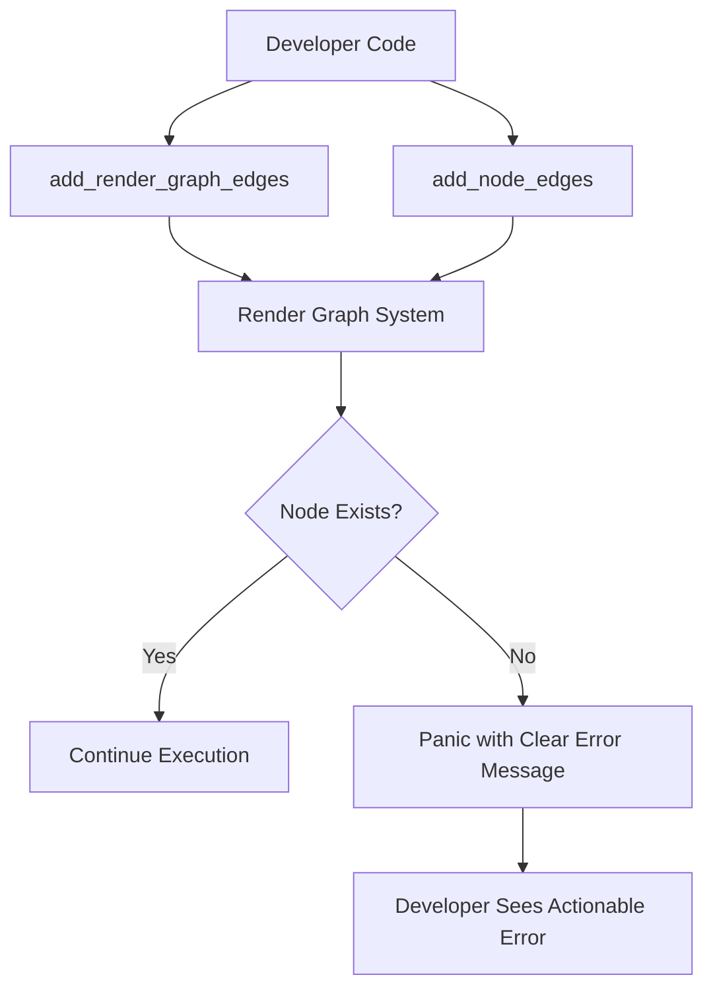

+++
title = "#21321 bevy_render: improve panic message when render graph node doesn't exist"
date = "2025-10-01T00:00:00"
draft = false
template = "pull_request_page.html"
in_search_index = true

[taxonomies]
list_display = ["show"]

[extra]
current_language = "en"
available_languages = {"en" = { name = "English", url = "/pull_request/bevy/2025-10/pr-21321-en-20251001" }, "zh-cn" = { name = "中文", url = "/pull_request/bevy/2025-10/pr-21321-zh-cn-20251001" }}
labels = ["A-Rendering", "C-Usability"]
+++

# Title
Improving Render Graph Error Messages for Better Developer Experience

## Basic Information
- **Title**: bevy_render: improve panic message when render graph node doesn't exist
- **PR Link**: https://github.com/bevyengine/bevy/pull/21321
- **Author**: jakobhellermann
- **Status**: MERGED
- **Labels**: A-Rendering, C-Usability, S-Ready-For-Final-Review
- **Created**: 2025-10-01T15:26:22Z
- **Merged**: 2025-10-01T20:09:44Z
- **Merged By**: alice-i-cecile

## Description Translation
# Objective

It should be possible to enable minimal bevy features by disabling all and then progressively enabling them until everything works.
This however requires, that bevy has good error reporting and gracefully supports different featuresets.

I ran my code with minimal features and got this unhelpful error:
```
thread 'main' (993068) panicked at /home/jakob/dev/rust/bevy/crates/bevy_render/src/render_graph/graph.rs:158:26:
InvalidNode(PostProcessing)
```

## Solution

With this PR it looks like this:
```
thread 'main' (989393) panicked at /home/jakob/dev/rust/bevy/crates/bevy_pbr/src/wireframe.rs:136:14:
node PostProcessing does not exist
```

Which immediately helps me figure out that I need some feature for the `WireframePlugin` I added.

## The Story of This Pull Request

This PR addresses a common development workflow challenge in Bevy: incrementally enabling features while maintaining clear error messages. The author encountered a practical problem when working with minimal feature sets - the render graph system was producing unhelpful panic messages that made debugging difficult.

The core issue was in the error reporting mechanism of the render graph system. When a render graph node didn't exist, the system would panic with a debug-formatted error variant like `InvalidNode(PostProcessing)`. While technically accurate, this message lacked the context needed for developers to quickly understand and resolve the issue, especially when working with feature flags that conditionally include render graph nodes.

The solution involved two key improvements to the error handling system. First, the error formatting was changed from debug representation (`{:?}`) to display representation (`{}`), which provides a more human-readable error message. Second, the `#[track_caller]` attribute was added to relevant methods to ensure panic locations point to the actual calling code rather than the internal implementation, making it easier to trace the source of the problem.

The technical implementation demonstrates a common pattern in Rust error handling: leveraging the difference between `Display` and `Debug` trait implementations. The `RenderGraphError` type likely has a `Display` implementation that provides a more descriptive error message, while the `Debug` implementation shows the raw enum variant and payload. By switching from `panic!("{err:?}")` to `panic!("{err}")`, the system now uses the user-friendly display format.

The addition of `#[track_caller]` to three methods (`add_node_edges`, `add_render_graph_edges` for both `World` and `SubApp`) ensures that when these methods panic, the error location reported will be the caller's location rather than the internal method implementation. This is particularly valuable in complex systems like render graphs where the same utility methods might be called from multiple places.

These changes significantly improve the developer experience by providing immediate, actionable information. Instead of seeing an obscure `InvalidNode(PostProcessing)` error deep in the render graph internals, developers now see a clear message "node PostProcessing does not exist" pointing directly to the code that attempted to use the missing node. This immediately guides developers to check their feature flags and dependencies.

The impact is most noticeable during the incremental feature development workflow described in the PR description. When starting with minimal features and gradually enabling them, developers can now quickly identify which features are missing based on the clear error messages, rather than having to trace through the codebase to understand what `InvalidNode` means in context.

## Visual Representation



## Key Files Changed

### `crates/bevy_render/src/render_graph/graph.rs` (+2/-1)

This file contains the core render graph implementation where the main error message improvement was made.

```rust
// Before:
pub fn add_node_edges<const N: usize>(&mut self, edges: impl IntoRenderNodeArray<N>) {
    for window in edges.into_array().windows(2) {
        let [a, b] = window else {
            unreachable!()
        };
        if let Err(err) = self.add_node_edge(a, b) {
            match err {
                // Already existing edges are very easy to produce with this api
                // and shouldn't cause a panic
                RenderGraphError::EdgeAlreadyExists(_) => {}
                _ => panic!("{err:?}"),
            }
        }
    }
}

// After:
#[track_caller]
pub fn add_node_edges<const N: usize>(&mut self, edges: impl IntoRenderNodeArray<N>) {
    for window in edges.into_array().windows(2) {
        let [a, b] = window else {
            unreachable!()
        };
        if let Err(err) = self.add_node_edge(a, b) {
            match err {
                // Already existing edges are very easy to produce with this api
                // and shouldn't cause a panic
                RenderGraphError::EdgeAlreadyExists(_) => {}
                _ => panic!("{err}"),
            }
        }
    }
}
```

The key changes are:
1. Added `#[track_caller]` attribute to improve panic location reporting
2. Changed panic format from `{err:?}` (debug) to `{err}` (display)

### `crates/bevy_render/src/render_graph/app.rs` (+2/-0)

This file contains the application-level render graph integration where caller tracking was added.

```rust
// Added #[track_caller] to both methods:
#[track_caller]
fn add_render_graph_edges<const N: usize>(
    &mut self,
    sub_graph: impl RenderSubGraph,
    edges: [&str; N],
) -> &mut Self {
    // ... method implementation unchanged
}
```

The change ensures consistent caller tracking across the render graph API surface.

## Further Reading

- [Rust `#[track_caller]` attribute documentation](https://doc.rust-lang.org/std/panic/fn.set_hook.html)
- [Rust Display vs Debug formatting](https://doc.rust-lang.org/std/fmt/trait.Display.html)
- [Bevy Render Graph documentation](https://bevyengine.org/learn/quick-start/rendering/render-graph/)
- [Error Handling in Rust](https://doc.rust-lang.org/book/ch09-00-error-handling.html)

# Full Code Diff
diff --git a/crates/bevy_render/src/render_graph/app.rs b/crates/bevy_render/src/render_graph/app.rs
index fce6a13ad33e0..879f28fe54015 100644
--- a/crates/bevy_render/src/render_graph/app.rs
+++ b/crates/bevy_render/src/render_graph/app.rs
@@ -53,6 +53,7 @@ impl RenderGraphExt for World {
         self
     }
 
+    #[track_caller]
     fn add_render_graph_edges<const N: usize>(
         &mut self,
         sub_graph: impl RenderSubGraph,
@@ -121,6 +122,7 @@ impl RenderGraphExt for SubApp {
         self
     }
 
+    #[track_caller]
     fn add_render_graph_edges<const N: usize>(
         &mut self,
         sub_graph: impl RenderSubGraph,
diff --git a/crates/bevy_render/src/render_graph/graph.rs b/crates/bevy_render/src/render_graph/graph.rs
index a7c4851d869b5..b7f8328610054 100644
--- a/crates/bevy_render/src/render_graph/graph.rs
+++ b/crates/bevy_render/src/render_graph/graph.rs
@@ -145,6 +145,7 @@ impl RenderGraph {
     ///
     /// Defining an edge that already exists is not considered an error with this api.
     /// It simply won't create a new edge.
+    #[track_caller]
     pub fn add_node_edges<const N: usize>(&mut self, edges: impl IntoRenderNodeArray<N>) {
         for window in edges.into_array().windows(2) {
             let [a, b] = window else {
@@ -155,7 +156,7 @@ impl RenderGraph {
                     // Already existing edges are very easy to produce with this api
                     // and shouldn't cause a panic
                     RenderGraphError::EdgeAlreadyExists(_) => {}
-                    _ => panic!("{err:?}"),
+                    _ => panic!("{err}"),
                 }
             }
         }