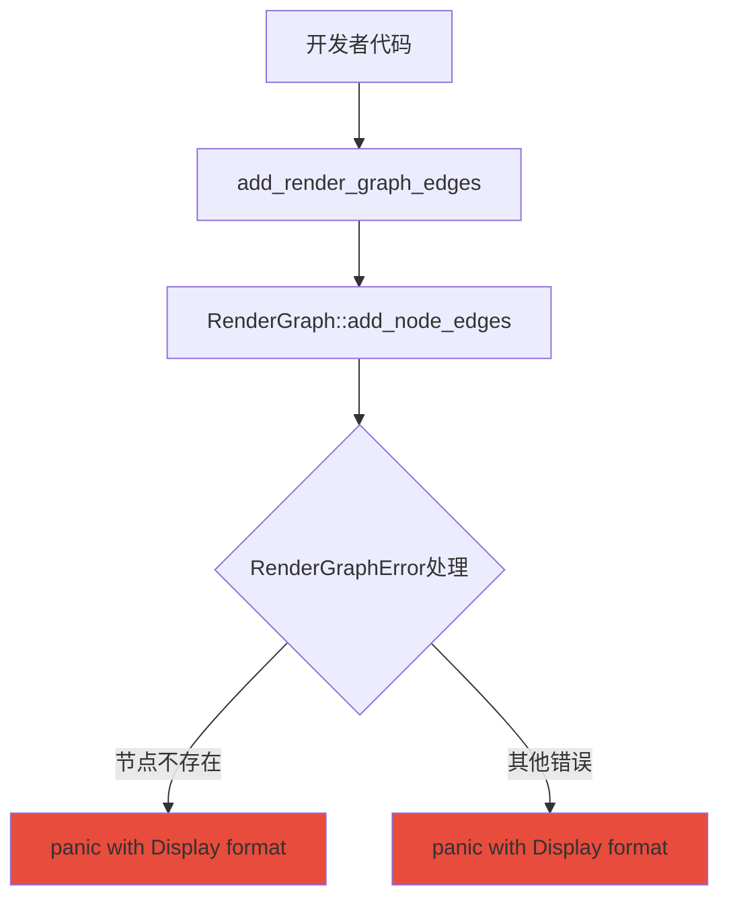

+++
title = "#21321 bevy_render: improve panic message when render graph node doesn't exist"
date = "2025-10-01T00:00:00"
draft = false
template = "pull_request_page.html"
in_search_index = false

[extra]
current_language = "zh-cn"
available_languages = {"en" = { name = "English", url = "/pull_request/bevy/2025-10/pr-21321-en-20251001" }, "zh-cn" = { name = "中文", url = "/pull_request/bevy/2025-10/pr-21321-zh-cn-20251001" }}
labels = ["A-Rendering", "C-Usability"]
+++

# bevy_render: improve panic message when render graph node doesn't exist

## Basic Information
- **Title**: bevy_render: improve panic message when render graph node doesn't exist
- **PR Link**: https://github.com/bevyengine/bevy/pull/21321
- **Author**: jakobhellermann
- **Status**: MERGED
- **Labels**: A-Rendering, C-Usability, S-Ready-For-Final-Review
- **Created**: 2025-10-01T15:26:22Z
- **Merged**: 2025-10-01T20:09:44Z
- **Merged By**: alice-i-cecile

## Description Translation
**目标**

应该能够通过禁用所有功能然后逐步启用它们直到一切正常工作来启用最小化的bevy功能。然而，这要求bevy具有良好的错误报告并优雅地支持不同的功能集。

我使用最小功能集运行代码时遇到了这个无用的错误：
```
thread 'main' (993068) panicked at /home/jakob/dev/rust/bevy/crates/bevy_render/src/render_graph/graph.rs:158:26:
InvalidNode(PostProcessing)
```

**解决方案**

使用此PR后，错误信息如下：
```
thread 'main' (989393) panicked at /home/jakob/dev/rust/bevy/crates/bevy_pbr/src/wireframe.rs:136:14:
node PostProcessing does not exist
```

这立即帮助我找出我需要为添加的`WireframePlugin`启用某些功能。

## The Story of This Pull Request

这个PR解决了一个实际的开发体验问题。当开发者使用最小功能集配置Bevy时，如果某个渲染图节点不存在，系统会抛出难以理解的panic信息。原始的错误消息`InvalidNode(PostProcessing)`缺乏上下文，让开发者难以快速定位问题根源。

问题的核心在于错误信息的表达方式。在Rust中，当使用`{:?}`格式符显示错误时，会显示枚举变体名称和值，这对于调试目的很有用，但对于最终用户来说可能不够友好。作者通过将错误显示从调试格式改为显示格式，使错误信息更加直观。

实现方案包含两个关键改进。首先，在`add_node_edges`方法中，将panic信息从`panic!("{err:?}")`改为`panic!("{err}")`。这个简单的改动利用了Rust的Display trait实现，为RenderGraphError类型提供了更友好的错误描述。

其次，作者在多个方法上添加了`#[track_caller]`属性。这个属性是Rust的一个有用特性，它使panic信息指向调用这些方法的代码位置，而不是方法本身的实现位置。这对于调试非常有帮助，因为开发者现在可以直接看到是他们的哪一行代码触发了问题。

从技术实现角度看，这个PR展示了良好的错误处理实践。RenderGraphError类型已经实现了适当的Display trait，但之前的代码没有充分利用这个特性。通过直接使用`{err}`而不是`{err:?}`，系统现在能够显示更有意义的错误信息，如"node PostProcessing does not exist"而不是晦涩的"InvalidNode(PostProcessing)"。

这个改进特别有价值，因为它帮助开发者在使用最小功能集时进行故障排除。在大型引擎如Bevy中，功能模块化是重要的架构考虑，良好的错误信息对于指导开发者正确配置他们的功能依赖至关重要。

## Visual Representation



## Key Files Changed

### `crates/bevy_render/src/render_graph/graph.rs` (+2/-1)

这个文件包含了主要的错误信息改进：

```rust
// File: crates/bevy_render/src/render_graph/graph.rs
// Before:
pub fn add_node_edges<const N: usize>(&mut self, edges: impl IntoRenderNodeArray<N>) {
    for window in edges.into_array().windows(2) {
        let [a, b] = window else {
            unreachable!();
        };
        if let Err(err) = self.add_node_edge(a, b) {
            match err {
                // Already existing edges are very easy to produce with this api
                // and shouldn't cause a panic
                RenderGraphError::EdgeAlreadyExists(_) => {}
                _ => panic!("{err:?}"),
            }
        }
    }
}

// After:
#[track_caller]
pub fn add_node_edges<const N: usize>(&mut self, edges: impl IntoRenderNodeArray<N>) {
    for window in edges.into_array().windows(2) {
        let [a, b] = window else {
            unreachable!();
        };
        if let Err(err) = self.add_node_edge(a, b) {
            match err {
                // Already existing edges are very easy to produce with this api
                // and shouldn't cause a panic
                RenderGraphError::EdgeAlreadyExists(_) => {}
                _ => panic!("{err}"),
            }
        }
    }
}
```

主要改动：
1. 添加了`#[track_caller]`属性，改善panic位置追踪
2. 将`panic!("{err:?}")`改为`panic!("{err}")`，使用Display格式而非Debug格式显示错误

### `crates/bevy_render/src/render_graph/app.rs` (+2/-0)

这个文件添加了调用追踪支持：

```rust
// File: crates/bevy_render/src/render_graph/app.rs
// 新增的改动：
#[track_caller]
fn add_render_graph_edges<const N: usize>(
    &mut self,
    sub_graph: impl RenderSubGraph,
    edges: [&str; N],
) -> &mut Self {
    // ... 方法实现
}
```

主要改动：
1. 在两个`add_render_graph_edges`方法上添加`#[track_caller]`属性
2. 这确保了当这些方法内部发生panic时，错误位置会指向调用这些方法的代码，而不是方法实现内部

## Further Reading

- [Rust `#[track_caller]` attribute documentation](https://doc.rust-lang.org/std/macro.panic.html#track_caller)
- [Bevy Render Graph documentation](https://bevyengine.org/learn/quick-start/rendering/render-graph/)
- [Rust Error Handling Best Practices](https://doc.rust-lang.org/book/ch09-00-error-handling.html)
- [Display vs Debug traits in Rust](https://doc.rust-lang.org/std/fmt/trait.Display.html)