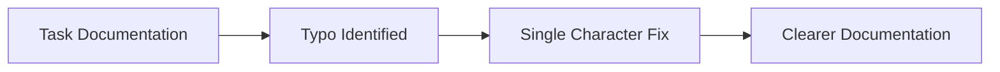

+++
title = "#21323 Fix typo in `Task` docs"
date = "2025-10-01T00:00:00"
draft = false
template = "pull_request_page.html"
in_search_index = true

[taxonomies]
list_display = ["show"]

[extra]
current_language = "en"
available_languages = {"en" = { name = "English", url = "/pull_request/bevy/2025-10/pr-21323-en-20251001" }, "zh-cn" = { name = "中文", url = "/pull_request/bevy/2025-10/pr-21323-zh-cn-20251001" }}
labels = ["C-Docs", "D-Trivial", "A-Tasks"]
+++

# Title
Fix typo in `Task` docs

## Basic Information
- **Title**: Fix typo in `Task` docs
- **PR Link**: https://github.com/bevyengine/bevy/pull/21323
- **Author**: rparrett
- **Status**: MERGED
- **Labels**: C-Docs, D-Trivial, S-Ready-For-Final-Review, A-Tasks
- **Created**: 2025-10-01T17:12:45Z
- **Merged**: 2025-10-01T19:29:49Z
- **Merged By**: mockersf

## Description Translation
# Objective

Fix typo in `Task` docs

## Solution

Get rid of that pesky `s`

## The Story of This Pull Request

This pull request addresses a straightforward but important documentation issue in the Bevy game engine's task system. The problem was a simple grammatical error in the documentation for the `Task` struct, where the word "its" was incorrectly written as "its gets" instead of "it gets."

The issue was identified in the `crates/bevy_tasks/src/task.rs` file, specifically in the documentation comment for the `Task` struct. The incorrect sentence read: "When a task is dropped, its gets canceled and won't be polled again." This typo could potentially confuse developers reading the documentation, as "its" is a possessive pronoun while "it" is the correct subject pronoun needed in this context.

The solution implemented by the author was minimal and precise - changing "its gets" to "it gets" by removing the extraneous 's' character. This correction maintains the technical accuracy of the documentation while improving its readability and professionalism.

From an engineering perspective, while this change is minor, it demonstrates the importance of maintaining high-quality documentation in open-source projects. Clear documentation helps developers understand the behavior of the task system, particularly the important detail that dropping a task causes cancellation and that awaiting a canceled task will panic.

The change fits into the broader context of Bevy's task system, which provides asynchronous task execution capabilities. The corrected documentation now accurately describes the cancellation behavior that occurs when a `Task` instance is dropped, which is crucial for developers to understand when working with asynchronous code in the engine.

## Visual Representation



## Key Files Changed

**File: `crates/bevy_tasks/src/task.rs`**

This file contains the core task implementation for Bevy's asynchronous task system. The change was a single-character fix in the documentation comment for the `Task` struct.

**Code Change:**
```rust
// Before:
/// When a task is dropped, its gets canceled and won't be polled again. To cancel a task a bit

// After:
/// When a task is dropped, it gets canceled and won't be polled again. To cancel a task a bit
```

The modification corrects the grammatical error from "its gets" to "it gets," making the documentation clearer and more professional. This change doesn't affect the code functionality but improves the quality of documentation that developers rely on when using the task system.

## Further Reading

- [Bevy Tasks Documentation](https://docs.rs/bevy_tasks/latest/bevy_tasks/) - Official documentation for Bevy's task system
- [Rust Documentation Guidelines](https://rust-lang.github.io/rfcs/1574-more-api-documentation-conventions.html) - Best practices for Rust documentation
- [Bevy Engine GitHub Repository](https://github.com/bevyengine/bevy) - Main repository for the Bevy game engine

# Full Code Diff
```diff
diff --git a/crates/bevy_tasks/src/task.rs b/crates/bevy_tasks/src/task.rs
index dd649ba47dca3..4f2a62e975f13 100644
--- a/crates/bevy_tasks/src/task.rs
+++ b/crates/bevy_tasks/src/task.rs
@@ -11,7 +11,7 @@ use crate::cfg;
 ///
 /// Tasks are also futures themselves and yield the output of the spawned future.
 ///
-/// When a task is dropped, its gets canceled and won't be polled again. To cancel a task a bit
+/// When a task is dropped, it gets canceled and won't be polled again. To cancel a task a bit
 /// more gracefully and wait until it stops running, use the [`Task::cancel()`] method.
 ///
 /// Tasks that panic get immediately canceled. Awaiting a canceled task also causes a panic.
```