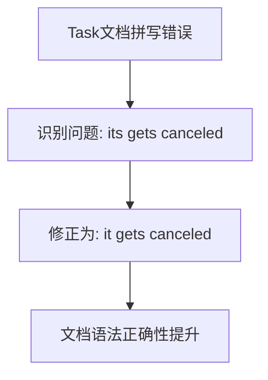

+++
title = "#21323 Fix typo in `Task` docs"
date = "2025-10-01T00:00:00"
draft = false
template = "pull_request_page.html"
in_search_index = false

[extra]
current_language = "zh-cn"
available_languages = {"en" = { name = "English", url = "/pull_request/bevy/2025-10/pr-21323-en-20251001" }, "zh-cn" = { name = "中文", url = "/pull_request/bevy/2025-10/pr-21323-zh-cn-20251001" }}
+++

# Fix typo in `Task` docs

## 基本信息
- **标题**: Fix typo in `Task` docs
- **PR链接**: https://github.com/bevyengine/bevy/pull/21323
- **作者**: rparrett
- **状态**: 已合并
- **标签**: C-Docs, D-Trivial, S-Ready-For-Final-Review, A-Tasks
- **创建时间**: 2025-10-01T17:12:45Z
- **合并时间**: 2025-10-01T19:29:49Z
- **合并者**: mockersf

## 描述翻译
# 目标

修复 `Task` 文档中的拼写错误

## 解决方案

去掉那个烦人的 `s`

## 这个PR的故事

这是一个典型的文档维护任务，展示了即使是大型开源项目中，基础的质量保证工作也同样重要。

问题出现在 `bevy_tasks` 模块的 `Task` 结构体文档中。在描述任务被丢弃时的行为时，文档中包含了一个语法错误。原句使用了"its gets canceled"，这里"its"和"gets"之间存在主谓不一致的问题。

从技术角度来看，这个错误虽然微小，但会影响文档的专业性和可读性。对于新手开发者来说，不准确的文档可能会造成困惑，特别是在理解任务生命周期这种核心概念时。

解决方案直接而有效：将"its gets canceled"修正为"it gets canceled"。这个修改确保了主语"it"与动词"gets"在语法上保持一致，使文档更加清晰和专业。

这个修改涉及到Bevy引擎的任务系统(task system)文档。在Bevy中，`Task` 结构体代表一个异步任务，它可以被spawn到任务池中执行。文档准确描述了当任务被丢弃时的行为 - 任务会被取消，并且不会再被轮询(polled)。

从工程实践的角度看，这类文档维护工作虽然简单，但对于保持代码库的质量至关重要。清晰的文档能够帮助开发者更好地理解API的预期行为，减少错误使用的可能性。

整个修复过程体现了开源项目的协作精神：一个开发者发现了问题，提交了最小且精确的修复，维护者快速审查并合并了这个改进。

## 可视化表示



## 关键文件变更

- `crates/bevy_tasks/src/task.rs` (+1/-1)

这个文件包含了Bevy任务系统的核心实现。修改的部分是`Task`结构体的文档注释：

```rust
// File: crates/bevy_tasks/src/task.rs
// Before:
/// When a task is dropped, its gets canceled and won't be polled again. To cancel a task a bit
/// more gracefully and wait until it stops running, use the [`Task::cancel()`] method.

// After:
/// When a task is dropped, it gets canceled and won't be polled again. To cancel a task a bit
/// more gracefully and wait until it stops running, use the [`Task::cancel()`] method.
```

这个修改修复了文档中的语法错误，将"its gets canceled"修正为"it gets canceled"，使文档更加专业和准确。

## 进一步阅读

- [Bevy Tasks模块文档](https://docs.rs/bevy_tasks/latest/bevy_tasks/)
- [Rust文档注释指南](https://doc.rust-lang.org/rustdoc/how-to-write-documentation.html)
- [Bevy异步任务系统](https://bevy-cheatbook.github.io/programming/tasks.html)

# 完整代码差异
```diff
diff --git a/crates/bevy_tasks/src/task.rs b/crates/bevy_tasks/src/task.rs
index dd649ba47dca3..4f2a62e975f13 100644
--- a/crates/bevy_tasks/src/task.rs
+++ b/crates/bevy_tasks/src/task.rs
@@ -11,7 +11,7 @@ use crate::cfg;
 ///
 /// Tasks are also futures themselves and yield the output of the spawned future.
 ///
-/// When a task is dropped, its gets canceled and won't be polled again. To cancel a task a bit
+/// When a task is dropped, it gets canceled and won't be polled again. To cancel a task a bit
 /// more gracefully and wait until it stops running, use the [`Task::cancel()`] method.
 ///
 /// Tasks that panic get immediately canceled. Awaiting a canceled task also causes a panic.
```