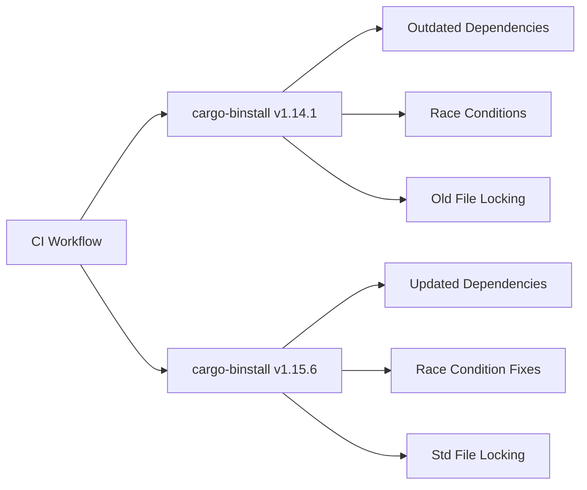

+++
title = "#21324 Update `cargo-binstall` to v1.15.6"
date = "2025-10-01T00:00:00"
draft = false
template = "pull_request_page.html"
in_search_index = true

[taxonomies]
list_display = ["show"]

[extra]
current_language = "en"
available_languages = {"en" = { name = "English", url = "/pull_request/bevy/2025-10/pr-21324-en-20251001" }, "zh-cn" = { name = "中文", url = "/pull_request/bevy/2025-10/pr-21324-zh-cn-20251001" }}
labels = ["A-Build-System", "C-Dependencies", "D-Straightforward"]
+++

# Title

## Basic Information
- **Title**: Update `cargo-binstall` to v1.15.6
- **PR Link**: https://github.com/bevyengine/bevy/pull/21324
- **Author**: BD103
- **Status**: MERGED
- **Labels**: A-Build-System, C-Dependencies, S-Ready-For-Final-Review, X-Uncontroversial, D-Straightforward
- **Created**: 2025-10-01T18:39:17Z
- **Merged**: 2025-10-01T19:46:44Z
- **Merged By**: alice-i-cecile

## Description Translation

# Objective

- Adopted from #21271.
- `cargo-binstall` in CI is outdated, let's update!

## Solution

- Update to v1.15.6 from v1.14.1.

## Testing

- As it's run in CI, the best way to test is to run CI! :)

## Notable Changes

- [v1.14.2](https://github.com/cargo-bins/cargo-binstall/releases/tag/v1.14.2) - Dependency updates
- [v1.14.3](https://github.com/cargo-bins/cargo-binstall/releases/tag/v1.14.3) - Fixes race condition
- [v1.14.4](https://github.com/cargo-bins/cargo-binstall/releases/tag/v1.14.4) - Switch from `fs4` to `std` for file locking
- [v1.15.0](https://github.com/cargo-bins/cargo-binstall/releases/tag/v1.15.0) - Prompt when using Quickinstall. ~~This may cause some issues in CI, I need to investigate it further.~~
- [v1.15.1](https://github.com/cargo-bins/cargo-binstall/releases/tag/v1.15.1) - Fix issues with manifest file and Quickinstall prompt
- [v1.15.2](https://github.com/cargo-bins/cargo-binstall/releases/tag/v1.15.2) - Fix updating telemetry config file
- [v1.15.3](https://github.com/cargo-bins/cargo-binstall/releases/tag/v1.15.3) - Stop building for x86 MacOS
- [v1.15.4](https://github.com/cargo-bins/cargo-binstall/releases/tag/v1.15.4) - Docs and dependencies
- [v1.15.5](https://github.com/cargo-bins/cargo-binstall/releases/tag/v1.15.5) - Support Socks5 proxy
- [v1.15.6](https://github.com/cargo-bins/cargo-binstall/releases/tag/v1.15.6) - Update dependencies

## The Story of This Pull Request

This PR addresses a straightforward but important maintenance task: updating the version of `cargo-binstall` used in Bevy's CI pipeline from v1.14.1 to v1.15.6. The update was necessary because the existing version was outdated and missing several important improvements and bug fixes.

The problem was identified through issue #21271, which highlighted that the CI was running with an older version of the tool. `cargo-binstall` is a binary installer for Rust projects that helps quickly install Rust binaries without compiling from source, making it an important component of the CI workflow for installing development tools efficiently.

The solution approach was direct and practical: update the version references in the CI configuration file to point to the latest stable release. The developer took a methodical approach by reviewing the release notes for each version between the current and target versions, noting important changes that could affect CI behavior. This included checking for potential breaking changes, particularly around the Quickinstall prompt introduced in v1.15.0, which the developer initially flagged for further investigation but later confirmed was fixed in subsequent releases.

The implementation required only two simple changes in the `.github/workflows/ci.yml` file, updating both the environment variable defining the version and the GitHub Action step that uses `cargo-binstall`. This ensures consistency between the version referenced in the environment and the version actually used by the action.

From a technical perspective, this update brings several important improvements to the CI system:

- Race condition fixes in v1.14.3 improve reliability when multiple CI jobs run concurrently
- The switch from `fs4` to standard library file locking in v1.14.4 reduces external dependencies
- Various dependency updates improve security and performance
- Support for SOCKS5 proxy in v1.15.5 enhances network flexibility
- Removal of x86 macOS support in v1.15.3 reflects current platform requirements

The impact of these changes is primarily in CI reliability and performance. The race condition fix alone could prevent intermittent CI failures, while the dependency updates ensure the toolchain remains secure and efficient. The changes are low-risk because they only affect the CI infrastructure, not the core Bevy codebase, and the testing strategy of "run CI to test CI" is appropriate for this type of change.

## Visual Representation



## Key Files Changed

### `.github/workflows/ci.yml` (+2/-2)

This file contains the GitHub Actions workflow configuration for Bevy's continuous integration. The changes update the version of `cargo-binstall` used in the CI pipeline.

**Key modifications:**

```yaml
# File: .github/workflows/ci.yml
# Before:
env:
  # If nightly is breaking CI, modify this variable to target a specific nightly version.
  NIGHTLY_TOOLCHAIN: nightly
  RUSTFLAGS: "-D warnings"
  BINSTALL_VERSION: "v1.14.1"

# ... later in the file ...
      # Update in sync with BINSTALL_VERSION
      - uses: cargo-bins/cargo-binstall@v1.15.4

# After:
env:
  # If nightly is breaking CI, modify this variable to target a specific nightly version.
  NIGHTLY_TOOLCHAIN: nightly
  RUSTFLAGS: "-D warnings"
  BINSTALL_VERSION: "v1.15.6"

# ... later in the file ...
      # Update in sync with BINSTALL_VERSION
      - uses: cargo-bins/cargo-binstall@v1.15.6
```

These changes ensure that both the environment variable and the GitHub Action reference the same version of `cargo-binstall`, maintaining consistency in the CI pipeline. The comment "Update in sync with BINSTALL_VERSION" indicates the intentional synchronization between these two values.

## Further Reading

- [cargo-binstall GitHub Repository](https://github.com/cargo-bins/cargo-binstall)
- [cargo-binstall Releases](https://github.com/cargo-bins/cargo-binstall/releases)
- [GitHub Actions Documentation](https://docs.github.com/en/actions)
- [Rust CI Best Practices](https://github.com/rust-unofficial/patterns/blob/master/patterns/ci.md)