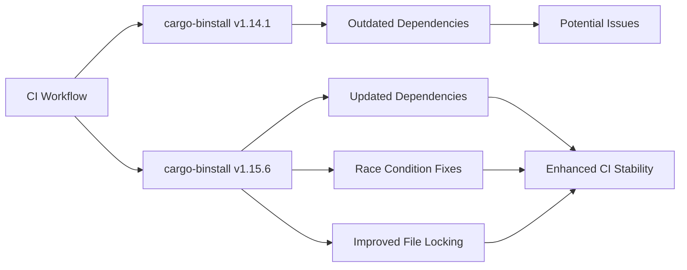

+++
title = "#21324 Update `cargo-binstall` to v1.15.6"
date = "2025-10-01T00:00:00"
draft = false
template = "pull_request_page.html"
in_search_index = false

[extra]
current_language = "zh-cn"
available_languages = {"en" = { name = "English", url = "/pull_request/bevy/2025-10/pr-21324-en-20251001" }, "zh-cn" = { name = "中文", url = "/pull_request/bevy/2025-10/pr-21324-zh-cn-20251001" }}
labels = ["A-Build-System", "C-Dependencies", "D-Straightforward"]
+++

# Title
Update `cargo-binstall` to v1.15.6

## Basic Information
- **Title**: Update `cargo-binstall` to v1.15.6
- **PR Link**: https://github.com/bevyengine/bevy/pull/21324
- **Author**: BD103
- **Status**: MERGED
- **Labels**: A-Build-System, C-Dependencies, S-Ready-For-Final-Review, X-Uncontroversial, D-Straightforward
- **Created**: 2025-10-01T18:39:17Z
- **Merged**: 2025-10-01T19:46:44Z
- **Merged By**: alice-i-cecile

## Description Translation
# 目标

- 从 #21271 采纳。
- CI 中的 `cargo-binstall` 版本过旧，需要更新！

## 解决方案

- 从 v1.14.1 更新到 v1.15.6。

## 测试

- 由于它在 CI 中运行，最好的测试方法就是运行 CI！:)

## 重要变更

- [v1.14.2](https://github.com/cargo-bins/cargo-binstall/releases/tag/v1.14.2) - 依赖更新
- [v1.14.3](https://github.com/cargo-bins/cargo-binstall/releases/tag/v1.14.3) - 修复竞态条件
- [v1.14.4](https://github.com/cargo-bins/cargo-binstall/releases/tag/v1.14.4) - 从 `fs4` 切换到 `std` 进行文件锁定
- [v1.15.0](https://github.com/cargo-bins/cargo-binstall/releases/tag/v1.15.0) - 使用 Quickinstall 时提示。~~这可能会在 CI 中引起一些问题，我需要进一步调查。~~
- [v1.15.1](https://github.com/cargo-bins/cargo-binstall/releases/tag/v1.15.1) - 修复清单文件和 Quickinstall 提示的问题
- [v1.15.2](https://github.com/cargo-bins/cargo-binstall/releases/tag/v1.15.2) - 修复更新遥测配置文件
- [v1.15.3](https://github.com/cargo-bins/cargo-binstall/releases/tag/v1.15.3) - 停止为 x86 MacOS 构建
- [v1.15.4](https://github.com/cargo-bins/cargo-binstall/releases/tag/v1.15.4) - 文档和依赖
- [v1.15.5](https://github.com/cargo-bins/cargo-binstall/releases/tag/v1.15.5) - 支持 Socks5 代理
- [v1.15.6](https://github.com/cargo-bins/cargo-binstall/releases/tag/v1.15.6) - 更新依赖

## The Story of This Pull Request

这个 PR 的故事始于一个简单的需求：保持构建工具链的现代化。BD103 注意到 Bevy 项目的持续集成（CI）环境中使用的 `cargo-binstall` 版本已经落后于最新发布版本。从 v1.14.1 到 v1.15.6，`cargo-binstall` 经历了多个版本的迭代，包含了重要的修复和改进。

在软件工程实践中，保持依赖项更新是维护项目健康的重要环节。过时的依赖可能导致安全漏洞、性能问题和兼容性风险。BD103 识别到这个问题后，决定采用从 #21271 中提出的方案，将 `cargo-binstall` 更新到最新稳定版本。

这个更新过程看似简单，但实际上包含了多个技术层面的考量。从 v1.14.1 到 v1.15.6 的版本跨度中，有几个关键的技术改进值得关注：

首先，v1.14.3 修复了竞态条件（race condition）问题，这对于 CI 环境的稳定性至关重要。竞态条件在多进程或并发环境中可能导致不可预测的行为，修复这个问题提高了工具在并行构建场景下的可靠性。

其次，v1.14.4 将文件锁定机制从 `fs4` 切换到标准库的 `std` 实现。这个改变减少了外部依赖，提高了工具的稳定性和兼容性，因为标准库的实现通常更加成熟和广泛测试。

v1.15.0 版本引入的 Quickinstall 提示功能最初引起了 BD103 的关注，因为交互式提示在非交互式的 CI 环境中可能导致问题。但后续的 v1.15.1 版本专门修复了这个问题，确保在 CI 环境中不会因提示而中断构建流程。

从技术实现角度看，这个更新只需要修改 CI 配置文件中的版本字符串。但 BD103 的谨慎态度体现在对每个中间版本变更的详细审查上，确保没有引入会破坏现有 CI 流程的变更。

```yaml
# 更新前
env:
  BINSTALL_VERSION: "v1.14.1"

# 更新后  
env:
  BINSTALL_VERSION: "v1.15.6"
```

测试策略也体现了实用主义思想。由于 `cargo-binstall` 主要在 CI 环境中使用，最有效的验证方法就是运行完整的 CI 流程。这种"在生产环境中测试"的方法对于基础设施工具来说是合理的选择。

这个 PR 的标签（A-Build-System, C-Dependencies, X-Uncontroversial, D-Straightforward）准确地反映了变更的性质：这是一个直截了当的依赖更新，不涉及核心代码逻辑的修改，但对构建系统的健康维护很重要。

从工程管理的角度看，这个 PR 展示了良好的依赖管理实践：定期审查和更新工具链，详细记录版本变更内容，以及通过 CI 进行自动化验证。这种维护性工作虽然不引人注目，但对于长期项目健康至关重要。

## Visual Representation



## Key Files Changed

### `.github/workflows/ci.yml` (+2/-2)

这个文件包含了 GitHub Actions CI 工作流的配置。更新涉及两个关键位置：

1. **环境变量定义**：更新了 `BINSTALL_VERSION` 环境变量
2. **Action 使用**：更新了 `cargo-bins/cargo-binstall` Action 的版本

```yaml
# 文件: .github/workflows/ci.yml
# 更新前:
env:
  # ... 其他环境变量
  BINSTALL_VERSION: "v1.14.1"

# 更新后:
env:
  # ... 其他环境变量  
  BINSTALL_VERSION: "v1.15.6"
```

```yaml
# 文件: .github/workflows/ci.yml  
# 更新前:
      # Update in sync with BINSTALL_VERSION
      - uses: cargo-bins/cargo-binstall@v1.15.4

# 更新后:
      # Update in sync with BINSTALL_VERSION
      - uses: cargo-bins/cargo-binstall@v1.15.6
```

这些变更确保了 CI 环境中使用的 `cargo-binstall` 版本与配置的环境变量保持一致，避免了版本不匹配可能导致的潜在问题。

## Further Reading

- [cargo-binstall 官方仓库](https://github.com/cargo-bins/cargo-binstall) - 了解这个工具的更多功能和使用方法
- [GitHub Actions 文档](https://docs.github.com/en/actions) - 深入学习 CI/CD 工作流的配置
- [Semantic Versioning](https://semver.org/) - 理解版本号管理的标准和实践
- [Dependency Management Best Practices](https://docs.github.com/en/code-security/supply-chain-security/understanding-your-software-supply-chain/about-dependency-management) - GitHub 关于依赖管理的指南

# Full Code Diff
```
diff --git a/.github/workflows/ci.yml b/.github/workflows/ci.yml
index d0d0a346b5984..ac4367d5561ad 100644
--- a/.github/workflows/ci.yml
+++ b/.github/workflows/ci.yml
@@ -19,7 +19,7 @@ env:
   # If nightly is breaking CI, modify this variable to target a specific nightly version.
   NIGHTLY_TOOLCHAIN: nightly
   RUSTFLAGS: "-D warnings"
-  BINSTALL_VERSION: "v1.14.1"
+  BINSTALL_VERSION: "v1.15.6"
 
 concurrency:
   group: ${{github.workflow}}-${{github.ref}}
@@ -318,7 +318,7 @@ jobs:
     steps:
       - uses: actions/checkout@v5
       # Update in sync with BINSTALL_VERSION
-      - uses: cargo-bins/cargo-binstall@v1.15.4
+      - uses: cargo-bins/cargo-binstall@v1.15.6
       - name: Install taplo
         run: cargo binstall taplo-cli@0.9.3 --locked
       - name: Run Taplo
```