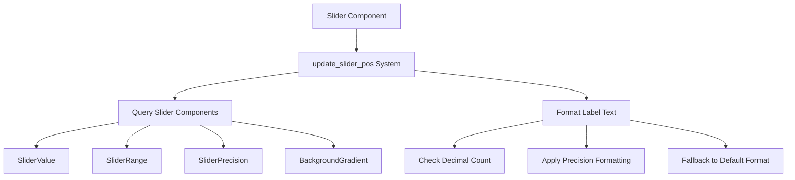

+++
title = "#21325 Use slider precision to format feathers slider label"
date = "2025-10-04T00:00:00"
draft = false
template = "pull_request_page.html"
in_search_index = true

[taxonomies]
list_display = ["show"]

[extra]
current_language = "en"
available_languages = {"en" = { name = "English", url = "/pull_request/bevy/2025-10/pr-21325-en-20251004" }, "zh-cn" = { name = "中文", url = "/pull_request/bevy/2025-10/pr-21325-zh-cn-20251004" }}
labels = ["C-Bug", "A-UI", "D-Straightforward"]
+++

# Title
Use slider precision to format feathers slider label

## Basic Information
- **Title**: Use slider precision to format feathers slider label
- **PR Link**: https://github.com/bevyengine/bevy/pull/21325
- **Author**: doup
- **Status**: MERGED
- **Labels**: C-Bug, A-UI, S-Ready-For-Final-Review, D-Straightforward
- **Created**: 2025-10-01T19:20:54Z
- **Merged**: 2025-10-04T00:47:11Z
- **Merged By**: alice-i-cecile

## Description Translation
# Objective

The slider label doesn't format consistently. For example, for precision `2` it might jump between: `20`, `20.01`, `20.02` ... `20.1`, `20.11`… which is noisy and ugly.

## Solution

Format the label using the precision.

## Testing

Checked the feathers example with `2`, `0` and `-1` precision.

## Showcase

https://github.com/user-attachments/assets/9f30200a-a832-43df-937a-123c8d3168cf

## The Story of This Pull Request

This PR addresses a UI formatting issue in Bevy's Feathers UI system where slider labels displayed inconsistent decimal formatting. The problem occurred because the slider value display was using Rust's default floating-point formatting, which doesn't maintain consistent decimal precision.

The core issue was in the `update_slider_pos` function, which updates both the slider's visual position and its text label. When a user moved a slider with precision set to 2, the label would display values like "20", "20.01", "20.02", then suddenly "20.1", "20.11" - creating visual noise as the number of decimal places changed unpredictably.

The solution involved modifying the query to include the `SliderPrecision` component and implementing conditional formatting logic. The key insight was to use the precision setting only when it would improve the display, while falling back to default formatting for values that naturally have more decimal places than the specified precision.

The implementation follows a practical approach:

```rust
let label = format!("{}", value.0);
let decimals_len = label
    .split_once('.')
    .map(|(_, decimals)| decimals.len() as i32)
    .unwrap_or(precision.0);

text.0 = if precision.0 >= 0 && decimals_len <= precision.0 {
    format!("{:.precision$}", value.0, precision = precision.0 as usize)
} else {
    label
};
```

This code first checks if the precision is non-negative and if the actual number of decimal places in the value is less than or equal to the precision setting. Only then does it apply the precision-based formatting using Rust's `{:.precision$}` format specifier. This prevents unnecessary zero-padding when the value naturally has fewer decimal places than the precision setting.

The change is minimal but effective - it adds only 17 lines while removing 4, demonstrating how a focused fix can resolve a noticeable UI issue. The solution maintains backward compatibility while providing consistent formatting behavior that matches user expectations for slider controls.

## Visual Representation



## Key Files Changed

- `crates/bevy_feathers/src/controls/slider.rs` (+21/-4)

This file contains the core logic for slider controls in the Feathers UI system. The changes modify the label formatting behavior to use precision settings consistently.

**Key modifications:**

1. Added import for `SliderPrecision`:
```rust
// Before:
use bevy_ui_widgets::{Slider, SliderRange, SliderValue, TrackClick};

// After:
use bevy_ui_widgets::{Slider, SliderPrecision, SliderRange, SliderValue, TrackClick};
```

2. Updated the query to include `SliderPrecision`:
```rust
// Before:
(Entity, &SliderValue, &SliderRange, &mut BackgroundGradient)

// After:
(Entity, &SliderValue, &SliderRange, &SliderPrecision, &mut BackgroundGradient)
```

3. Implemented the precision-based formatting logic:
```rust
// Before:
text.0 = format!("{}", value.0);

// After:
let label = format!("{}", value.0);
let decimals_len = label
    .split_once('.')
    .map(|(_, decimals)| decimals.len() as i32)
    .unwrap_or(precision.0);

// Don't format with precision if the value has more decimals than the precision
text.0 = if precision.0 >= 0 && decimals_len <= precision.0 {
    format!("{:.precision$}", value.0, precision = precision.0 as usize)
} else {
    label
};
```

## Further Reading

- [Rust Formatting Documentation](https://doc.rust-lang.org/std/fmt/) - Details on Rust's formatting syntax and precision specifiers
- [Bevy UI System](https://bevyengine.org/learn/quick-start/ui/) - Bevy's official UI documentation
- [Floating-Point Precision in UI](https://developer.mozilla.org/en-US/docs/Web/JavaScript/Reference/Global_Objects/Number/toFixed) - Similar precision formatting concepts in other languages

# Full Code Diff
diff --git a/crates/bevy_feathers/src/controls/slider.rs b/crates/bevy_feathers/src/controls/slider.rs
index 1bcb2449f9370..594174c15a7d0 100644
--- a/crates/bevy_feathers/src/controls/slider.rs
+++ b/crates/bevy_feathers/src/controls/slider.rs
@@ -23,7 +23,7 @@ use bevy_ui::{
     InteractionDisabled, InterpolationColorSpace, JustifyContent, LinearGradient, Node,
     PositionType, UiRect, Val,
 };
-use bevy_ui_widgets::{Slider, SliderRange, SliderValue, TrackClick};
+use bevy_ui_widgets::{Slider, SliderPrecision, SliderRange, SliderValue, TrackClick};
 
 use crate::{
     constants::{fonts, size},
@@ -195,7 +195,13 @@ fn set_slider_styles(
 
 fn update_slider_pos(
     mut q_sliders: Query<
-        (Entity, &SliderValue, &SliderRange, &mut BackgroundGradient),
+        (
+            Entity,
+            &SliderValue,
+            &SliderRange,
+            &SliderPrecision,
+            &mut BackgroundGradient,
+        ),
         (
             With<SliderStyle>,
             Or<(
@@ -208,7 +214,7 @@ fn update_slider_pos(
     q_children: Query<&Children>,
     mut q_slider_text: Query<&mut Text, With<SliderValueText>>,
 ) {
-    for (slider_ent, value, range, mut gradient) in q_sliders.iter_mut() {
+    for (slider_ent, value, range, precision, mut gradient) in q_sliders.iter_mut() {
         if let [Gradient::Linear(linear_gradient)] = &mut gradient.0[..] {
             let percent_value = range.thumb_position(value.0) * 100.0;
             linear_gradient.stops[1].point = Val::Percent(percent_value);
@@ -218,7 +224,18 @@ fn update_slider_pos(
         // Find slider text child entity and update its text with the formatted value
         q_children.iter_descendants(slider_ent).for_each(|child| {
             if let Ok(mut text) = q_slider_text.get_mut(child) {
-                text.0 = format!("{}", value.0);
+                let label = format!("{}", value.0);
+                let decimals_len = label
+                    .split_once('.')
+                    .map(|(_, decimals)| decimals.len() as i32)
+                    .unwrap_or(precision.0);
+
+                // Don't format with precision if the value has more decimals than the precision
+                text.0 = if precision.0 >= 0 && decimals_len <= precision.0 {
+                    format!("{:.precision$}", value.0, precision = precision.0 as usize)
+                } else {
+                    label
+                };
             }
         });
     }