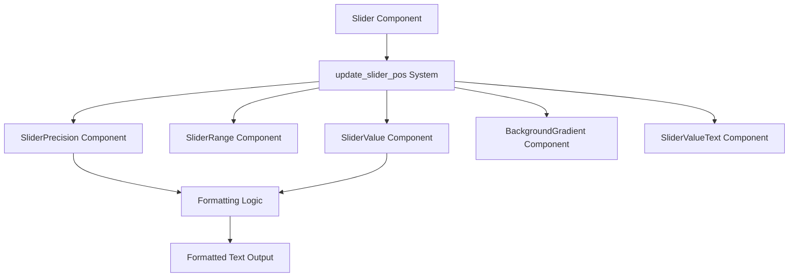

+++
title = "#21325 Use slider precision to format feathers slider label"
date = "2025-10-04T00:00:00"
draft = false
template = "pull_request_page.html"
in_search_index = false

[extra]
current_language = "zh-cn"
available_languages = {"en" = { name = "English", url = "/pull_request/bevy/2025-10/pr-21325-en-20251004" }, "zh-cn" = { name = "中文", url = "/pull_request/bevy/2025-10/pr-21325-zh-cn-20251004" }}
labels = ["C-Bug", "A-UI", "D-Straightforward"]
+++

# Title
Use slider precision to format feathers slider label

## Basic Information
- **Title**: Use slider precision to format feathers slider label
- **PR Link**: https://github.com/bevyengine/bevy/pull/21325
- **Author**: doup
- **Status**: MERGED
- **Labels**: C-Bug, A-UI, S-Ready-For-Final-Review, D-Straightforward
- **Created**: 2025-10-01T19:20:54Z
- **Merged**: 2025-10-04T00:47:11Z
- **Merged By**: alice-i-cecile

## Description Translation
# 目标

滑块标签的格式不一致。例如，对于精度 `2`，它可能会在以下格式之间跳转：`20`、`20.01`、`20.02` ... `20.1`、`20.11`... 这既嘈杂又难看。

## 解决方案

使用精度来格式化标签。

## 测试

使用精度 `2`、`0` 和 `-1` 检查了 feathers 示例。

## 展示

https://github.com/user-attachments/assets/9f30200a-a832-43df-937a-123c8d3168cf

## The Story of This Pull Request

这个PR解决了一个UI组件中的显示一致性问题。在Bevy引擎的Feathers UI系统中，滑块控件的数值标签显示存在格式不一致的问题，这影响了用户体验和界面的专业性。

问题的核心在于滑块数值的格式化逻辑。当用户设置滑块精度为2时，期望看到的是两位小数的稳定显示，如"20.00"、"20.01"、"20.02"。但实际实现中，数值标签会随着滑块移动在"20"、"20.01"、"20.02"、"20.1"、"20.11"等不同格式间跳转。这种不一致的显示给用户带来了视觉干扰，也显得不够专业。

开发者识别到问题的根源在于文本格式化逻辑没有充分利用滑块组件已有的精度设置。在原有的实现中，滑块数值被简单地转换为字符串，没有考虑精度控制：

```rust
// 修改前的代码
text.0 = format!("{}", value.0);
```

解决方案的关键洞察是：滑块组件已经包含了`SliderPrecision`组件，这个组件定义了期望的显示精度，但没有在标签格式化中被使用。开发者通过扩展系统查询来包含精度信息，然后应用标准的Rust浮点数格式化功能。

技术实现上，开发者采用了渐进式的改进方法。首先修改系统查询，添加对`SliderPrecision`组件的访问：

```rust
// 修改后的查询
(Entity, &SliderValue, &SliderRange, &SliderPrecision, &mut BackgroundGradient)
```

然后实现了智能的格式化逻辑，既考虑了精度设置，又保留了原始数值的完整性：

```rust
let label = format!("{}", value.0);
let decimals_len = label
    .split_once('.')
    .map(|(_, decimals)| decimals.len() as i32)
    .unwrap_or(precision.0);

// 只有当精度非负且原始数值的小数位数不超过精度时才应用格式化
text.0 = if precision.0 >= 0 && decimals_len <= precision.0 {
    format!("{:.precision$}", value.0, precision = precision.0 as usize)
} else {
    label
};
```

这个实现体现了几个重要的工程决策：

1. **向后兼容性**：当精度设置为负值时，系统会回退到原始行为，保持与现有代码的兼容性。

2. **数据完整性保护**：如果原始数值的小数位数超过精度设置，系统会显示完整数值而不是截断，避免信息丢失。

3. **性能考虑**：通过简单的字符串分析和条件判断，避免了不必要的格式化操作。

从架构角度看，这个修改很好地遵循了Bevy的ECS模式。系统现在正确地利用了所有相关的组件数据（`SliderValue`、`SliderRange`、`SliderPrecision`）来生成一致的UI显示。这种设计保持了组件的单一职责原则，同时让系统能够组合不同的组件功能。

这个修复虽然代码量不大，但对用户体验有显著改善。它展示了在UI系统中正确处理数值格式化的最佳实践，也为其他类似的控件提供了参考实现。

## Visual Representation



## Key Files Changed

### `crates/bevy_feathers/src/controls/slider.rs` (+21/-4)

这个文件包含了滑块控件的核心实现。修改主要集中在数值标签的格式化逻辑上。

**主要变更：**

1. **导入添加**：添加了`SliderPrecision`的导入
2. **系统查询扩展**：更新了`update_slider_pos`系统的查询以包含精度信息
3. **格式化逻辑改进**：实现了基于精度的智能数值格式化

**代码对比：**

```rust
// 修改前：
fn update_slider_pos(
    mut q_sliders: Query<
        (Entity, &SliderValue, &SliderRange, &mut BackgroundGradient),
        // ...
    >,
    // ...
) {
    for (slider_ent, value, range, mut gradient) in q_sliders.iter_mut() {
        // ... 渐变更新逻辑
        
        // 简单的数值显示
        q_children.iter_descendants(slider_ent).for_each(|child| {
            if let Ok(mut text) = q_slider_text.get_mut(child) {
                text.0 = format!("{}", value.0);  // 直接转换为字符串
            }
        });
    }
}

// 修改后：
fn update_slider_pos(
    mut q_sliders: Query<
        (
            Entity,
            &SliderValue,
            &SliderRange,
            &SliderPrecision,  // 新增精度查询
            &mut BackgroundGradient,
        ),
        // ...
    >,
    // ...
) {
    for (slider_ent, value, range, precision, mut gradient) in q_sliders.iter_mut() {
        // ... 渐变更新逻辑保持不变
        
        // 智能的数值格式化
        q_children.iter_descendants(slider_ent).for_each(|child| {
            if let Ok(mut text) = q_slider_text.get_mut(child) {
                let label = format!("{}", value.0);
                let decimals_len = label
                    .split_once('.')
                    .map(|(_, decimals)| decimals.len() as i32)
                    .unwrap_or(precision.0);

                // 基于精度的条件格式化
                text.0 = if precision.0 >= 0 && decimals_len <= precision.0 {
                    format!("{:.precision$}", value.0, precision = precision.0 as usize)
                } else {
                    label
                };
            }
        });
    }
}
```

这些修改确保了滑块数值标签能够根据精度设置进行一致的格式化，解决了原始问题中的显示不一致性。

## Further Reading

- [Rust 格式化语法文档](https://doc.rust-lang.org/std/fmt/) - 了解Rust中数值格式化的各种选项
- [Bevy UI 系统文档](https://bevyengine.org/learn/quick-start/ecs/) - 了解Bevy的实体组件系统架构
- [浮点数精度处理最佳实践](https://floating-point-gui.de/) - 关于浮点数显示和精度的综合指南

# Full Code Diff
```diff
diff --git a/crates/bevy_feathers/src/controls/slider.rs b/crates/bevy_feathers/src/controls/slider.rs
index 1bcb2449f9370..594174c15a7d0 100644
--- a/crates/bevy_feathers/src/controls/slider.rs
+++ b/crates/bevy_feathers/src/controls/slider.rs
@@ -23,7 +23,7 @@ use bevy_ui::{
     InteractionDisabled, InterpolationColorSpace, JustifyContent, LinearGradient, Node,
     PositionType, UiRect, Val,
 };
-use bevy_ui_widgets::{Slider, SliderRange, SliderValue, TrackClick};
+use bevy_ui_widgets::{Slider, SliderPrecision, SliderRange, SliderValue, TrackClick};
 
 use crate::{
     constants::{fonts, size},
@@ -195,7 +195,13 @@ fn set_slider_styles(
 
 fn update_slider_pos(
     mut q_sliders: Query<
-        (Entity, &SliderValue, &SliderRange, &mut BackgroundGradient),
+        (
+            Entity,
+            &SliderValue,
+            &SliderRange,
+            &SliderPrecision,
+            &mut BackgroundGradient,
+        ),
         (
             With<SliderStyle>,
             Or<(
@@ -208,7 +214,7 @@ fn update_slider_pos(
     q_children: Query<&Children>,
     mut q_slider_text: Query<&mut Text, With<SliderValueText>>,
 ) {
-    for (slider_ent, value, range, mut gradient) in q_sliders.iter_mut() {
+    for (slider_ent, value, range, precision, mut gradient) in q_sliders.iter_mut() {
         if let [Gradient::Linear(linear_gradient)] = &mut gradient.0[..] {
             let percent_value = range.thumb_position(value.0) * 100.0;
             linear_gradient.stops[1].point = Val::Percent(percent_value);
@@ -218,7 +224,18 @@ fn update_slider_pos(
         // Find slider text child entity and update its text with the formatted value
         q_children.iter_descendants(slider_ent).for_each(|child| {
             if let Ok(mut text) = q_slider_text.get_mut(child) {
-                text.0 = format!("{}", value.0);
+                let label = format!("{}", value.0);
+                let decimals_len = label
+                    .split_once('.')
+                    .map(|(_, decimals)| decimals.len() as i32)
+                    .unwrap_or(precision.0);
+
+                // Don't format with precision if the value has more decimals than the precision
+                text.0 = if precision.0 >= 0 && decimals_len <= precision.0 {
+                    format!("{:.precision$}", value.0, precision = precision.0 as usize)
+                } else {
+                    label
+                };
             }
         });
     }
```