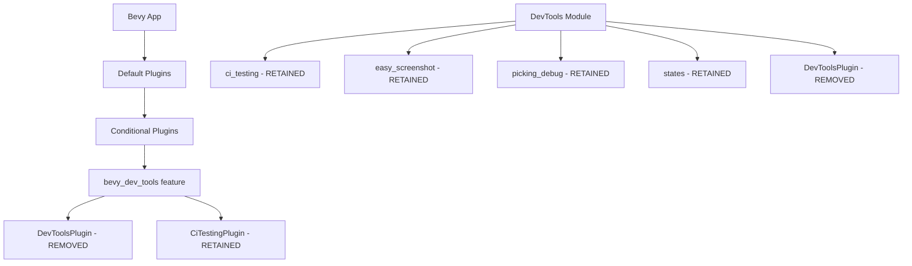

+++
title = "#21328 Remove empty DevToolsPlugin"
date = "2025-10-01T00:00:00"
draft = false
template = "pull_request_page.html"
in_search_index = true

[taxonomies]
list_display = ["show"]

[extra]
current_language = "en"
available_languages = {"en" = { name = "English", url = "/pull_request/bevy/2025-10/pr-21328-en-20251001" }, "zh-cn" = { name = "中文", url = "/pull_request/bevy/2025-10/pr-21328-zh-cn-20251001" }}
labels = ["C-Code-Quality", "A-Dev-Tools", "D-Straightforward"]
+++

# Remove empty DevToolsPlugin

## Basic Information
- **Title**: Remove empty DevToolsPlugin
- **PR Link**: https://github.com/bevyengine/bevy/pull/21328
- **Author**: dloukadakis
- **Status**: MERGED
- **Labels**: C-Code-Quality, A-Dev-Tools, D-Straightforward
- **Created**: 2025-10-01T19:42:14Z
- **Merged**: 2025-10-01T20:33:23Z
- **Merged By**: james7132

## Description Translation
# Objective

Resolves #21291

## Solution

Remove the empty DevToolsPlugin

## The Story of This Pull Request

This PR addresses a straightforward code quality issue in the Bevy engine's developer tools module. The problem was simple: the `DevToolsPlugin` struct existed but contained no functionality - it was essentially dead code that served no purpose.

The issue originated from the fact that the `DevToolsPlugin` was defined as a Bevy plugin but had an empty implementation. When examining the plugin's build method:

```rust
impl Plugin for DevToolsPlugin {
    fn build(&self, _app: &mut App) {}
}
```

The method received an `App` instance but performed no operations on it. This pattern is typically used for plugins that register systems, resources, or other app extensions, but in this case, the plugin was completely inert.

The developer tools module (`bevy_dev_tools`) contains several useful submodules like `ci_testing`, `easy_screenshot`, `picking_debug`, and `states`, but the main `DevToolsPlugin` itself didn't actually integrate any of these components. The individual features were likely being registered elsewhere or through different mechanisms.

The solution was a clean removal of the empty plugin. This approach follows the principle that unused code should be eliminated to reduce maintenance burden, improve code clarity, and prevent confusion for developers who might expect the plugin to actually do something.

From an architectural perspective, this change simplifies the plugin registration chain. The `DevToolsPlugin` was conditionally included in Bevy's default plugins when the `bevy_dev_tools` feature was enabled:

```rust
#[cfg(feature = "bevy_dev_tools")]
bevy_dev_tools:::DevToolsPlugin,
```

Removing this line means one less plugin to initialize during app startup, even if the plugin was empty. While the performance impact would be negligible, it contributes to cleaner dependency management and build times.

The removal also eliminates potential confusion for developers who might have been looking at the plugin's extensive documentation comments and wondering what functionality it actually provided. The comments described various ways to enable developer tools, but the plugin itself did nothing.

This change demonstrates good code hygiene practices - regularly auditing and removing dead code helps maintain a clean, understandable codebase. It's a small but meaningful improvement that makes the codebase more honest about what it actually does.

## Visual Representation



## Key Files Changed

### `crates/bevy_dev_tools/src/lib.rs` (+0/-36)

This file contained the main definition of the empty `DevToolsPlugin`. The changes removed:

1. The unused import: `use bevy_app::prelude::*;`
2. The entire `DevToolsPlugin` struct definition and its `Plugin` implementation
3. Extensive documentation comments that were no longer relevant

**Code removed:**
```rust
use bevy_app::prelude::*;

// ... other code ...

/// Enables developer tools in an [`App`]. This plugin is added automatically with `bevy_dev_tools`
/// feature.
///
/// Warning: It is not recommended to enable this in final shipped games or applications.
/// Dev tools provide a high level of access to the internals of your application,
/// and may interfere with ordinary use and gameplay.
///
/// To enable developer tools, you can either:
///
/// - Create a custom crate feature (e.g "`dev_mode`"), which enables the `bevy_dev_tools` feature
///   along with any other development tools you might be using:
///
/// ```toml
/// [feature]
/// dev_mode = ["bevy/bevy_dev_tools", "other_dev_tools"]
/// ```
///
/// - Use `--feature bevy/bevy_dev_tools` flag when using the `cargo run` command:
///
/// `cargo run --features bevy/bevy_dev_tools`
///
/// - Add the `bevy_dev_tools` feature to the bevy dependency in your `Cargo.toml` file:
///
/// `features = ["bevy_dev_tools"]`
///
///  Note: The third method is not recommended, as it requires you to remove the feature before
///  creating a build for release to the public.
#[derive(Default)]
pub struct DevToolsPlugin;

impl Plugin for DevToolsPlugin {
    fn build(&self, _app: &mut App) {}
}
```

### `crates/bevy_internal/src/default_plugins.rs` (+0/-2)

This file contained the registration of the `DevToolsPlugin` in Bevy's default plugin set. The change removed the conditional inclusion of the empty plugin.

**Code removed:**
```rust
#[cfg(feature = "bevy_dev_tools")]
bevy_dev_tools:::DevToolsPlugin,
```

## Further Reading

- [Bevy Plugin System Documentation](https://docs.rs/bevy/latest/bevy/app/trait.Plugin.html)
- [Rust Dead Code Detection](https://doc.rust-lang.org/rustc/lints/listing/warn-by-default.html#dead-code)
- [Code Quality Best Practices](https://rust-unofficial.github.io/patterns/patterns/structural.html)

# Full Code Diff
```diff
diff --git a/crates/bevy_dev_tools/src/lib.rs b/crates/bevy_dev_tools/src/lib.rs
index 10097ef2142e5..c6c1ca9204105 100644
--- a/crates/bevy_dev_tools/src/lib.rs
+++ b/crates/bevy_dev_tools/src/lib.rs
@@ -8,8 +8,6 @@
 //! This crate provides additional utilities for the [Bevy game engine](https://bevy.org),
 //! focused on improving developer experience.
 
-use bevy_app::prelude::*;
-
 #[cfg(feature = "bevy_ci_testing")]
 pub mod ci_testing;
 
@@ -22,37 +20,3 @@ pub mod picking_debug;
 pub mod states;
 
 pub use easy_screenshot::*;
-
-/// Enables developer tools in an [`App`]. This plugin is added automatically with `bevy_dev_tools`
-/// feature.
-///
-/// Warning: It is not recommended to enable this in final shipped games or applications.
-/// Dev tools provide a high level of access to the internals of your application,
-/// and may interfere with ordinary use and gameplay.
-///
-/// To enable developer tools, you can either:
-///
-/// - Create a custom crate feature (e.g "`dev_mode`"), which enables the `bevy_dev_tools` feature
-///   along with any other development tools you might be using:
-///
-/// ```toml
-/// [feature]
-/// dev_mode = ["bevy/bevy_dev_tools", "other_dev_tools"]
-/// ```
-///
-/// - Use `--feature bevy/bevy_dev_tools` flag when using the `cargo run` command:
-///
-/// `cargo run --features bevy/bevy_dev_tools`
-///
-/// - Add the `bevy_dev_tools` feature to the bevy dependency in your `Cargo.toml` file:
-///
-/// `features = ["bevy_dev_tools"]`
-///
-///  Note: The third method is not recommended, as it requires you to remove the feature before
-///  creating a build for release to the public.
-#[derive(Default)]
-pub struct DevToolsPlugin;
-
-impl Plugin for DevToolsPlugin {
-    fn build(&self, _app: &mut App) {}
-}
diff --git a/crates/bevy_internal/src/default_plugins.rs b/crates/bevy_internal/src/default_plugins.rs
index 4467da12f4f11..a1c41b0645f2a 100644
--- a/crates/bevy_internal/src/default_plugins.rs
+++ b/crates/bevy_internal/src/default_plugins.rs
@@ -80,8 +80,6 @@ plugin_group! {
         bevy_gizmos:::GizmoPlugin,
         #[cfg(feature = "bevy_state")]
         bevy_state::app:::StatesPlugin,
-        #[cfg(feature = "bevy_dev_tools")]
-        bevy_dev_tools:::DevToolsPlugin,
         #[cfg(feature = "bevy_ci_testing")]
         bevy_dev_tools::ci_testing:::CiTestingPlugin,
         #[cfg(feature = "hotpatching")]
```