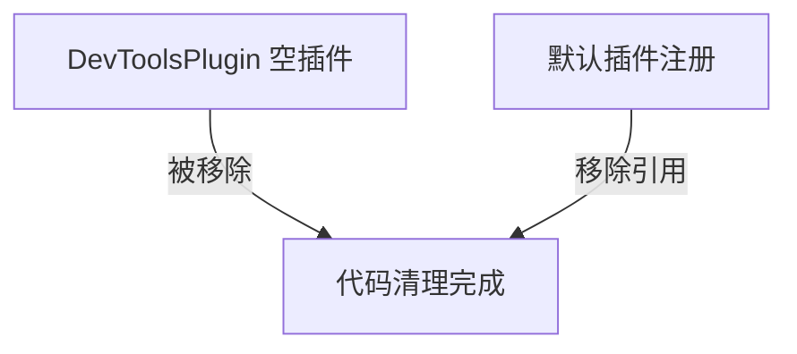

+++
title = "#21328 Remove empty DevToolsPlugin"
date = "2025-10-01T00:00:00"
draft = false
template = "pull_request_page.html"
in_search_index = false

[extra]
current_language = "zh-cn"
available_languages = {"en" = { name = "English", url = "/pull_request/bevy/2025-10/pr-21328-en-20251001" }, "zh-cn" = { name = "中文", url = "/pull_request/bevy/2025-10/pr-21328-zh-cn-20251001" }}
labels = ["C-Code-Quality", "A-Dev-Tools", "D-Straightforward"]
+++

# Remove empty DevToolsPlugin

## Basic Information
- **Title**: Remove empty DevToolsPlugin
- **PR Link**: https://github.com/bevyengine/bevy/pull/21328
- **Author**: dloukadakis
- **Status**: MERGED
- **Labels**: C-Code-Quality, A-Dev-Tools, D-Straightforward
- **Created**: 2025-10-01T19:42:14Z
- **Merged**: 2025-10-01T20:33:23Z
- **Merged By**: james7132

## Description Translation
# Objective

解决 #21291

## Solution

移除空的 DevToolsPlugin

## The Story of This Pull Request

这个PR解决了一个简单的代码质量问题：从Bevy引擎中移除一个空的开发者工具插件。问题背景是DevToolsPlugin在代码库中存在，但实际上没有任何功能实现，只是一个空壳。

在软件工程中，空的代码结构会增加维护负担却没有实际价值。DevToolsPlugin定义了一个Plugin trait的实现，但它的build方法完全是空的：

```rust
impl Plugin for DevToolsPlugin {
    fn build(&self, _app: &mut App) {}
}
```

这种空实现会产生几个问题：首先，它给代码库增加了不必要的复杂性；其次，它可能会误导开发者认为这里应该有实际功能；最后，它占用了编译时间和二进制大小，尽管影响很小。

解决方案直接明了：完全移除这个空的插件。这涉及两个主要修改：

1. 从bevy_dev_tools库中删除DevToolsPlugin的定义和实现
2. 从默认插件注册中移除对这个插件的引用

这种清理工作体现了良好的代码卫生习惯。在大型项目如Bevy中，定期清理无用的代码可以防止技术债务积累，保持代码库的整洁和可维护性。

从技术角度看，这个变更不会影响任何现有功能，因为被移除的插件本来就是空的。它纯粹是一个代码质量改进，符合"死代码消除"的最佳实践。

## Visual Representation



## Key Files Changed

### `crates/bevy_dev_tools/src/lib.rs` (+0/-36)

这个文件移除了整个空的DevToolsPlugin定义：

```rust
// 移除的代码：
#[derive(Default)]
pub struct DevToolsPlugin;

impl Plugin for DevToolsPlugin {
    fn build(&self, _app: &mut App) {}
}
```

同时还移除了相关的导入和文档注释：
```rust
// 移除的导入：
use bevy_app::prelude::*;

// 移除的文档注释（约20行详细说明）
```

### `crates/bevy_internal/src/default_plugins.rs` (+0/-2)

这个文件从默认插件列表中移除了对DevToolsPlugin的引用：

```rust
// 移除的代码行：
#[cfg(feature = "bevy_dev_tools")]
bevy_dev_tools:::DevToolsPlugin,
```

这些更改确保了当启用`bevy_dev_tools`功能时，系统不会尝试加载一个实际上不存在的插件。

## Further Reading

- [Bevy Plugin System Documentation](https://docs.rs/bevy/latest/bevy/app/trait.Plugin.html)
- [Rust Dead Code Elimination](https://doc.rust-lang.org/rustc/codegen-options/index.html#dead-code)
- [Code Quality Best Practices](https://rust-unofficial.github.io/patterns/)

# Full Code Diff
diff --git a/crates/bevy_dev_tools/src/lib.rs b/crates/bevy_dev_tools/src/lib.rs
index 10097ef2142e5..c6c1ca9204105 100644
--- a/crates/bevy_dev_tools/src/lib.rs
+++ b/crates/bevy_dev_tools/src/lib.rs
@@ -8,8 +8,6 @@
 //! This crate provides additional utilities for the [Bevy game engine](https://bevy.org),
 //! focused on improving developer experience.
 
-use bevy_app::prelude::*;
-
 #[cfg(feature = "bevy_ci_testing")]
 pub mod ci_testing;
 
@@ -22,37 +20,3 @@ pub mod picking_debug;
 pub mod states;
 
 pub use easy_screenshot::*;
-
-/// Enables developer tools in an [`App`]. This plugin is added automatically with `bevy_dev_tools`
-/// feature.
-///
-/// Warning: It is not recommended to enable this in final shipped games or applications.
-/// Dev tools provide a high level of access to the internals of your application,
-/// and may interfere with ordinary use and gameplay.
-///
-/// To enable developer tools, you can either:
-///
-/// - Create a custom crate feature (e.g "`dev_mode`"), which enables the `bevy_dev_tools` feature
-///   along with any other development tools you might be using:
-///
-/// ```toml
-/// [feature]
-/// dev_mode = ["bevy/bevy_dev_tools", "other_dev_tools"]
-/// ```
-///
-/// - Use `--feature bevy/bevy_dev_tools` flag when using the `cargo run` command:
-///
-/// `cargo run --features bevy/bevy_dev_tools`
-///
-/// - Add the `bevy_dev_tools` feature to the bevy dependency in your `Cargo.toml` file:
-///
-/// `features = ["bevy_dev_tools"]`
-///
-///  Note: The third method is not recommended, as it requires you to remove the feature before
-///  creating a build for release to the public.
-#[derive(Default)]
-pub struct DevToolsPlugin;
-
-impl Plugin for DevToolsPlugin {
-    fn build(&self, _app: &mut App) {}
-}
diff --git a/crates/bevy_internal/src/default_plugins.rs b/crates/bevy_internal/src/default_plugins.rs
index 4467da12f4f11..a1c41b0645f2a 100644
--- a/crates/bevy_internal/src/default_plugins.rs
+++ b/crates/bevy_internal/src/default_plugins.rs
@@ -80,8 +80,6 @@ plugin_group! {
         bevy_gizmos:::GizmoPlugin,
         #[cfg(feature = "bevy_state")]
         bevy_state::app:::StatesPlugin,
-        #[cfg(feature = "bevy_dev_tools")]
-        bevy_dev_tools:::DevToolsPlugin,
         #[cfg(feature = "bevy_ci_testing")]
         bevy_dev_tools::ci_testing:::CiTestingPlugin,
         #[cfg(feature = "hotpatching")]