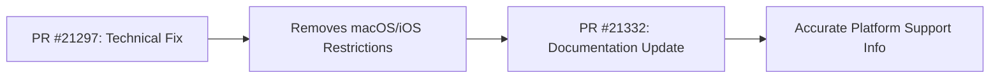

+++
title = "#21332 clustered decals docs: macOS and iOS are no longer restricted"
date = "2025-10-02T00:00:00"
draft = false
template = "pull_request_page.html"
in_search_index = true

[taxonomies]
list_display = ["show"]

[extra]
current_language = "en"
available_languages = {"en" = { name = "English", url = "/pull_request/bevy/2025-10/pr-21332-en-20251002" }, "zh-cn" = { name = "中文", url = "/pull_request/bevy/2025-10/pr-21332-zh-cn-20251002" }}
labels = ["C-Docs", "A-Rendering"]
+++

# Title
clustered decals docs: macOS and iOS are no longer restricted

## Basic Information
- **Title**: clustered decals docs: macOS and iOS are no longer restricted
- **PR Link**: https://github.com/bevyengine/bevy/pull/21332
- **Author**: ChristopherBiscardi
- **Status**: MERGED
- **Labels**: C-Docs, A-Rendering
- **Created**: 2025-10-01T23:22:11Z
- **Merged**: 2025-10-02T00:47:19Z
- **Merged By**: james7132

## Description Translation
# Objective

https://github.com/bevyengine/bevy/pull/21297 removed the restriction that prevented macos/ios from using clustered decals

## Solution

Remove them from the list of "unsupported" targets.

## The Story of This Pull Request

This PR addresses a straightforward documentation update that needed to happen after a significant technical improvement in the Bevy engine. The core issue was that the documentation for clustered decals contained outdated platform support information.

The problem originated from previous technical limitations in the Bevy rendering system. Clustered decals, which are high-quality decal projections that use bindless textures, had platform restrictions due to graphics API compatibility requirements. Specifically, macOS and iOS were previously unable to use this feature because of limitations in the WebGL 2 and WebGPU implementations on those platforms.

The technical context here involves how clustered decals work in modern graphics pipelines. They require bindless texture support, which allows shaders to access textures without explicit binding slots. This capability wasn't fully available or stable across all platforms when the original documentation was written.

The solution came in PR #21297, which removed the underlying technical restrictions that prevented macOS and iOS from using clustered decals. This was likely achieved through either improved graphics API abstraction, better fallback mechanisms, or updates to the rendering backend that made bindless texture support more widely available.

Once the technical limitation was resolved, this documentation PR became necessary to reflect the current state of platform support. The change is minimal but important because inaccurate documentation can mislead developers about what features are available on different platforms, potentially causing them to avoid using capabilities that are actually supported.

The implementation approach is purely documentation-focused. The change removes macOS and iOS from the list of unsupported platforms in the clustered decals documentation, accurately reflecting the current capabilities of the Bevy engine after the technical improvements in PR #21297.

This type of documentation maintenance is crucial in active game engine development. When underlying technical limitations are resolved, the documentation must be updated to prevent confusion and ensure developers can make full use of the engine's capabilities. The quick turnaround between the technical fix (PR #21297) and this documentation update demonstrates good development practices where documentation is treated as an integral part of the codebase.

## Visual Representation



## Key Files Changed

**File: `crates/bevy_pbr/src/decal/clustered.rs`** (+1/-1)

This file contains the documentation for Bevy's clustered decals system. The change updates the platform support information to reflect that macOS and iOS restrictions have been removed.

```rust
// File: crates/bevy_pbr/src/decal/clustered.rs
// Before:
//! Clustered decals are the highest-quality types of decals that Bevy supports,
//! but they require bindless textures. This means that they presently can't be
//! used on WebGL 2, WebGPU, macOS, or iOS. Bevy's clustered decals can be used

// After:
//! Clustered decals are the highest-quality types of decals that Bevy supports,
//! but they require bindless textures. This means that they presently can't be
//! used on WebGL 2 or WebGPU. Bevy's clustered decals can be used
```

The change removes "macOS, or iOS" from the list of unsupported platforms, leaving only WebGL 2 and WebGPU as the remaining restrictions. This directly addresses the objective of updating documentation to match the current platform support capabilities.

## Further Reading

- [Bevy Rendering Documentation](https://bevyengine.org/learn/quick-start/rendering/) - Official Bevy rendering guide
- [Bindless Textures in Graphics Programming](https://www.khronos.org/opengl/wiki/Bindless_Texture) - Technical background on bindless textures
- [WebGPU vs Native Graphics APIs](https://webgpu.io/) - Information about WebGPU limitations and capabilities
- [Bevy PBR (Physically Based Rendering)](https://github.com/bevyengine/bevy/tree/main/crates/bevy_pbr) - Source code for Bevy's PBR rendering system

# Full Code Diff
```diff
diff --git a/crates/bevy_pbr/src/decal/clustered.rs b/crates/bevy_pbr/src/decal/clustered.rs
index 7aeed1518ed77..51a141d15ae22 100644
--- a/crates/bevy_pbr/src/decal/clustered.rs
+++ b/crates/bevy_pbr/src/decal/clustered.rs
@@ -6,7 +6,7 @@
 //!
 //! Clustered decals are the highest-quality types of decals that Bevy supports,
 //! but they require bindless textures. This means that they presently can't be
-//! used on WebGL 2, WebGPU, macOS, or iOS. Bevy's clustered decals can be used
+//! used on WebGL 2 or WebGPU. Bevy's clustered decals can be used
 //! with forward or deferred rendering and don't require a prepass.
 //!
 //! On their own, clustered decals only project the base color of a texture. You
```