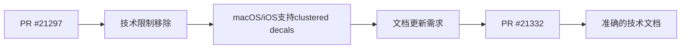

+++
title = "#21332 clustered decals docs: macOS and iOS are no longer restricted"
date = "2025-10-02T00:00:00"
draft = false
template = "pull_request_page.html"
in_search_index = false

[extra]
current_language = "zh-cn"
available_languages = {"en" = { name = "English", url = "/pull_request/bevy/2025-10/pr-21332-en-20251002" }, "zh-cn" = { name = "中文", url = "/pull_request/bevy/2025-10/pr-21332-zh-cn-20251002" }}
labels = ["C-Docs", "A-Rendering"]
+++

# clustered decals docs: macOS and iOS are no longer restricted

## Basic Information
- **Title**: clustered decals docs: macOS and iOS are no longer restricted
- **PR Link**: https://github.com/bevyengine/bevy/pull/21332
- **Author**: ChristopherBiscardi
- **Status**: MERGED
- **Labels**: C-Docs, A-Rendering
- **Created**: 2025-10-01T23:22:11Z
- **Merged**: 2025-10-02T00:47:19Z
- **Merged By**: james7132

## Description Translation
# Objective

https://github.com/bevyengine/bevy/pull/21297 移除了阻止 macOS/ios 使用 clustered decals 的限制

## Solution

将它们从"不支持"的目标列表中移除。

## The Story of This Pull Request

这个PR的核心是一个简单的文档更新，但它反映了底层渲染系统的一个重要改进。故事始于一个技术限制：Bevy引擎的clustered decals功能之前无法在macOS和iOS平台上使用。

**问题根源**在于clustered decals需要bindless textures支持，而苹果的Metal图形API在特定版本之前对此支持有限。这导致Bevy的文档明确将macOS和iOS列为不支持clustered decals的平台。

**技术突破**发生在PR #21297中，该PR解决了底层渲染问题，使得macOS和iOS现在能够支持clustered decals功能。这个技术改进意味着文档需要相应更新以反映新的平台支持状态。

**文档同步**是这个PR的主要任务。当底层技术限制被移除后，文档必须及时更新，否则会误导开发者认为某些功能仍然不可用。这种文档维护是软件工程中常见但重要的实践，确保技术实现和用户文档保持一致。

从工程角度看，这是一个典型的"文档追赶代码"的案例。当核心功能发生变更时，相关的文档、注释和示例都需要相应更新。虽然这个变更本身很小，但它体现了良好的软件维护习惯 - 及时更新文档以防止用户困惑和错误认知。

## Visual Representation



## Key Files Changed

### `crates/bevy_pbr/src/decal/clustered.rs` (+1/-1)

这个文件包含了clustered decals功能的模块级文档注释。变更非常简洁但重要：

```rust
// Before:
//! Clustered decals are the highest-quality types of decals that Bevy supports,
//! but they require bindless textures. This means that they presently can't be
//! used on WebGL 2, WebGPU, macOS, or iOS. Bevy's clustered decals can be used

// After:
//! Clustered decals are the highest-quality types of decals that Bevy supports,
//! but they require bindless textures. This means that they presently can't be
//! used on WebGL 2 or WebGPU. Bevy's clustered decals can be used
```

**变更说明**：
- 从平台限制列表中移除了"macOS"和"iOS"
- 保留了WebGL 2和WebGPU的限制说明，因为这些平台的限制仍然存在
- 更新后的文档准确反映了当前的技术现实

这个变更直接对应PR的目标：确保文档准确反映macOS和iOS现在支持clustered decals功能的事实。

## Further Reading

- [Bevy Clustered Decals Documentation](https://docs.rs/bevy_pbr/latest/bevy_pbr/decal/clustered/index.html) - 官方的clustered decals文档
- [Bindless Textures概念](https://www.khronos.org/opengl/wiki/Bindless_Texture) - 了解bindless textures技术
- [Metal图形API](https://developer.apple.com/metal/) - Apple的图形API文档

# Full Code Diff
```diff
diff --git a/crates/bevy_pbr/src/decal/clustered.rs b/crates/bevy_pbr/src/decal/clustered.rs
index 7aeed1518ed77..51a141d15ae22 100644
--- a/crates/bevy_pbr/src/decal/clustered.rs
+++ b/crates/bevy_pbr/src/decal/clustered.rs
@@ -6,7 +6,7 @@
 //!
 //! Clustered decals are the highest-quality types of decals that Bevy supports,
 //! but they require bindless textures. This means that they presently can't be
-//! used on WebGL 2, WebGPU, macOS, or iOS. Bevy's clustered decals can be used
+//! used on WebGL 2 or WebGPU. Bevy's clustered decals can be used
 //! with forward or deferred rendering and don't require a prepass.
 //!
 //! On their own, clustered decals only project the base color of a texture. You
```