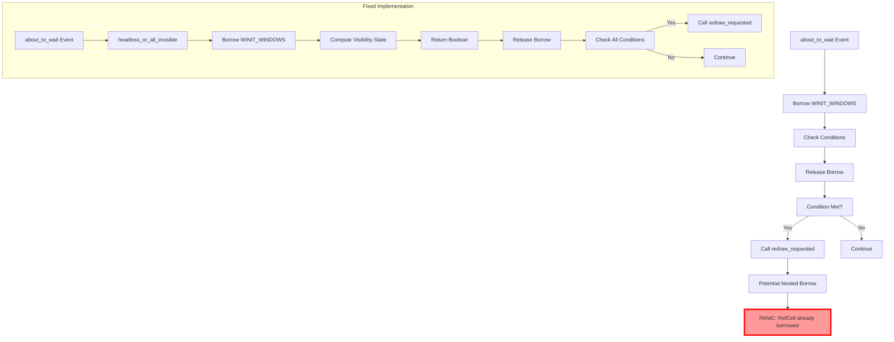

+++
title = "#21338 Avoid a \"RefCell already borrowed\" error with WINIT_WINDOWS"
date = "2025-10-03T00:00:00"
draft = false
template = "pull_request_page.html"
in_search_index = true

[taxonomies]
list_display = ["show"]

[extra]
current_language = "en"
available_languages = {"en" = { name = "English", url = "/pull_request/bevy/2025-10/pr-21338-en-20251003" }, "zh-cn" = { name = "中文", url = "/pull_request/bevy/2025-10/pr-21338-zh-cn-20251003" }}
labels = ["C-Bug", "A-Windowing", "O-Windows", "D-Straightforward"]
+++

# Title
Avoid a "RefCell already borrowed" error with WINIT_WINDOWS

## Basic Information
- **Title**: Avoid a "RefCell already borrowed" error with WINIT_WINDOWS
- **PR Link**: https://github.com/bevyengine/bevy/pull/21338
- **Author**: ejrh
- **Status**: MERGED
- **Labels**: C-Bug, A-Windowing, O-Windows, S-Ready-For-Final-Review, D-Straightforward
- **Created**: 2025-10-02T07:46:25Z
- **Merged**: 2025-10-03T02:40:38Z
- **Merged By**: james7132

## Description Translation
# Objective

Fixes #21319.

## Solution

In the "about_to_wait" state of Bevy's winit event loop, we borrow WINIT_WINDOWS only to check the conditions for a redraw, and perform the call after that check is concluded.

## Testing

Tested by confirming that the RefCell error no longer occurs in my application.  In my application, the error occurred when the `bevy-egui-inspector` crate was used.

I do not know whether the original reporter of #21319 was also using third-party Bevy plugins that might have caused the issue.  It would be good if they could check whether this change fixes it for them.

Tested on Windows 11, where the bug is known to occur.  The code that was changed is only included in Windows builds so there is little need to test on other platforms.

## The Story of This Pull Request

This PR addresses a specific race condition in Bevy's windowing system on Windows that manifested as a "RefCell already borrowed" panic. The issue occurred in the `about_to_wait` event loop handler where the code was performing a nested borrow of the WINIT_WINDOWS thread-local storage.

The core problem was in the interaction between Bevy's event processing and the WINIT_WINDOWS RefCell. In the original implementation, the code borrowed WINIT_WINDOWS and then, while still holding that borrow, called `self.redraw_requested(event_loop)`. This created a situation where if the redraw processing also needed to access WINIT_WINDOWS, it would attempt to borrow the already-borrowed RefCell, causing a panic.

The solution demonstrates a clear understanding of Rust's borrowing rules and RefCell semantics. Instead of performing the redraw request inside the WINIT_WINDOWS borrow scope, the implementation extracts the necessary state checking into a separate function `headless_or_all_invisible()`. This function performs the minimal borrow of WINIT_WINDOWS needed to determine the window visibility state, then returns a boolean result. The actual redraw request is made outside of any WINIT_WINDOWS borrow.

Here's the key transformation in the code structure:

```rust
// Before: Redraw called inside WINIT_WINDOWS borrow
WINIT_WINDOWS.with_borrow(|winit_windows| {
    // ... condition checks
    if condition {
        self.redraw_requested(event_loop); // Potential nested borrow
    }
});

// After: Conditions extracted, redraw called outside borrow
fn headless_or_all_invisible() -> bool {
    WINIT_WINDOWS.with_borrow(|winit_windows| {
        // Minimal borrow for state checking only
    })
}

if condition {
    self.redraw_requested(event_loop); // Safe outside WINIT_WINDOWS borrow
}
```

The implementation also simplifies the condition checking logic by inlining several variables that were previously computed inside the borrow scope. The `reactive` check is now done directly with a pattern match, and the `exiting` condition is checked using `self.app_exit.is_some()` directly.

This change is particularly important because it addresses a timing-sensitive bug that only manifested under specific conditions, often when third-party plugins like `bevy-egui-inspector` were involved. The fix ensures that the windowing system maintains proper borrowing discipline, preventing potential deadlocks or panics in complex application scenarios.

The Windows-specific nature of this fix is appropriate because the problematic code was already conditionally compiled only for Windows, addressing the platform-specific window creation behavior mentioned in the linked issue #18027.

## Visual Representation



## Key Files Changed

### `crates/bevy_winit/src/state.rs` (+21/-22)

This file contains the core windowing state management for Bevy's winit integration. The changes focus on the Windows-specific event handling in the `about_to_wait` method.

**Key Changes:**

1. **Extracted visibility checking into a separate function:**
```rust
// Before:
WINIT_WINDOWS.with_borrow(|winit_windows| {
    let headless = winit_windows.windows.is_empty();
    let exiting = self.app_exit.is_some();
    let reactive = matches!(self.update_mode, UpdateMode::Reactive { .. });
    let all_invisible = winit_windows
        .windows
        .iter()
        .all(|(_, w)| !w.is_visible().unwrap_or(false));
    if !exiting
        && (self.startup_forced_updates > 0
            || headless
            || all_invisible
            || reactive
            || self.window_event_received)
    {
        self.redraw_requested(event_loop);
    }
});

// After:
fn headless_or_all_invisible() -> bool {
    WINIT_WINDOWS.with_borrow(|winit_windows| {
        winit_windows
            .windows
            .iter()
            .all(|(_, w)| !w.is_visible().unwrap_or(false))
    })
}

if !self.app_exit.is_some()
    && (self.startup_forced_updates > 0
        || matches!(self.update_mode, UpdateMode::Reactive { .. })
        || self.window_event_received
        || headless_or_all_invisible())
{
    self.redraw_requested(event_loop);
}
```

2. **Minor formatting fix in test code:**
```rust
// Before:
mut window_backend_scale_factor_changed: MessageWriter<
    WindowBackendScaleFactorChanged,
>,
mut window_scale_factor_changed: MessageWriter<WindowScaleFactorChanged>| {

// After:
mut window_backend_scale_factor_changed: MessageWriter<
    WindowBackendScaleFactorChanged,
>,
mut window_scale_factor_changed: MessageWriter<WindowScaleFactorChanged>| {
```

The changes ensure that the WINIT_WINDOWS borrow is held for the shortest possible time and that no nested operations that might require re-borrowing are performed within the borrow scope.

## Further Reading

- [Rust RefCell Documentation](https://doc.rust-lang.org/std/cell/struct.RefCell.html) - Understanding interior mutability and borrowing rules
- [Bevy Window Management](https://bevyengine.org/learn/quick-start/getting-started/window/) - Bevy's windowing system overview
- [Winit Event Loop](https://docs.rs/winit/latest/winit/event_loop/struct.EventLoop.html) - Winit's event handling model
- [Thread Local Storage in Rust](https://doc.rust-lang.org/std/macro.thread_local.html) - How WINIT_WINDOWS thread-local storage works

# Full Code Diff
diff --git a/crates/bevy_winit/src/state.rs b/crates/bevy_winit/src/state.rs
index 0eef31fb96640..93db66446038e 100644
--- a/crates/bevy_winit/src/state.rs
+++ b/crates/bevy_winit/src/state.rs
@@ -466,24 +466,23 @@ impl<M: Message> ApplicationHandler<M> for WinitAppRunnerState<M> {
         // invisible window creation. https://github.com/bevyengine/bevy/issues/18027
         #[cfg(target_os = "windows")]
         {
-            WINIT_WINDOWS.with_borrow(|winit_windows| {
-                let headless = winit_windows.windows.is_empty();
-                let exiting = self.app_exit.is_some();
-                let reactive = matches!(self.update_mode, UpdateMode::Reactive { .. });
-                let all_invisible = winit_windows
-                    .windows
-                    .iter()
-                    .all(|(_, w)| !w.is_visible().unwrap_or(false));
-                if !exiting
-                    && (self.startup_forced_updates > 0
-                        || headless
-                        || all_invisible
-                        || reactive
-                        || self.window_event_received)
-                {
-                    self.redraw_requested(event_loop);
-                }
-            });
+            fn headless_or_all_invisible() -> bool {
+                WINIT_WINDOWS.with_borrow(|winit_windows| {
+                    winit_windows
+                        .windows
+                        .iter()
+                        .all(|(_, w)| !w.is_visible().unwrap_or(false))
+                })
+            }
+
+            if !self.app_exit.is_some()
+                && (self.startup_forced_updates > 0
+                    || matches!(self.update_mode, UpdateMode::Reactive { .. })
+                    || self.window_event_received
+                    || headless_or_all_invisible())
+            {
+                self.redraw_requested(event_loop);
+            }
         }
     }
 
@@ -1023,10 +1022,10 @@ mod tests {
         app.add_systems(
             Update,
             move |mut window: Single<(Entity, &mut Window)>,
-             mut window_backend_scale_factor_changed: MessageWriter<
-                WindowBackendScaleFactorChanged,
-            >,
-             mut window_scale_factor_changed: MessageWriter<WindowScaleFactorChanged>| {
+                  mut window_backend_scale_factor_changed: MessageWriter<
+                      WindowBackendScaleFactorChanged,
+                  >,
+                  mut window_scale_factor_changed: MessageWriter<WindowScaleFactorChanged>| {
                 react_to_scale_factor_change(
                     window.0,
                     &mut window.1,