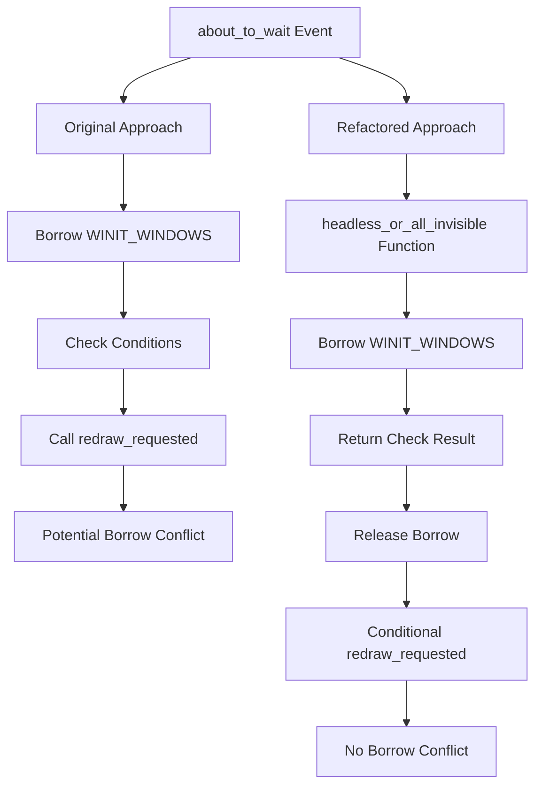

+++
title = "#21338 Avoid a \"RefCell already borrowed\" error with WINIT_WINDOWS"
date = "2025-10-03T00:00:00"
draft = false
template = "pull_request_page.html"
in_search_index = false

[extra]
current_language = "zh-cn"
available_languages = {"en" = { name = "English", url = "/pull_request/bevy/2025-10/pr-21338-en-20251003" }, "zh-cn" = { name = "中文", url = "/pull_request/bevy/2025-10/pr-21338-zh-cn-20251003" }}
labels = ["C-Bug", "A-Windowing", "O-Windows", "D-Straightforward"]
+++

# Title
Avoid a "RefCell already borrowed" error with WINIT_WINDOWS

## Basic Information
- **Title**: Avoid a "RefCell already borrowed" error with WINIT_WINDOWS
- **PR Link**: https://github.com/bevyengine/bevy/pull/21338
- **Author**: ejrh
- **Status**: MERGED
- **Labels**: C-Bug, A-Windowing, O-Windows, S-Ready-For-Final-Review, D-Straightforward
- **Created**: 2025-10-02T07:46:25Z
- **Merged**: 2025-10-03T02:40:38Z
- **Merged By**: james7132

## Description Translation
# 目标

修复 #21319。

## 解决方案

在 Bevy 的 winit 事件循环的 "about_to_wait" 状态中，我们仅在检查重绘条件时借用 WINIT_WINDOWS，并在该检查完成后执行调用。

## 测试

通过确认在我的应用程序中不再出现 RefCell 错误来进行测试。在我的应用程序中，当使用 `bevy-egui-inspector` crate 时会出现此错误。

我不知道 #21319 的原始报告者是否也使用了可能引起此问题的第三方 Bevy 插件。如果他们能检查此更改是否解决了问题，那将会很好。

在已知会出现此错误的 Windows 11 上进行了测试。被更改的代码仅包含在 Windows 构建中，因此无需在其他平台上进行测试。

## The Story of This Pull Request

这个 PR 解决了一个在 Windows 平台上出现的 RefCell 借用冲突问题。问题的核心在于 winit 事件循环处理中，对 WINIT_WINDOWS 的借用范围过大，导致了潜在的借用冲突。

问题出现在 `about_to_wait` 事件处理阶段。原始代码在借用 WINIT_WINDOWS 的闭包内不仅检查重绘条件，还可能在条件满足时调用 `redraw_requested` 方法。这种设计可能导致在 WINIT_WINDOWS 仍然被借用的情况下，尝试进行其他可能也需要借用同一资源的操作，从而触发 "RefCell already borrowed" 错误。

开发者采用了重构的方法来解决这个问题。关键思路是将条件检查与后续操作分离，确保 WINIT_WINDOWS 的借用范围最小化。具体来说：

1. **提取条件检查逻辑**：将涉及 WINIT_WINDOWS 借用的条件检查提取到独立的函数 `headless_or_all_invisible()` 中
2. **缩短借用生命周期**：通过独立的函数调用，确保 WINIT_WINDOWS 的借用仅在条件检查期间有效
3. **重组条件判断**：在 WINIT_WINDOWS 借用结束后，再基于检查结果和其他条件决定是否调用重绘

这种重构保持了原有的功能逻辑，但通过重新组织代码结构，避免了潜在的借用冲突。从实现细节来看，开发者：

- 将原有的复杂闭包结构拆分为更清晰的函数调用
- 保持了所有原有的条件检查逻辑，包括对无窗口、所有窗口不可见、响应式模式等情况的处理
- 通过函数边界自然地限制了借用范围

这种解决方案体现了 Rust 中处理 RefCell 借用冲突的常见模式：通过重构代码来缩短借用生命周期，避免在借用期间进行可能引起冲突的操作。对于涉及多层级调用或复杂事件处理的系统，这种模式尤为重要。

## Visual Representation



## Key Files Changed

### `crates/bevy_winit/src/state.rs` (+21/-22)

这个文件包含了主要的修复逻辑，重构了 Windows 平台特定的重绘条件检查代码。

**主要变化：**

```rust
// 重构前：
WINIT_WINDOWS.with_borrow(|winit_windows| {
    let headless = winit_windows.windows.is_empty();
    let exiting = self.app_exit.is_some();
    let reactive = matches!(self.update_mode, UpdateMode::Reactive { .. });
    let all_invisible = winit_windows
        .windows
        .iter()
        .all(|(_, w)| !w.is_visible().unwrap_or(false));
    if !exiting
        && (self.startup_forced_updates > 0
            || headless
            || all_invisible
            || reactive
            || self.window_event_received)
    {
        self.redraw_requested(event_loop);  // 在借用期间调用潜在的危险操作
    }
});

// 重构后：
fn headless_or_all_invisible() -> bool {
    WINIT_WINDOWS.with_borrow(|winit_windows| {
        winit_windows
            .windows
            .iter()
            .all(|(_, w)| !w.is_visible().unwrap_or(false))
    })
}

if !self.app_exit.is_some()
    && (self.startup_forced_updates > 0
        || matches!(self.update_mode, UpdateMode::Reactive { .. })
        || self.window_event_received
        || headless_or_all_invisible())
{
    self.redraw_requested(event_loop);  // 在借用结束后调用
}
```

**关键改进：**

1. **借用范围最小化**：将 WINIT_WINDOWS 的借用限制在 `headless_or_all_invisible()` 函数内
2. **逻辑分离**：条件检查与重绘调用分离，避免在借用期间进行复杂操作
3. **代码清晰度**：通过提取函数，使条件逻辑更加清晰

## Further Reading

- [Rust Book: RefCell and Interior Mutability](https://doc.rust-lang.org/book/ch15-05-interior-mutability.html#keeping-track-of-borrows-at-runtime-with-refcellt)
- [Bevy Engine: Window Management](https://bevyengine.org/learn/quick-start/window/)
- [winit Event Loop Documentation](https://docs.rs/winit/latest/winit/event_loop/struct.EventLoop.html)