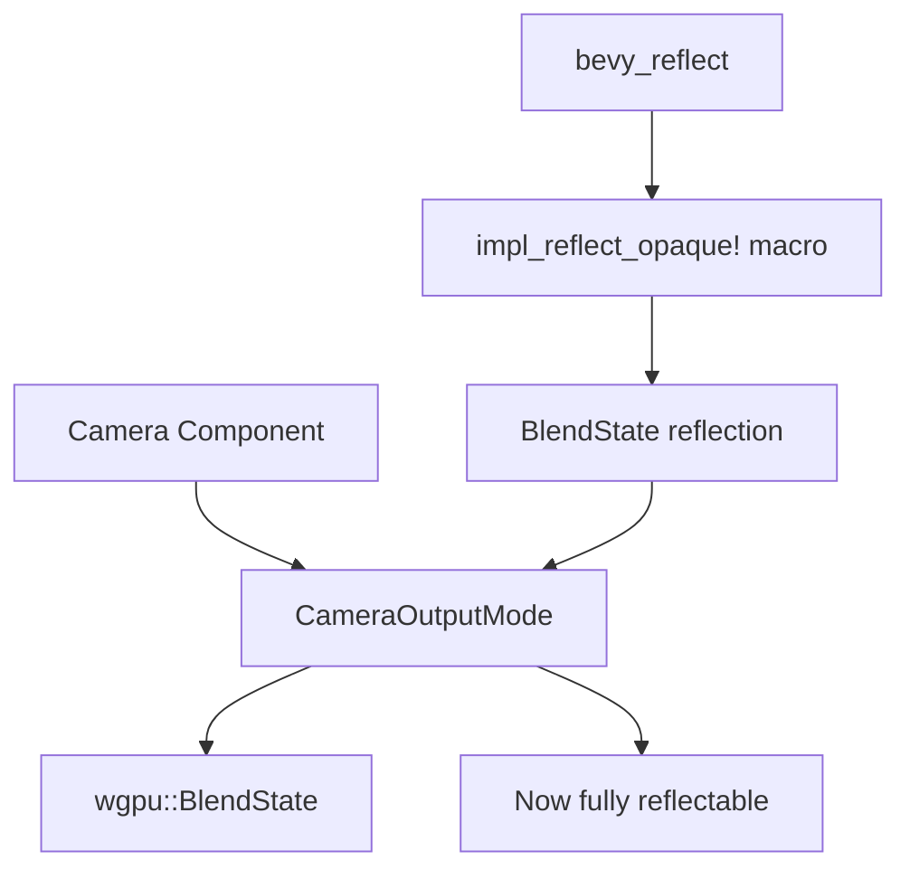

+++
title = "#21344 Implement `Reflect` for `CameraOutputMode`"
date = "2025-10-03T00:00:00"
draft = false
template = "pull_request_page.html"
in_search_index = true

[taxonomies]
list_display = ["show"]

[extra]
current_language = "en"
available_languages = {"en" = { name = "English", url = "/pull_request/bevy/2025-10/pr-21344-en-20251003" }, "zh-cn" = { name = "中文", url = "/pull_request/bevy/2025-10/pr-21344-zh-cn-20251003" }}
labels = ["A-Reflection", "D-Straightforward"]
+++

# Title
## Basic Information
- **Title**: Implement `Reflect` for `CameraOutputMode`
- **PR Link**: https://github.com/bevyengine/bevy/pull/21344
- **Author**: beicause
- **Status**: MERGED
- **Labels**: S-Ready-For-Final-Review, A-Reflection, D-Straightforward
- **Created**: 2025-10-02T12:17:49Z
- **Merged**: 2025-10-03T03:04:30Z
- **Merged By**: james7132

## Description Translation
# Objective

`CameraOutputMode` doesn't Implement `Reflect` and is ignored in `Camera`.

## Solution

Like #15355, this Implements opaque `Reflect` for `wgpu::BlendState` thus we can add `#derive(Reflect)` for `CameraOutputMode`.

As the commnent says, it can also implement `Reflect` througth `reflect_remote` (#6042),  but I'm not sure if we should do this for wgpu types.

## Testing

ci

## The Story of This Pull Request

This PR addresses a gap in Bevy's reflection system where `CameraOutputMode` couldn't be properly reflected, causing it to be ignored when working with `Camera` components through reflection APIs. The core issue was straightforward: `CameraOutputMode` contains a `wgpu::BlendState` field, and since `BlendState` didn't implement the `Reflect` trait, the entire enum couldn't derive `Reflect`.

The developer took a pragmatic approach by implementing opaque reflection for `wgpu::BlendState` using the existing `impl_reflect_opaque!` macro pattern. This solution follows the precedent set by PR #15355, which implemented similar opaque reflection for `wgpu::TextureFormat`. The opaque reflection approach treats these external types as black boxes - they can be stored and retrieved through reflection but don't expose their internal structure, which is appropriate for types from external crates like wgpu.

The implementation required three coordinated changes. First, in `bevy_reflect`, the developer added the opaque reflection implementation for `BlendState` alongside the existing one for `TextureFormat`. This allows the reflection system to handle `BlendState` instances without needing to understand their internal structure:

```rust
impl_reflect_opaque!(::wgpu_types::BlendState(
    Clone,
    Debug,
    Hash,
    PartialEq,
    Deserialize,
    Serialize,
));
```

Second, the `bevy_camera` crate needed to enable the `wgpu-types` feature in its `bevy_reflect` dependency, since the new reflection implementation is feature-gated. This ensures that the reflection capabilities are only compiled when explicitly requested.

Third, with `BlendState` now reflectable, the developer could remove the `#[reflect(ignore, clone)]` attribute from the `output_mode` field in the `Camera` struct and add `Reflect` to the derive macro for `CameraOutputMode` itself.

The alternative approach mentioned in the PR description - using `reflect_remote` from PR #6042 - was considered but deemed potentially inappropriate for wgpu types. The opaque reflection approach is cleaner for external types that don't need their internal structure exposed to the reflection system.

This change enables important functionality like serializing camera configurations, editing camera properties through editor tools, and runtime manipulation of camera output modes through Bevy's reflection APIs. The implementation is minimal and follows established patterns in the codebase, making it a low-risk addition that significantly improves the completeness of the reflection system.

## Visual Representation



## Key Files Changed

### `crates/bevy_reflect/src/impls/wgpu_types.rs` (+8/-0)
Added opaque reflection implementation for `wgpu::BlendState`:

```rust
impl_reflect_opaque!(::wgpu_types::BlendState(
    Clone,
    Debug,
    Hash,
    PartialEq,
    Deserialize,
    Serialize,
));
```

This change enables the reflection system to handle `BlendState` instances as opaque types, which was the prerequisite for making `CameraOutputMode` reflectable.

### `crates/bevy_camera/Cargo.toml` (+3/-1)
Enabled the `wgpu-types` feature for bevy_reflect dependency:

```toml
bevy_reflect = { path = "../bevy_reflect", version = "0.18.0-dev", features = [
  "wgpu-types",
] }
```

This ensures that the reflection implementation for wgpu types is available to the camera crate.

### `crates/bevy_camera/src/camera.rs` (+1/-3)
Made `CameraOutputMode` reflectable and removed the ignore attribute:

```rust
// Before:
// #[reflect(ignore, clone)]
// pub output_mode: CameraOutputMode,

// After:
pub output_mode: CameraOutputMode,

// Before:
// #[derive(Debug, Clone, Copy)]
// After:
#[derive(Debug, Clone, Copy, Reflect)]
pub enum CameraOutputMode {
```

These changes complete the integration by making both the field and the enum itself properly reflectable.

## Further Reading

- [Bevy Reflection Documentation](https://docs.rs/bevy_reflect/latest/bevy_reflect/) - Comprehensive guide to Bevy's reflection system
- [PR #15355](https://github.com/bevyengine/bevy/pull/15355) - Previous implementation of opaque reflection for `wgpu::TextureFormat`
- [PR #6042](https://github.com/bevyengine/bevy/pull/6042) - `reflect_remote` functionality for external type reflection
- [wgpu BlendState Documentation](https://docs.rs/wgpu/latest/wgpu/struct.BlendState.html) - Details about the wgpu blend state being reflected

# Full Code Diff
diff --git a/crates/bevy_camera/Cargo.toml b/crates/bevy_camera/Cargo.toml
index 573fc85a983e9..b8a1332dcd06b 100644
--- a/crates/bevy_camera/Cargo.toml
+++ b/crates/bevy_camera/Cargo.toml
@@ -15,7 +15,9 @@ bevy_asset = { path = "../bevy_asset", version = "0.18.0-dev" }
 bevy_image = { path = "../bevy_image", version = "0.18.0-dev" }
 bevy_mesh = { path = "../bevy_mesh", version = "0.18.0-dev" }
 bevy_math = { path = "../bevy_math", version = "0.18.0-dev" }
-bevy_reflect = { path = "../bevy_reflect", version = "0.18.0-dev" }
+bevy_reflect = { path = "../bevy_reflect", version = "0.18.0-dev", features = [
+  "wgpu-types",
+] }
 bevy_ecs = { path = "../bevy_ecs", version = "0.18.0-dev" }
 bevy_transform = { path = "../bevy_transform", version = "0.18.0-dev" }
 bevy_derive = { path = "../bevy_derive", version = "0.18.0-dev" }
diff --git a/crates/bevy_camera/src/camera.rs b/crates/bevy_camera/src/camera.rs
index 444a39e43d3b7..815c7609460df 100644
--- a/crates/bevy_camera/src/camera.rs
+++ b/crates/bevy_camera/src/camera.rs
@@ -362,9 +362,7 @@ pub struct Camera {
     pub computed: ComputedCameraValues,
     /// The "target" that this camera will render to.
     pub target: RenderTarget,
-    // todo: reflect this when #6042 lands
     /// The [`CameraOutputMode`] for this camera.
-    #[reflect(ignore, clone)]
     pub output_mode: CameraOutputMode,
     /// If this is enabled, a previous camera exists that shares this camera's render target, and this camera has MSAA enabled, then the previous camera's
     /// outputs will be written to the intermediate multi-sampled render target textures for this camera. This enables cameras with MSAA enabled to
@@ -777,7 +775,7 @@ impl Camera {
 }
 
 /// Control how this [`Camera`] outputs once rendering is completed.
-#[derive(Debug, Clone, Copy)]
+#[derive(Debug, Clone, Copy, Reflect)]
 pub enum CameraOutputMode {
     /// Writes the camera output to configured render target.
     Write {
diff --git a/crates/bevy_reflect/src/impls/wgpu_types.rs b/crates/bevy_reflect/src/impls/wgpu_types.rs
index 734eace938a04..b0ca0d2308b82 100644
--- a/crates/bevy_reflect/src/impls/wgpu_types.rs
+++ b/crates/bevy_reflect/src/impls/wgpu_types.rs
@@ -8,3 +8,11 @@ impl_reflect_opaque!(::wgpu_types::TextureFormat(
     Deserialize,
     Serialize,
 ));
+impl_reflect_opaque!(::wgpu_types::BlendState(
+    Clone,
+    Debug,
+    Hash,
+    PartialEq,
+    Deserialize,
+    Serialize,
+));