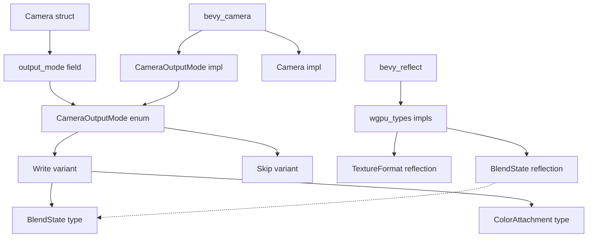

+++
title = "#21344 Implement `Reflect` for `CameraOutputMode`"
date = "2025-10-03T00:00:00"
draft = false
template = "pull_request_page.html"
in_search_index = false

[extra]
current_language = "zh-cn"
available_languages = {"en" = { name = "English", url = "/pull_request/bevy/2025-10/pr-21344-en-20251003" }, "zh-cn" = { name = "中文", url = "/pull_request/bevy/2025-10/pr-21344-zh-cn-20251003" }}
labels = ["A-Reflection", "D-Straightforward"]
+++

# Title
PR #21344: Implement `Reflect` for `CameraOutputMode`

## Basic Information
- **Title**: Implement `Reflect` for `CameraOutputMode`
- **PR Link**: https://github.com/bevyengine/bevy/pull/21344
- **Author**: beicause
- **Status**: MERGED
- **Labels**: S-Ready-For-Final-Review, A-Reflection, D-Straightforward
- **Created**: 2025-10-02T12:17:49Z
- **Merged**: 2025-10-03T03:04:30Z
- **Merged By**: james7132

## Description Translation
# 目标

`CameraOutputMode` 没有实现 `Reflect` 并且在 `Camera` 中被忽略。

## 解决方案

类似于 #15355，这为 `wgpu::BlendState` 实现了不透明的 `Reflect`，因此我们可以为 `CameraOutputMode` 添加 `#derive(Reflect)`。

如注释所述，也可以通过 `reflect_remote` (#6042) 实现 `Reflect`，但我不确定我们是否应该为 wgpu 类型这样做。

## 测试

ci

## The Story of This Pull Request

这个PR解决了一个在Bevy引擎中相机系统反射支持不完整的问题。问题的核心是`CameraOutputMode`枚举类型缺少反射实现，导致在使用反射系统时该字段被忽略。

**问题根源分析**

在Bevy的反射系统中，如果一个类型没有实现`Reflect` trait，那么它就无法被序列化、反序列化，也无法在编辑器工具中动态修改。查看修改前的代码：

```rust
// Before in camera.rs
pub struct Camera {
    // ...
    /// The [`CameraOutputMode`] for this camera.
    #[reflect(ignore, clone)]
    pub output_mode: CameraOutputMode,
    // ...
}
```

`#[reflect(ignore, clone)]`属性明确表示这个字段应该被反射系统忽略。这种设计选择是因为`CameraOutputMode`内部使用了`wgpu::BlendState`类型，而该类型本身没有实现反射。

**解决方案的技术决策**

开发者采用了与之前类似问题(#15355)相同的解决方案模式：为外部类型实现不透明的反射。具体来说，他们为`wgpu::BlendState`添加了反射支持：

```rust
// In bevy_reflect/src/impls/wgpu_types.rs
impl_reflect_opaque!(::wgpu_types::BlendState(
    Clone,
    Debug,
    Hash,
    PartialEq,
    Deserialize,
    Serialize,
));
```

`impl_reflect_opaque!`宏是Bevy反射系统中的一个重要工具，它允许为外部类型实现反射，而无需修改这些类型的原始定义。这种"不透明反射"意味着类型可以被反射系统识别和处理，但其内部结构对反射系统保持不透明。

**依赖关系调整**

为了启用这个功能，需要在`bevy_camera`的依赖配置中启用相应的特性：

```toml
# In bevy_camera/Cargo.toml
bevy_reflect = { path = "../bevy_reflect", version = "0.18.0-dev", features = [
  "wgpu-types",
] }
```

这个特性标志确保了只有当需要wgpu类型反射时才编译相关代码，避免了不必要的编译开销。

**最终实现**

在解决了依赖关系后，为`CameraOutputMode`添加反射支持就变得简单直接：

```rust
// After in camera.rs
#[derive(Debug, Clone, Copy, Reflect)]
pub enum CameraOutputMode {
    /// Writes the camera output to configured render target.
    Write {
        /// The blend state used when writing to the render target.
        blend_state: Option<BlendState>,
        /// The color attachment used when writing to the render target.
        color_attachment: ColorAttachment,
    },
    /// Skips writing the camera output to the configured render target.
    Skip,
}
```

移除`#[reflect(ignore, clone)]`属性后，`Camera`结构体中的`output_mode`字段现在可以正常参与反射操作。

**技术权衡考虑**

PR作者在描述中提到，也可以考虑使用`reflect_remote`(#6042)作为替代方案。这两种方法的主要区别在于：

- `impl_reflect_opaque`：创建类型的不透明表示，适用于不需要深入反射外部类型内部结构的场景
- `reflect_remote`：为外部类型创建完整的反射实现，提供更详细的类型信息

对于wgpu类型，使用不透明反射是更合适的选择，因为这些类型通常包含复杂的GPU相关状态，不需要在反射系统中进行细粒度操作。

**影响和意义**

这个改动虽然代码量不大，但对Bevy生态系统的完整性有重要意义：

1. **工具链支持**：编辑器工具现在可以正确显示和修改相机输出模式
2. **序列化能力**：场景序列化时能够正确保存相机输出模式配置
3. **API一致性**：所有相机相关配置现在都具有完整的反射支持

这个PR体现了Bevy引擎对反射系统完整性的持续投入，确保核心组件都能与引擎的元编程基础设施良好集成。

## Visual Representation



## Key Files Changed

### 1. `crates/bevy_reflect/src/impls/wgpu_types.rs` (+8/-0)

这个文件为wgpu类型添加反射实现。关键改动是为`BlendState`类型添加了不透明反射支持：

```rust
impl_reflect_opaque!(::wgpu_types::BlendState(
    Clone,
    Debug,
    Hash,
    PartialEq,
    Deserialize,
    Serialize,
));
```

这行代码使用`impl_reflect_opaque`宏为外部的`wgpu_types::BlendState`类型实现了反射trait。宏参数指定了该类型需要实现的其他trait，确保反射系统能够正确处理该类型。

### 2. `crates/bevy_camera/Cargo.toml` (+3/-1)

更新依赖配置以启用wgpu类型的反射支持：

```toml
# Before:
bevy_reflect = { path = "../bevy_reflect", version = "0.18.0-dev" }

# After:
bevy_reflect = { path = "../bevy_reflect", version = "0.18.0-dev", features = [
  "wgpu-types",
] }
```

这个改动启用了`bevy_reflect`的`wgpu-types`特性，确保编译时包含对wgpu类型的反射支持。

### 3. `crates/bevy_camera/src/camera.rs` (+1/-3)

主要的业务逻辑改动，为`CameraOutputMode`启用反射并移除之前的忽略标记：

```rust
// Before:
// todo: reflect this when #6042 lands
/// The [`CameraOutputMode`] for this camera.
#[reflect(ignore, clone)]
pub output_mode: CameraOutputMode,

// After:
/// The [`CameraOutputMode`] for this camera.
pub output_mode: CameraOutputMode,
```

同时为枚举类型添加反射derive：

```rust
// Before:
#[derive(Debug, Clone, Copy)]

// After:
#[derive(Debug, Clone, Copy, Reflect)]
```

这些改动使得`CameraOutputMode`现在可以完全参与反射系统的操作。

## Further Reading

- [Bevy Reflection Documentation](https://docs.rs/bevy_reflect/latest/bevy_reflect/) - Bevy反射系统的官方文档
- [PR #15355](https://github.com/bevyengine/bevy/pull/15355) - 类似的为wgpu类型实现反射的PR
- [Issue #6042](https://github.com/bevyengine/bevy/issues/6042) - 关于`reflect_remote`功能的讨论
- [The Rust Programming Language - Traits](https://doc.rust-lang.org/book/ch10-02-traits.html) - Rust trait系统的核心概念