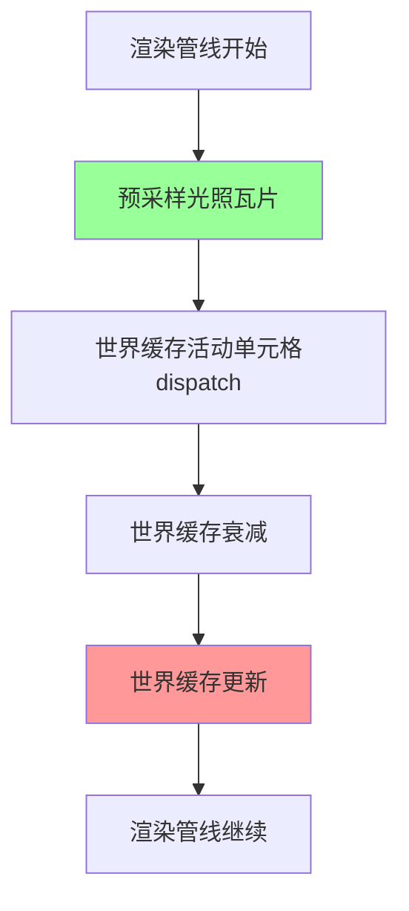

+++
title = "#21348 Solari: Fix world cache update using last frame's light tiles due to incorrect pass ordering"
date = "2025-10-02T00:00:00"
draft = false
template = "pull_request_page.html"
in_search_index = false

[extra]
current_language = "zh-cn"
available_languages = {"en" = { name = "English", url = "/pull_request/bevy/2025-10/pr-21348-en-20251002" }, "zh-cn" = { name = "中文", url = "/pull_request/bevy/2025-10/pr-21348-zh-cn-20251002" }}
labels = ["C-Bug", "A-Rendering", "D-Straightforward"]
+++

# Solari: Fix world cache update using last frame's light tiles due to incorrect pass ordering

## Basic Information
- **Title**: Solari: Fix world cache update using last frame's light tiles due to incorrect pass ordering
- **PR Link**: https://github.com/bevyengine/bevy/pull/21348
- **Author**: JMS55
- **Status**: MERGED
- **Labels**: C-Bug, A-Rendering, S-Ready-For-Final-Review, D-Straightforward
- **Created**: 2025-10-02T15:11:39Z
- **Merged**: 2025-10-02T17:06:12Z
- **Merged By**: alice-i-cecile

## Description Translation
Light tiles used to be generated _after_ the world cache update, despite the world cache update relying on them. This means that the world cache update used last frame's light tiles, which is fine for static lights, but completely wrong for dynamic lights and lead to missing GI contributions from dynamic lights.

Moving the presample light tile step to before the world cache update fixes this.

Can be tested by running the solari example, turning off the directional light so there's only the emissive robot light, enabling VISUALIZE_WORLD_CACHE, and then comparing before/after this PR.

## The Story of This Pull Request

这个PR解决了一个渲染管线中执行顺序错误导致的bug。问题出现在Bevy引擎的Solari全局光照系统中，具体涉及光照瓦片（light tiles）和世界缓存（world cache）的更新时序。

问题的核心在于依赖关系被错误地处理了。在渲染管线中，世界缓存的更新需要依赖当前帧的光照瓦片数据，但原来的执行顺序却是先更新世界缓存，然后再生成光照瓦片。这导致世界缓存实际上使用的是上一帧的光照瓦片数据。

对于静态光源来说，这种时序问题可能不会立即显现，因为静态光源的位置和属性在帧之间不会改变。但对于动态光源，比如移动的发射光机器人，使用上一帧的数据就会导致全局光照计算错误，具体表现为动态光源的贡献丢失。

从技术实现角度看，这个bug的修复相对简单直接：只需要调整两个计算步骤的执行顺序。原来的代码流程是：

1. 设置世界缓存活动单元格的dispatch
2. 执行世界缓存衰减（decay_world_cache）
3. 执行世界缓存更新（update_world_cache）
4. 最后才预采样光照瓦片（presample_light_tiles）

修复后的正确顺序是：

1. 先预采样光照瓦片（presample_light_tiles）
2. 设置世界缓存活动单元格的dispatch
3. 执行世界缓存衰减（decay_world_cache）
4. 执行世界缓存更新（update_world_cache）

这种调整确保了当世界缓存更新执行时，它能够访问到当前帧最新生成的光照瓦片数据，而不是过时的上一帧数据。

从代码层面看，这个修复涉及将`presample_light_tiles_pipeline`相关的代码块从管线末尾移动到世界缓存更新操作之前。具体的修改包括设置管线、推送常量（包含帧索引和重置标志），以及dispatch工作组的调用。

这种类型的bug在图形编程中比较常见，特别是在复杂的多阶段渲染管线中。它强调了正确理解数据依赖关系的重要性，以及在GPU计算中确保计算步骤按正确顺序执行的必要性。虽然修复本身只是简单的代码重排，但识别出这种时序问题需要对渲染管线的数据流有深入的理解。

## Visual Representation



## Key Files Changed

### `crates/bevy_solari/src/realtime/node.rs` (+7/-7)

这个文件包含了渲染节点的实现，是修复的核心所在。修改涉及重新排列渲染管线中计算步骤的执行顺序。

**关键修改：**

```rust
// 修复后的执行顺序：
// 光照瓦片预采样被移到世界缓存更新之前
pass.set_pipeline(presample_light_tiles_pipeline);
pass.set_push_constants(
    0,
    bytemuck::cast_slice(&[frame_index, solari_lighting.reset as u32]),
);
pass.dispatch_workgroups(LIGHT_TILE_BLOCKS as u32, 1, 1);

// 世界缓存相关操作
pass.set_bind_group(2, &bind_group_world_cache_active_cells_dispatch, &[]);
pass.set_pipeline(decay_world_cache_pipeline);
// ... 其他世界缓存操作

// 原来的错误顺序（被移除的代码位置）：
// pass.set_pipeline(presample_light_tiles_pipeline);
// pass.set_push_constants(
//     0,
//     bytemuck::cast_slice(&[frame_index, solari_lighting.reset as u32]),
// );
// pass.dispatch_workgroups(LIGHT_TILE_BLOCKS as u32, 1, 1);
```

这个修改确保了世界缓存更新操作能够使用当前帧生成的光照瓦片数据，而不是上一帧的过时数据。

## Further Reading

- [Bevy Engine Rendering Documentation](https://bevyengine.org/learn/book/getting-started/rendering/)
- [Global Illumination Concepts](https://en.wikipedia.org/wiki/Global_illumination)
- [GPU Compute Pipelines and Data Dependencies](https://vkguide.dev/docs/gpudriven/compute_pipelines/)