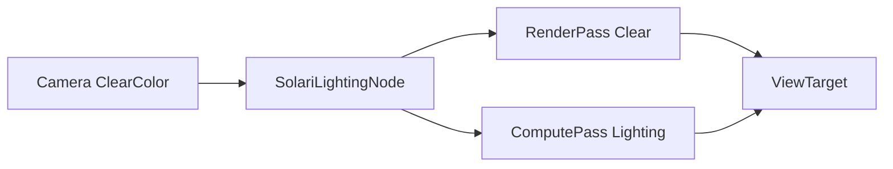

+++
title = "#21350 Solari: Support clear color"
date = "2025-10-02T00:00:00"
draft = false
template = "pull_request_page.html"
in_search_index = true

[taxonomies]
list_display = ["show"]

[extra]
current_language = "en"
available_languages = {"en" = { name = "English", url = "/pull_request/bevy/2025-10/pr-21350-en-20251002" }, "zh-cn" = { name = "中文", url = "/pull_request/bevy/2025-10/pr-21350-zh-cn-20251002" }}
labels = ["C-Feature", "A-Rendering", "S-Ready-For-Final-View", "D-Straightforward"]
+++

# Title
Solari: Support clear color

## Basic Information
- **Title**: Solari: Support clear color
- **PR Link**: https://github.com/bevyengine/bevy/pull/21350
- **Author**: JMS55
- **Status**: MERGED
- **Labels**: C-Feature, A-Rendering, S-Ready-For-Final-View, D-Straightforward
- **Created**: 2025-10-02T16:14:00Z
- **Merged**: 2025-10-02T16:55:39Z
- **Merged By**: alice-i-cecile

## Description Translation


* ClearColor is not supported for the pathtracer still
* Tonemapping makes the clear color appear incorrect (the above image is supposed to be pure white), which is a little wonky. That's a separate issue though.

## The Story of This Pull Request

This PR addresses a gap in Bevy's Solari rendering system where clear color functionality was not properly supported in the real-time lighting pipeline. The core issue was that the SolariLightingNode was not respecting the clear color configuration defined by the camera, which meant background pixels weren't being initialized with the expected clear color.

The problem stemmed from two related issues. First, in the compute shader (`restir_di.wgsl`), there was explicit logic that wrote black (`vec4(vec3(0.0), 1.0)`) to the output texture for pixels with zero depth (background pixels). This hardcoded behavior overrode any clear color settings. Second, the node implementation wasn't checking if it should perform a clear operation before beginning its compute work.

The solution involved coordinated changes across both the Rust node implementation and the WGSL shader. In the Rust code, the node now checks if the view target has a clear load operation configured. If so, it begins a render pass specifically to perform the clear before starting the compute work. This is a more efficient approach than trying to handle clear operations within the compute shader itself.

The key insight here was recognizing that clear operations are fundamentally a render pass operation in graphics APIs like WebGPU, not something that should be handled manually in compute shaders. By leveraging the existing render pass infrastructure, the solution maintains consistency with Bevy's rendering patterns while adding minimal overhead.

In the shader code, the fix was straightforward - simply removing the line that explicitly wrote black for background pixels. This allows the clear color (if applied) to remain visible, or if no clear was performed, the existing contents of the texture to persist.

One important engineering consideration was the conditional nature of the clear operation. The node only performs the clear if the view target's load operation is configured as `LoadOp::Clear`. This ensures compatibility with other rendering pipelines that might have already cleared the target, preventing unnecessary double-clears that could impact performance.

The implementation demonstrates good separation of concerns - the clear operation is handled at the appropriate abstraction level (render pass operations) while the compute shader focuses solely on lighting calculations. This approach also makes the system more maintainable, as clear color behavior is now consistent with other Bevy rendering nodes.

## Visual Representation



## Key Files Changed

### `crates/bevy_solari/src/realtime/node.rs` (+16/-3)

This file contains the main logic change for clear color support. The key modifications include:

1. Added imports for `LoadOp` and `RenderPassDescriptor` to support render pass operations
2. Added logic to check for clear operations and execute them before compute work

```rust
// Key additions in imports
use bevy_render::{
    // ... existing imports ...
    LoadOp, RenderPassDescriptor,  // New imports for clear support
    // ... other imports ...
};

// In the run method, after getting view_target:
let view_target = view_target.get_unsampled_color_attachment();

// New clear logic before compute pass:
if matches!(view_target.ops.load, LoadOp::Clear(_)) {
    command_encoder.begin_render_pass(&RenderPassDescriptor {
        label: Some("solari_lighting_clear"),
        color_attachments: &[Some(view_target)],
        depth_stencil_attachment: None,
        timestamp_writes: None,
        occlusion_query_set: None,
    });
}
```

### `crates/bevy_solari/src/realtime/restir_di.wgsl` (+0/-1)

This shader file had a single line removed that was explicitly writing black to background pixels:

```wgsl
// Before:
if depth == 0.0 {
    store_reservoir_a(global_id.xy, empty_reservoir());
    textureStore(view_output, global_id.xy, vec4(vec3(0.0), 1.0));  // This line was removed
    return;
}

// After:
if depth == 0.0 {
    store_reservoir_a(global_id.xy, empty_reservoir());
    return;
}
```

## Further Reading

- [WebGPU Render Passes Documentation](https://gpuweb.github.io/gpuweb/#render-passes)
- [Bevy Render Graph Documentation](https://docs.rs/bevy_render/latest/bevy_render/render_graph/index.html)
- [LoadOp and StoreOp in Graphics APIs](https://docs.rs/wgpu/latest/wgpu/enum.LoadOp.html)