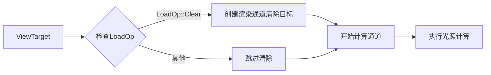

+++
title = "#21350 Solari: Support clear color"
date = "2025-10-02T00:00:00"
draft = false
template = "pull_request_page.html"
in_search_index = false

[extra]
current_language = "zh-cn"
available_languages = {"en" = { name = "English", url = "/pull_request/bevy/2025-10/pr-21350-en-20251002" }, "zh-cn" = { name = "中文", url = "/pull_request/bevy/2025-10/pr-21350-zh-cn-20251002" }}
labels = ["C-Feature", "A-Rendering", "S-Ready-For-Final-View", "D-Straightforward"]
+++

# Solari: Support clear color

## Basic Information
- **Title**: Solari: Support clear color
- **PR Link**: https://github.com/bevyengine/bevy/pull/21350
- **Author**: JMS55
- **Status**: MERGED
- **Labels**: C-Feature, A-Rendering, S-Ready-For-Final-View, D-Straightforward
- **Created**: 2025-10-02T16:14:00Z
- **Merged**: 2025-10-02T16:55:39Z
- **Merged By**: alice-i-cecile

## Description Translation


* 路径追踪器目前还不支持 ClearColor
* 色调映射导致清除颜色显示不正确（上面的图像应该是纯白色），这有点问题。不过这是一个独立的问题。

## The Story of This Pull Request

这个PR解决了Solari渲染器中清除颜色支持的问题。在之前的实现中，当没有几何体被渲染时（即深度为0的情况），着色器会直接将输出颜色设置为黑色，这忽略了用户可能设置的清除颜色（例如纯白色）。

问题的核心在于Solari光照节点没有正确处理渲染目标的初始状态。当渲染目标需要被清除时（比如设置为白色或其他颜色），之前的实现直接在计算着色器中硬编码了黑色，这导致了清除颜色配置失效。

解决方案分为两个主要部分。首先，在Rust代码中，我们添加了对渲染目标清除操作的支持。通过检查`view_target.ops.load`是否为`LoadOp::Clear`，可以确定是否需要执行清除操作。如果需要清除，就在开始计算通道之前创建一个渲染通道来执行清除：

```rust
if matches!(view_target.ops.load, LoadOp::Clear(_)) {
    command_encoder.begin_render_pass(&RenderPassDescriptor {
        label: Some("solari_lighting_clear"),
        color_attachments: &[Some(view_target)],
        depth_stencil_attachment: None,
        timestamp_writes: None,
        occlusion_query_set: None,
    });
}
```

这个设计选择很巧妙，因为它利用了现有的渲染目标状态信息，而不是重复实现清除逻辑。渲染目标已经知道它需要被清除以及用什么颜色清除，我们只需要在适当的时候触发这个操作。

其次，在WGSL着色器代码中，我们移除了硬编码的黑色输出。在`restir_di.wgsl`文件中，当检测到深度为0（没有几何体）时，不再强制设置输出为黑色：

```wgsl
// 之前：
if depth == 0.0 {
    store_reservoir_a(global_id.xy, empty_reservoir());
    textureStore(view_output, global_id.xy, vec4(vec3(0.0), 1.0));
    return;
}

// 现在：
if depth == 0.0 {
    store_reservoir_a(global_id.xy, empty_reservoir());
    return;
}
```

这种实现方式遵循了Bevy的渲染架构模式，即让渲染目标管理自己的状态，节点只需在适当的时候触发相应的操作。这种分离关注点的设计使得代码更加模块化和可维护。

从技术角度看，这个PR还引入了一个重要的概念：混合使用渲染通道和计算通道。虽然Solari主要使用计算着色器进行光照计算，但在需要执行传统的渲染操作（如清除）时，可以无缝地切换到渲染通道。这展示了现代图形API的灵活性。

需要注意的是，这个实现有一个已知的限制：路径追踪器仍然不支持清除颜色，而且色调映射可能会导致清除颜色显示不正确。但正如PR描述中提到的，这些是独立的问题，需要在其他PR中解决。

## Visual Representation



## Key Files Changed

### `crates/bevy_solari/src/realtime/node.rs` (+16/-3)

这个文件是主要的修改点，添加了对清除颜色的支持。

**关键修改：**

```rust
// 新增导入
use bevy_render::render_resource::{
    // ... 其他导入
    LoadOp, RenderPassDescriptor, // 新增
};

// 在run方法中添加清除逻辑
let view_target = view_target.get_unsampled_color_attachment();

// ... 其他代码 ...

// 新增清除操作
if matches!(view_target.ops.load, LoadOp::Clear(_)) {
    command_encoder.begin_render_pass(&RenderPassDescriptor {
        label: Some("solari_lighting_clear"),
        color_attachments: &[Some(view_target)],
        depth_stencil_attachment: None,
        timestamp_writes: None,
        occlusion_query_set: None,
    });
}
```

### `crates/bevy_solari/src/realtime/restir_di.wgsl` (+0/-1)

这个文件移除了硬编码的黑色输出。

**关键修改：**

```wgsl
// 之前：
if depth == 0.0 {
    store_reservoir_a(global_id.xy, empty_reservoir());
    textureStore(view_output, global_id.xy, vec4(vec3(0.0), 1.0));
    return;
}

// 现在：
if depth == 0.0 {
    store_reservoir_a(global_id.xy, empty_reservoir());
    return;
}
```

## Further Reading

- [WebGPU Render Passes Documentation](https://gpuweb.github.io/gpuweb/#render-passes)
- [Bevy Render Graph Documentation](https://bevyengine.org/learn/quick-start/getting-started/systems/)
- [WGSL Shader Language Specification](https://www.w3.org/TR/WGSL/)