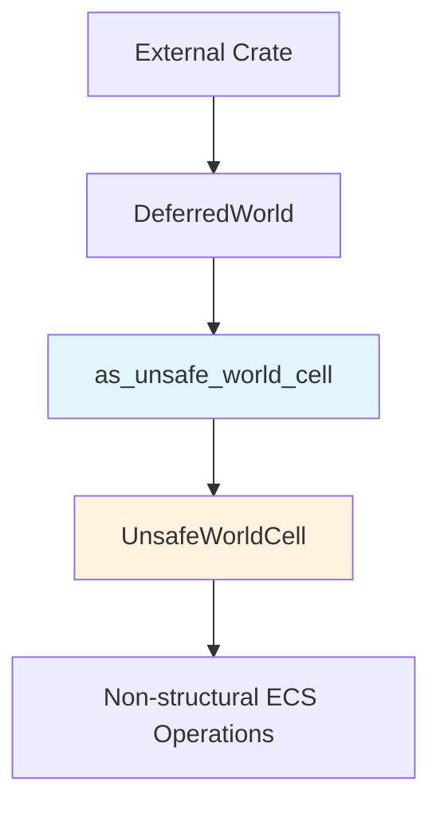

+++
title = "#21360 Relax deferred UnsafeWorldCell visibility"
date = "2025-10-04T00:00:00"
draft = false
template = "pull_request_page.html"
in_search_index = true

[taxonomies]
list_display = ["show"]

[extra]
current_language = "en"
available_languages = {"en" = { name = "English", url = "/pull_request/bevy/2025-10/pr-21360-en-20251004" }, "zh-cn" = { name = "中文", url = "/pull_request/bevy/2025-10/pr-21360-zh-cn-20251004" }}
labels = ["D-Trivial", "A-ECS", "D-Unsafe"]
+++

# Title
Relax deferred UnsafeWorldCell visibility

## Basic Information
- **Title**: Relax deferred UnsafeWorldCell visibility
- **PR Link**: https://github.com/bevyengine/bevy/pull/21360
- **Author**: CorvusPrudens
- **Status**: MERGED
- **Labels**: D-Trivial, A-ECS, S-Ready-For-Final-Review, D-Unsafe
- **Created**: 2025-10-03T12:28:35Z
- **Merged**: 2025-10-04T18:25:19Z
- **Merged By**: alice-i-cecile

## Description Translation
# Objective

Addresses the immediate blocker in #21354 by relaxing the `(crate)` visibility restriction on `DeferredWorld::as_unsafe_world_cell`.

This method already has documentation, including a safety comment. While sparse, I think they communicate the function clearly.

## The Story of This Pull Request

This PR addresses a specific visibility constraint that was blocking progress on another development effort. The core issue was straightforward: the `as_unsafe_world_cell` method in the `DeferredWorld` struct had `pub(crate)` visibility, which prevented external crates from accessing it. This was preventing work on PR #21354 from moving forward.

The `DeferredWorld` type in Bevy's ECS system provides a way to queue up world modifications and apply them later. The `as_unsafe_world_cell` method is particularly important because it allows accessing the underlying `UnsafeWorldCell`, which enables performing unsafe ECS operations. However, the method's `pub(crate)` visibility meant it could only be used within the `bevy_ecs` crate itself.

The solution implemented here is minimal and surgical. By changing the visibility modifier from `pub(crate)` to `pub`, the method becomes accessible to external crates while maintaining all the same safety guarantees. The method already contained appropriate safety documentation:

```rust
/// # Safety
/// - must only be used to make non-structural ECS changes
```

This safety comment is crucial because it reminds callers that while they can perform unsafe operations through the returned `UnsafeWorldCell`, they must avoid making structural changes to the ECS - meaning they shouldn't add or remove components, create or destroy entities, or perform other operations that would change the fundamental structure of the world.

The implementation change is technically simple but strategically important. It follows the principle of making the smallest possible change to unblock dependent work. The method signature and behavior remain identical; only the visibility scope expands.

From an architectural perspective, this change acknowledges that the functionality provided by `as_unsafe_world_cell` is useful beyond the immediate crate boundaries. The safety documentation provides sufficient guidance for external callers to use the method correctly, and the existing implementation doesn't require modification to support broader usage.

## Visual Representation



## Key Files Changed

**File: `crates/bevy_ecs/src/world/deferred_world.rs`** (+1/-1)

This file contains the core change that relaxes the visibility constraint on the `as_unsafe_world_cell` method.

**Before:**
```rust
pub(crate) fn as_unsafe_world_cell(&mut self) -> UnsafeWorldCell<'_> {
    self.world
}
```

**After:**
```rust
pub fn as_unsafe_world_cell(&mut self) -> UnsafeWorldCell<'_> {
    self.world
}
```

The change is minimal but significant. The method now has public visibility (`pub`) instead of crate-only visibility (`pub(crate)`), allowing external crates to access the `UnsafeWorldCell` from a `DeferredWorld` instance. This directly addresses the blocking issue in PR #21354 while maintaining all existing safety guarantees through the method's documentation.

## Further Reading

- [Rust Visibility and Privacy](https://doc.rust-lang.org/reference/visibility-and-privacy.html) - Official Rust documentation on visibility modifiers
- [Bevy ECS World Documentation](https://docs.rs/bevy_ecs/latest/bevy_ecs/world/struct.World.html) - Bevy's ECS World API
- [UnsafeWorldCell Documentation](https://docs.rs/bevy_ecs/latest/bevy_ecs/world/struct.UnsafeWorldCell.html) - Bevy's unsafe world operations
- [PR #21354](https://github.com/bevyengine/bevy/pull/21354) - The dependent PR that required this change

# Full Code Diff
diff --git a/crates/bevy_ecs/src/world/deferred_world.rs b/crates/bevy_ecs/src/world/deferred_world.rs
index b30792207731c..099d58a6935bb 100644
--- a/crates/bevy_ecs/src/world/deferred_world.rs
+++ b/crates/bevy_ecs/src/world/deferred_world.rs
@@ -831,7 +831,7 @@ impl<'w> DeferredWorld<'w> {
     /// # Safety
     /// - must only be used to make non-structural ECS changes
     #[inline]
-    pub(crate) fn as_unsafe_world_cell(&mut self) -> UnsafeWorldCell<'_> {
+    pub fn as_unsafe_world_cell(&mut self) -> UnsafeWorldCell<'_> {
         self.world
     }
 }