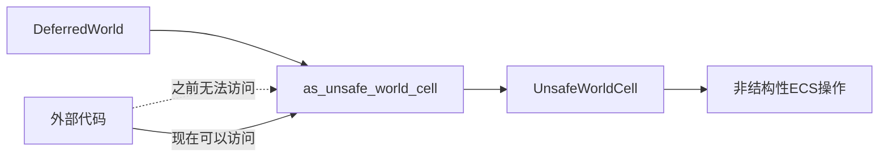

+++
title = "#21360 Relax deferred UnsafeWorldCell visibility"
date = "2025-10-04T00:00:00"
draft = false
template = "pull_request_page.html"
in_search_index = false

[extra]
current_language = "zh-cn"
available_languages = {"en" = { name = "English", url = "/pull_request/bevy/2025-10/pr-21360-en-20251004" }, "zh-cn" = { name = "中文", url = "/pull_request/bevy/2025-10/pr-21360-zh-cn-20251004" }}
+++

# Relax deferred UnsafeWorldCell visibility

## Basic Information
- **标题**: Relax deferred UnsafeWorldCell visibility
- **PR链接**: https://github.com/bevyengine/bevy/pull/21360
- **作者**: CorvusPrudens
- **状态**: 已合并
- **标签**: D-Trivial, A-ECS, S-Ready-For-Final-Review, D-Unsafe
- **创建时间**: 2025-10-03T12:28:35Z
- **合并时间**: 2025-10-04T18:25:19Z
- **合并者**: alice-i-cecile

## 描述翻译

### 目标

解决 #21354 中的直接阻塞问题，通过放宽 `DeferredWorld::as_unsafe_world_cell` 的 `(crate)` 可见性限制。

该方法已有文档，包括安全注释。虽然简洁，但我认为它们清楚地传达了函数的功能。

## 这个Pull Request的故事

这个PR源于一个实际的开发阻塞问题。在PR #21354中，开发人员需要在crate外部访问 `DeferredWorld::as_unsafe_world_cell` 方法，但该方法被限制为仅crate内部可见（`pub(crate)`），这阻碍了外部代码的使用。

`DeferredWorld` 是Bevy ECS系统中的一个重要组件，用于处理延迟的世界操作。其中的 `as_unsafe_world_cell` 方法返回一个 `UnsafeWorldCell`，这是进行非结构性ECS更改所必需的。非结构性更改指的是那些不会影响ECS结构（如添加/移除组件或实体）的操作。

从技术角度来看，这个方法的可见性限制最初可能是出于安全考虑，因为 `UnsafeWorldCell` 允许绕过Rust的安全检查。然而，该方法已经包含了适当的安全文档：

```rust
/// # Safety
/// - must only be used to make non-structural ECS changes
```

这表明开发者已经考虑了安全使用的要求，并且通过文档明确传达了使用约束。

解决方案很简单但有效：将方法的可见性从 `pub(crate)` 改为 `pub`。这个改变虽然只有一行代码，但解决了实际的开发阻塞问题：

```rust
// 修改前:
pub(crate) fn as_unsafe_world_cell(&mut self) -> UnsafeWorldCell<'_> {

// 修改后:
pub fn as_unsafe_world_cell(&mut self) -> UnsafeWorldCell<'_> {
```

从工程角度看，这是一个典型的可见性调整决策。当方法已经具备适当的安全文档和明确的用途说明时，放宽可见性限制是合理的。这种方法避免了过度封装，同时通过文档保持了安全约束。

这个改变的影响是直接的：它解除了PR #21354的阻塞，同时为其他可能需要类似访问的外部代码提供了便利。由于方法已经包含了安全要求文档，这个改变不会引入新的安全风险。

## 可视化表示



## 关键文件变更

**文件**: `crates/bevy_ecs/src/world/deferred_world.rs` (+1/-1)

这个文件包含了主要的修改，只是简单地将方法的可见性从crate级别提升到公开级别：

```rust
// 修改前:
#[inline]
pub(crate) fn as_unsafe_world_cell(&mut self) -> UnsafeWorldCell<'_> {
    self.world
}

// 修改后:
#[inline]
pub fn as_unsafe_world_cell(&mut self) -> UnsafeWorldCell<'_> {
    self.world
}
```

这个改变允许外部crate访问 `DeferredWorld` 的 `as_unsafe_world_cell` 方法，解决了PR #21354中的阻塞问题。方法的实现保持不变，只是可见性范围扩大了。

## 延伸阅读

- [Rust可见性规则](https://doc.rust-lang.org/book/ch07-02-defining-modules-to-control-scope-and-privacy.html)
- [Bevy ECS文档](https://bevyengine.org/learn/quick-start/ecs-intro/)
- [UnsafeWorldCell文档](https://docs.rs/bevy_ecs/latest/bevy_ecs/world/struct.UnsafeWorldCell.html)

# 完整代码差异

```diff
diff --git a/crates/bevy_ecs/src/world/deferred_world.rs b/crates/bevy_ecs/src/world/deferred_world.rs
index b30792207731c..099d58a6935bb 100644
--- a/crates/bevy_ecs/src/world/deferred_world.rs
+++ b/crates/bevy_ecs/src/world/deferred_world.rs
@@ -831,7 +831,7 @@ impl<'w> DeferredWorld<'w> {
     /// # Safety
     /// - must only be used to make non-structural ECS changes
     #[inline]
-    pub(crate) fn as_unsafe_world_cell(&mut self) -> UnsafeWorldCell<'_> {
+    pub fn as_unsafe_world_cell(&mut self) -> UnsafeWorldCell<'_> {
         self.world
     }
 }
```