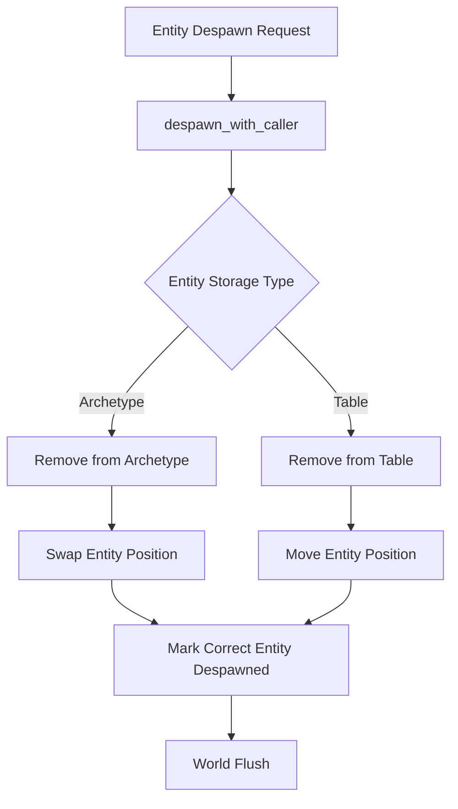

+++
title = "#21364 Fixing Entity Spawn/Despawn Tracking in Bevy ECS"
date = "2025-10-04T00:00:00"
draft = false
template = "pull_request_page.html"
in_search_index = true

[taxonomies]
list_display = ["show"]

[extra]
current_language = "en"
available_languages = {"en" = { name = "English", url = "/pull_request/bevy/2025-10/pr-21364-en-20251004" }, "zh-cn" = { name = "中文", url = "/pull_request/bevy/2025-10/pr-21364-zh-cn-20251004" }}
labels = ["C-Bug", "A-ECS"]
+++

# Title: Fixing Entity Spawn/Despawn Tracking in Bevy ECS

## Basic Information
- **Title**: set spawn_despawn on the correct entity when despawning
- **PR Link**: https://github.com/bevyengine/bevy/pull/21364
- **Author**: janis-bhm
- **Status**: MERGED
- **Labels**: C-Bug, A-ECS, S-Ready-For-Final-Review
- **Created**: 2025-10-03T14:41:17Z
- **Merged**: 2025-10-04T00:39:06Z
- **Merged By**: james7132

## Description Translation
**Objective**

Fixes #21293
Fixes #17314 to ensure that this is tested correctly.

**Solution**

When despawning an entity, previously the swapped in (archetype) or moved in entity (table) (which both require extra bookkeeping to update archetype or table rows) were marked as `spawned_or_despawned` by the location and tick that the to-be-removed entity was meant to be marked, while the to-be-removed entity wasn't marked.

As pointed out by @akimakinai in [#19047](https://github.com/bevyengine/bevy/pull/19047), I've re-added the correct `mark_spawn_despawn` call to `despawn_with_caller`.

**Testing**

I've added a test `spawned_after_swap_remove` that ensures that despawning an entity by swapping doesn't affect other entities `spawned_or_despawned` location, and that it does affect the despawned entity's index's `spawned_or_despawned` location.

Co-Authored By: waterwhisperer24@qq.com

## The Story of This Pull Request

This PR addresses a subtle but important bug in Bevy's Entity Component System (ECS) related to how entity spawn and despawn events are tracked. The core issue was in the `despawn_with_caller` method, which handles the complex process of removing entities from the ECS world.

When an entity is despawned in Bevy, the ECS performs internal optimizations that involve entity swapping and movement. In the archetype-based storage system, when an entity is removed, another entity might be swapped into its position to maintain memory locality. Similarly, in table storage, entities might be moved to fill gaps. These optimizations are crucial for performance but require careful bookkeeping.

The bug occurred because the despawn tracking was being applied to the wrong entities. Instead of marking the actual entity being despawned, the code was incorrectly marking the entities that were swapped or moved during the despawn process. This meant that:

- The despawned entity wasn't properly tracked as despawned
- Other entities that were moved during the process were incorrectly marked as despawned
- Systems relying on spawn/despawn tracking would receive incorrect information

The fix involved removing the incorrect `mark_spawn_despawn` calls that were targeting the swapped and moved entities, and adding a single correct call that targets the actual entity being despawned. This ensures that spawn/despawn tracking accurately reflects which entities actually entered or left the world.

The implementation shows a good understanding of ECS internals. The key insight was recognizing that the `self.entity` (the entity being despawned) should be the one receiving the despawn marker, not the entities that get moved during the internal reorganization. The fix is concise and targeted, addressing the root cause without introducing unnecessary complexity.

To validate the fix, the PR adds a comprehensive test that verifies:
1. Despawning one entity doesn't affect the spawn tracking of other entities
2. The despawned entity's tracking is properly updated
3. The fix works correctly with the swap-based removal optimization

## Visual Representation



## Key Files Changed

### `crates/bevy_ecs/src/world/entity_ref.rs` (+31/-6)

This file contains the core ECS implementation for entity references and world operations. The changes fix the despawn tracking bug and add a test to prevent regression.

**Key Changes:**

1. **Removed incorrect spawn/despawn marking:**
```rust
// Before (incorrectly marking swapped entity):
world
    .entities
    .mark_spawn_despawn(swapped_entity.index(), caller, change_tick);

// Before (incorrectly marking moved entity):  
world
    .entities
    .mark_spawn_despawn(moved_entity.index(), caller, change_tick);
```

2. **Added correct spawn/despawn marking:**
```rust
// After (correctly marking the actual despawned entity):
// SAFETY: `self.entity` is a valid entity index
unsafe {
    world
        .entities
        .mark_spawn_despawn(self.entity.index(), caller, change_tick);
}
```

3. **Added comprehensive test:**
```rust
#[test]
fn spawned_after_swap_remove() {
    #[derive(Component)]
    struct Marker;

    let mut world = World::new();
    let id1 = world.spawn(Marker).id();
    let _id2 = world.spawn(Marker).id();
    let id3 = world.spawn(Marker).id();

    #[cfg(feature = "track_location")]
    let e1_spawned = world.entity(id1).spawned_by();

    let spawn = world.entity(id3).spawned_by();
    world.entity_mut(id1).despawn();
    #[cfg(feature = "track_location")]
    let e1_despawned = world.entities().entity_get_spawned_or_despawned_by(id1);
    #[cfg(feature = "track_location")]
    assert_ne!(e1_spawned.map(Some), e1_despawned);

    let spawn_after = world.entity(id3).spawned_by();
    assert_eq!(spawn, spawn_after);
}
```

### `tools/ci/src/commands/test.rs` (+1/-1)

This file configures the CI test command. The change ensures that the new test runs with the required `track_location` feature enabled.

**Key Change:**
```rust
// Before:
"cargo test --workspace --lib --bins --tests {no_fail_fast...} {jobs_ref...} -- {test_threads_ref...}"

// After:
"cargo test --workspace --lib --bins --tests --features bevy_ecs/track_location {no_fail_fast...} {jobs_ref...} -- {test_threads_ref...}"
```

## Further Reading

- [Bevy ECS Documentation](https://docs.rs/bevy_ecs/latest/bevy_ecs/) - Comprehensive guide to Bevy's Entity Component System
- [Entity Component System Pattern](https://en.wikipedia.org/wiki/Entity_component_system) - Background on ECS architecture
- [Rust Unsafe Code Guidelines](https://rust-lang.github.io/unsafe-code-guidelines/) - Understanding unsafe code patterns used in the fix
- [Bevy GitHub Issues #21293](https://github.com/bevyengine/bevy/issues/21293) - Original bug report
- [Bevy GitHub Issues #17314](https://github.com/bevyengine/bevy/issues/17314) - Related tracking issue