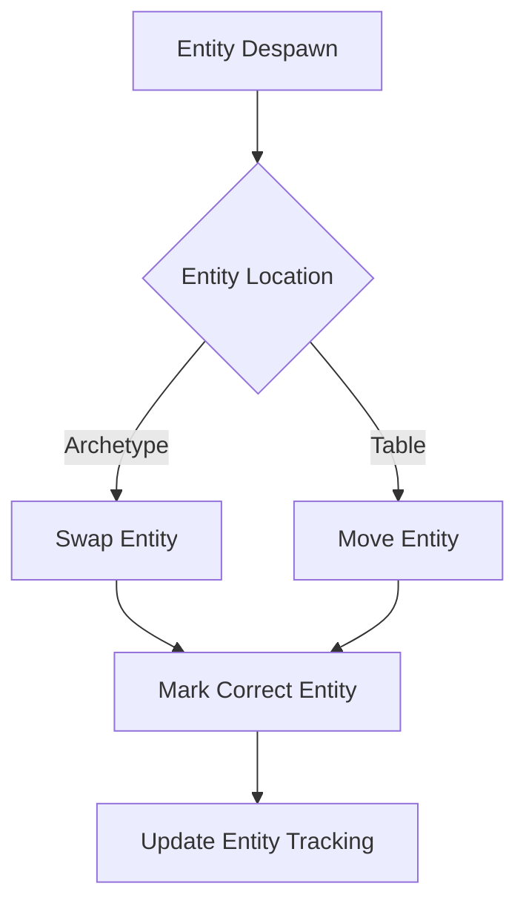

+++
title = "#21364 set spawn_despawn on the correct entity when despawning"
date = "2025-10-04T00:00:00"
draft = false
template = "pull_request_page.html"
in_search_index = false

[extra]
current_language = "zh-cn"
available_languages = {"en" = { name = "English", url = "/pull_request/bevy/2025-10/pr-21364-en-20251004" }, "zh-cn" = { name = "中文", url = "/pull_request/bevy/2025-10/pr-21364-zh-cn-20251004" }}
+++

# Title

## Basic Information
- **Title**: set spawn_despawn on the correct entity when despawning
- **PR Link**: https://github.com/bevyengine/bevy/pull/21364
- **作者**: janis-bhm
- **状态**: 已合并
- **标签**: C-Bug, A-ECS, S-Ready-For-Final-Review
- **创建时间**: 2025-10-03T14:41:17Z
- **合并时间**: 2025-10-04T00:39:06Z
- **合并者**: james7132

## 描述翻译

# 目标

修复 #21293
修复 #17314 以确保正确测试此问题。

## 解决方案

当反生成(despawn)一个实体时，之前交换进来的(archetype)或移动进来的实体(table)(这两者都需要额外的簿记来更新archetype或table行)被位置和tick标记为`spawned_or_despawned`，而要被移除的实体却没有被标记。

正如@akimakinai在[#19047](https://github.com/bevyengine/bevy/pull/19047)中指出的，我已在`despawn_with_caller`中重新添加了正确的`mark_spawn_despawn`调用。

## 测试

我添加了一个测试`spawned_after_swap_remove`，确保通过交换反生成一个实体不会影响其他实体的`spawned_or_despawned`位置，并且确实会影响被反生成实体的索引的`spawned_or_despawned`位置。

共同作者：waterwhisperer24@qq.com

## 这个Pull Request的故事

这个PR解决了一个在Bevy ECS(实体组件系统)中关于实体反生成标记的bug。当反生成一个实体时，系统需要正确标记哪个实体被反生成，这对于实体生命周期追踪至关重要。

问题的核心在于`despawn_with_caller`方法中的逻辑错误。在反生成过程中，当实体从archetype或table中移除时，可能会有其他实体被交换或移动来填充空缺位置。原来的代码错误地将这些交换或移动进来的实体标记为已反生成，而没有标记实际要被移除的实体。

具体来说，在`crates/bevy_ecs/src/world/entity_ref.rs`中，`despawn_with_caller`方法包含两个有问题的`mark_spawn_despawn`调用：

```rust
// 问题代码 - 标记了错误的实体
world
    .entities
    .mark_spawn_despawn(swapped_entity.index(), caller, change_tick);

world
    .entities
    .mark_spawn_despawn(moved_entity.index(), caller, change_tick);
```

这些调用标记的是交换或移动进来的实体，而不是实际要被反生成的实体`self.entity`。

修复方案是移除这两个错误的调用，并在方法末尾添加正确的调用：

```rust
// 修复后的代码 - 标记正确的实体
unsafe {
    world
        .entities
        .mark_spawn_despawn(self.entity.index(), caller, change_tick);
}
```

这个修复确保了实体生命周期追踪的准确性，这对于依赖实体生成/反生成状态的功能至关重要，比如查询过滤、事件系统等。

为了验证修复的有效性，作者添加了一个测试用例`spawned_after_swap_remove`。这个测试创建多个实体，反生成其中一个，然后验证：
1. 被反生成的实体的`spawned_or_despawned`位置确实发生了变化
2. 其他实体的`spawned_or_despawned`位置保持不变

此外，在`tools/ci/src/commands/test.rs`中，测试命令被更新以包含`bevy_ecs/track_location`特性，确保新的测试能够运行。

这个bug修复展示了在系统编程中正确处理实体生命周期的重要性，特别是在涉及内存管理和资源追踪的ECS系统中。正确的实体标记确保了系统的稳定性和可预测性。

## 可视化表示



## 关键文件变更

### `crates/bevy_ecs/src/world/entity_ref.rs` (+31/-6)

主要变更：
1. 修复了`despawn_with_caller`方法中错误的实体标记
2. 添加了测试用例验证修复

关键代码变更：

```rust
// 移除的错误标记调用：
// world.entities.mark_spawn_despawn(swapped_entity.index(), caller, change_tick);
// world.entities.mark_spawn_despawn(moved_entity.index(), caller, change_tick);

// 添加的正确标记调用：
unsafe {
    world
        .entities
        .mark_spawn_despawn(self.entity.index(), caller, change_tick);
}
```

新增的测试用例：

```rust
#[test]
fn spawned_after_swap_remove() {
    #[derive(Component)]
    struct Marker;

    let mut world = World::new();
    let id1 = world.spawn(Marker).id();
    let _id2 = world.spawn(Marker).id();
    let id3 = world.spawn(Marker).id();

    #[cfg(feature = "track_location")]
    let e1_spawned = world.entity(id1).spawned_by();

    let spawn = world.entity(id3).spawned_by();
    world.entity_mut(id1).despawn();
    #[cfg(feature = "track_location")]
    let e1_despawned = world.entities().entity_get_spawned_or_despawned_by(id1);
    #[cfg(feature = "track_location")]
    assert_ne!(e1_spawned.map(Some), e1_despawned);

    let spawn_after = world.entity(id3).spawned_by();
    assert_eq!(spawn, spawn_after);
}
```

### `tools/ci/src/commands/test.rs` (+1/-1)

更新了测试命令以包含必要的特性：

```rust
// 变更前：
"cargo test --workspace --lib --bins --tests {no_fail_fast...} {jobs_ref...} -- {test_threads_ref...}"

// 变更后：
"cargo test --workspace --lib --bins --tests --features bevy_ecs/track_location {no_fail_fast...} {jobs_ref...} -- {test_threads_ref...}"
```

## 进一步阅读

- [Bevy ECS 文档](https://bevyengine.org/learn/book/ecs/) - 了解Bevy的实体组件系统
- [实体生命周期管理](https://bevyengine.org/learn/book/ecs/entity-lifecycle/) - 实体生成和反生成的详细说明
- [Rust unsafe代码指南](https://doc.rust-lang.org/nomicon/) - 理解代码中的unsafe块使用