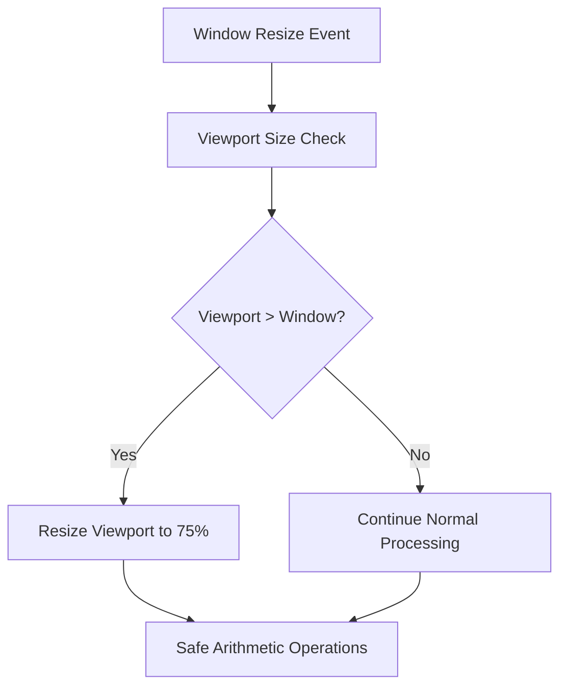

+++
title = "#21365 Fix u32 overflow when window is resize"
date = "2025-10-04T00:00:00"
draft = false
template = "pull_request_page.html"
in_search_index = true

[taxonomies]
list_display = ["show"]

[extra]
current_language = "en"
available_languages = {"en" = { name = "English", url = "/pull_request/bevy/2025-10/pr-21365-en-20251004" }, "zh-cn" = { name = "中文", url = "/pull_request/bevy/2025-10/pr-21365-zh-cn-20251004" }}
labels = ["C-Bug", "A-Rendering", "C-Examples", "A-Windowing", "D-Straightforward"]
+++

# Fix u32 overflow when window is resize

## Basic Information
- **Title**: Fix u32 overflow when window is resize
- **PR Link**: https://github.com/bevyengine/bevy/pull/21365
- **Author**: baozaolaoba-top
- **Status**: MERGED
- **Labels**: C-Bug, A-Rendering, C-Examples, A-Windowing, S-Ready-For-Final-Review, D-Straightforward
- **Created**: 2025-10-03T16:12:30Z
- **Merged**: 2025-10-04T19:07:15Z
- **Merged By**: alice-i-cecile

## Description Translation
The original description is in English, so it is preserved as-is:

# Objective

bevy v0.17.1, archlinux + i3wm.

`cargo run --example 2d_viewport_to_world`

```
thread 'Compute Task Pool (1)' (470531) panicked at /home/go/.cargo/registry/src/index.crates.io-1949cf8c6b5b557f/glam-0.30.8/src/u32/uvec2.rs:1071:23:
attempt to subtract with overflow
note: run with `RUST_BACKTRACE=1` environment variable to display a backtrace
Encountered a panic in system `2d_viewport_to_world::controls`!
Encountered a panic in system `bevy_app::main_schedule::FixedMain::run_fixed_main`!
Encountered a panic in system `bevy_time::fixed::run_fixed_main_schedule`!
Encountered a panic in system `bevy_app::main_schedule::Main::run_main`!
```

## Solution

Consider window resize。

## Testing

no panic.

---

## The Story of This Pull Request

This PR addresses a specific integer overflow bug that occurs when resizing windows in the Bevy game engine's 2D viewport example. The issue manifested as a panic in the `glam` library's vector mathematics code when attempting to perform subtraction operations that would underflow unsigned integers.

The core problem occurred in the `2d_viewport_to_world` example's control system. When users resized their application window to a smaller size, the viewport's physical dimensions could become larger than the window itself. This mismatch created a scenario where subsequent arithmetic operations in the viewport positioning logic would attempt to subtract larger values from smaller ones, causing unsigned integer underflow.

The solution implemented is straightforward and defensive. Before processing viewport movement controls, the code now checks if either dimension of the viewport's physical size exceeds the corresponding window dimension. If this condition is met, the viewport is automatically resized to 75% of the window dimensions, ensuring the viewport always fits within the window bounds.

This fix demonstrates an important principle in game engine development: robust handling of dynamic window resizing. The implementation uses saturation arithmetic (`saturating_sub`) for viewport movement to prevent similar overflow issues, and the new resize check acts as a safety net against invalid viewport configurations.

The change is minimal but effective - it adds only three lines of code that prevent a crash scenario while maintaining the example's intended functionality. The solution preserves the viewport's relative size (75% of window) while ensuring mathematical operations remain within safe bounds.

## Visual Representation



## Key Files Changed

### `examples/2d/2d_viewport_to_world.rs`

This file contains the 2D viewport to world example that demonstrates how to work with viewports and convert between viewport coordinates and world coordinates.

**Key Changes:**
- Added viewport size validation logic to prevent integer overflow
- Implemented defensive programming against window resize edge cases

```rust
// File: examples/2d/2d_viewport_to_world.rs
// Added code:
if let Some(viewport) = camera.viewport.as_mut() {
    // Reset viewport size on window resize
    if viewport.physical_size.x > window_size.x || viewport.physical_size.y > window_size.y {
        viewport.physical_size = (window_size.as_vec2() * 0.75).as_uvec2();
    }

    // Viewport movement controls
    if input.pressed(KeyCode::KeyW) {
        viewport.physical_position.y = viewport.physical_position.y.saturating_sub(uspeed);
```

The change integrates seamlessly with the existing viewport movement controls, placing the validation check at the beginning of the viewport modification logic. This ensures the viewport is in a valid state before any movement operations occur.

## Further Reading

- [Bevy Viewport Documentation](https://docs.rs/bevy/latest/bevy/render/view/struct.Viewport.html)
- [Rust Integer Overflow Handling](https://doc.rust-lang.org/book/ch03-02-data-types.html#integer-overflow)
- [Saturation Arithmetic in Game Development](https://gamedev.stackexchange.com/questions/140469/what-is-saturation-arithmetic)
- [Bevy Camera and Viewport Systems](https://bevy-cheatbook.github.io/features/camera.html)