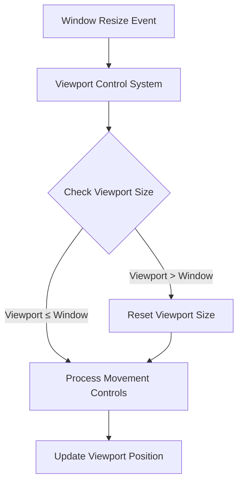

+++
title = "#21365 Fix u32 overflow when window is resize"
date = "2025-10-04T00:00:00"
draft = false
template = "pull_request_page.html"
in_search_index = false

[extra]
current_language = "zh-cn"
available_languages = {"en" = { name = "English", url = "/pull_request/bevy/2025-10/pr-21365-en-20251004" }, "zh-cn" = { name = "中文", url = "/pull_request/bevy/2025-10/pr-21365-zh-cn-20251004" }}
labels = ["C-Bug", "A-Rendering", "C-Examples", "A-Windowing", "D-Straightforward"]
+++

# Title

## Basic Information
- **Title**: Fix u32 overflow when window is resize
- **PR Link**: https://github.com/bevyengine/bevy/pull/21365
- **Author**: baozaolaoba-top
- **Status**: MERGED
- **Labels**: C-Bug, A-Rendering, C-Examples, A-Windowing, S-Ready-For-Final-Review, D-Straightforward
- **Created**: 2025-10-03T16:12:30Z
- **Merged**: 2025-10-04T19:07:15Z
- **Merged By**: alice-i-cecile

## Description Translation
**目标**

bevy v0.17.1, archlinux + i3wm.

`cargo run --example 2d_viewport_to_world`

```
thread 'Compute Task Pool (1)' (470531) panicked at /home/go/.cargo/registry/src/index.crates.io-1949cf8c6b5b557f/glam-0.30.8/src/u32/uvec2.rs:1071:23:
attempt to subtract with overflow
note: run with `RUST_BACKTRACE=1` environment variable to display a backtrace
Encountered a panic in system `2d_viewport_to_world::controls`!
Encountered a panic in system `bevy_app::main_schedule::FixedMain::run_fixed_main`!
Encountered a panic in system `bevy_time::fixed::run_fixed_main_schedule`!
Encountered a panic in system `bevy_app::main_schedule::Main::run_main`!
```

**解决方案**

考虑窗口调整大小的情况。

**测试**

不再出现panic。

---

## The Story of This Pull Request

这个PR解决了一个在窗口调整大小时出现的u32整数溢出问题。问题的根本原因是在`2d_viewport_to_world`示例中，当窗口被缩小后，视口(viewport)的物理尺寸可能超过窗口的实际尺寸，导致后续的视口位置计算出现下溢。

问题的技术背景是：在Bevy引擎中，视口系统允许定义一个渲染区域，这个区域可以小于整个窗口。示例代码中的视口初始设置为窗口尺寸的75%。但当用户调整窗口大小时，特别是缩小窗口时，现有的代码没有相应调整视口尺寸，导致视口尺寸可能超过窗口边界。

开发者遇到的具体问题是：在archlinux + i3wm环境下运行`2d_viewport_to_world`示例时，系统在视口控制系统中触发panic，错误信息显示在glam库的uvec2操作中发生了减法溢出。

解决方案的核心思想很简单：在每次处理视口控制逻辑时，检查当前视口尺寸是否超过了窗口尺寸。如果超过，就将视口尺寸重置为窗口尺寸的75%。这个修复确保了视口尺寸永远不会超过窗口边界，从而避免了后续计算中的整数溢出问题。

从技术实现角度看，这个修复采用了防御性编程(defensive programming)的策略。通过在视口移动控制逻辑之前添加边界检查，确保了系统状态的合法性。代码使用了简单的条件判断：

```rust
if viewport.physical_size.x > window_size.x || viewport.physical_size.y > window_size.y {
    viewport.physical_size = (window_size.as_vec2() * 0.75).as_uvec2();
}
```

这个检查的逻辑很直接：如果视口的宽度或高度超过了窗口的对应尺寸，就重新设置视口尺寸。使用乘法因子0.75保持了示例原有的设计意图，即视口占据窗口的75%区域。

从工程角度看，这个修复体现了几个重要的编程原则：
1. **边界条件处理**：明确处理窗口大小变化的边界情况
2. **状态一致性**：确保视口状态与窗口状态保持一致
3. **故障预防**：通过前置检查预防潜在的运行时错误

这个修复虽然代码量很小，但解决了实际使用中可能遇到的重要问题。它展示了在图形编程中处理动态窗口大小变化的重要性，以及如何在交互式应用中维护状态的一致性。

## Visual Representation



## Key Files Changed

### `examples/2d/2d_viewport_to_world.rs` (+5/-0)

这个文件是2D视口到世界坐标转换的示例代码。修改在视口控制系统(controls system)中添加了窗口大小检查逻辑。

**关键修改：**
```rust
// 在视口移动控制之前添加了边界检查
if let Some(viewport) = camera.viewport.as_mut() {
    // Reset viewport size on window resize
    if viewport.physical_size.x > window_size.x || viewport.physical_size.y > window_size.y {
        viewport.physical_size = (window_size.as_vec2() * 0.75).as_uvec2();
    }

    // 原有的视口移动控制逻辑保持不变
    if input.pressed(KeyCode::KeyW) {
        viewport.physical_position.y = viewport.physical_position.y.saturating_sub(uspeed);
    }
    // ... 其他移动控制代码
}
```

这个修改确保了当窗口被缩小时，视口尺寸会相应调整，避免出现视口大于窗口的情况。

## Further Reading

- [Bevy Viewport Documentation](https://docs.rs/bevy/latest/bevy/render/view/struct.Viewport.html) - Bevy视口系统的官方文档
- [Rust Integer Overflow Handling](https://doc.rust-lang.org/book/ch03-02-data-types.html#integer-overflow) - Rust整数溢出处理机制
- [Defensive Programming Techniques](https://en.wikipedia.org/wiki/Defensive_programming) - 防御性编程技术概述
- [Bevy Window Management](https://bevy-cheatbook.github.io/window.html) - Bevy窗口管理指南