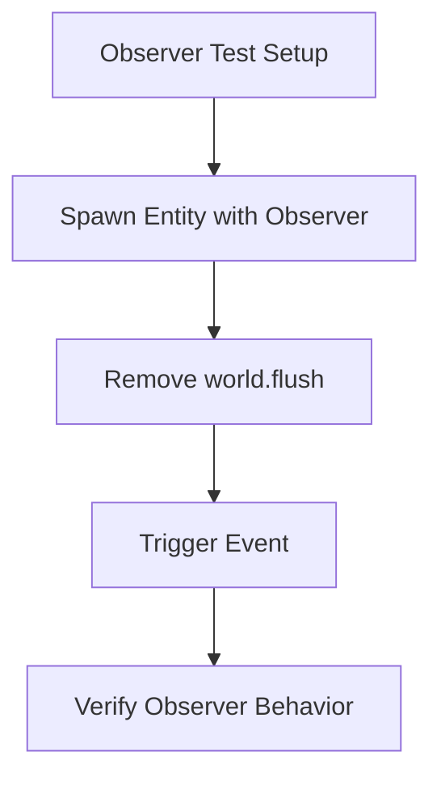

+++
title = "#21371 Remove unnecessary calls to `world.flush()`"
date = "2025-10-04T00:00:00"
draft = false
template = "pull_request_page.html"
in_search_index = true

[taxonomies]
list_display = ["show"]

[extra]
current_language = "en"
available_languages = {"en" = { name = "English", url = "/pull_request/bevy/2025-10/pr-21371-en-20251004" }, "zh-cn" = { name = "中文", url = "/pull_request/bevy/2025-10/pr-21371-zh-cn-20251004" }}
labels = ["D-Trivial", "A-ECS"]
+++

# Title
Remove unnecessary calls to `world.flush()`

## Basic Information
- **Title**: Remove unnecessary calls to `world.flush()`
- **PR Link**: https://github.com/bevyengine/bevy/pull/21371
- **Author**: WaterWhisperer
- **Status**: MERGED
- **Labels**: D-Trivial, A-ECS
- **Created**: 2025-10-04T06:50:43Z
- **Merged**: 2025-10-04T07:51:09Z
- **Merged By**: mockersf

## Description Translation
# Objective

Fixes #20177 

## Solution

Remove unnecessary calls to `world.flush()` in observer tests 

## Testing

Ran `cargo test --package bevy_ecs --lib observer` and all tests passed


## The Story of This Pull Request

This PR addresses a straightforward optimization in Bevy's ECS observer tests by removing redundant `world.flush()` calls. The issue was identified in #20177, where unnecessary flush operations were adding overhead without providing functional benefits.

The core problem relates to how Bevy's Entity Component System (ECS) manages entity operations. When entities are spawned or components are added/removed, these operations are typically batched and processed during system execution. The `world.flush()` method forces immediate processing of these pending operations, which can be useful in specific scenarios where you need to ensure entities are fully initialized before proceeding.

However, in the context of observer tests, these flush calls were unnecessary. Observers in Bevy are systems that react to events or changes in the ECS world. The tests were setting up observers and then immediately triggering events, but the flush operations weren't required for the test logic to work correctly.

The solution approach was simple and surgical: identify and remove the unnecessary flush calls. The developer ran the observer test suite to verify that all tests continued to pass without the flush operations, confirming that these calls were indeed redundant.

From a technical perspective, this change improves test performance by eliminating unnecessary synchronization points. Each `world.flush()` call incurs overhead as it processes all pending entity operations and updates internal data structures. In test scenarios where many operations are performed, these flushes can accumulate significant overhead.

The implementation was minimal but effective - removing a single line of code that was adding overhead without functional benefit. This follows the principle of keeping code clean and efficient, especially in test code that may run frequently during development.

## Visual Representation



## Key Files Changed

**File**: `crates/bevy_ecs/src/observer/entity_cloning.rs`

This file contains tests for entity cloning functionality in Bevy's observer system. The change removes one unnecessary call to `world.flush()` that was not required for the test to function correctly.

```rust
// File: crates/bevy_ecs/src/observer/entity_cloning.rs
// Before:
        world.spawn_empty()
            .observe(|_: On<E>, mut res: ResMut<Num>| res.0 += 1)
            .id();
        world.flush();

        world.trigger(E(e));

// After:
        world.spawn_empty()
            .observe(|_: On<E>, mut res: ResMut<Num>| res.0 += 1)
            .id();

        world.trigger(E(e));
```

The removal of `world.flush()` streamlines the test execution without affecting the test's ability to verify observer behavior. The test continues to validate that observers correctly respond to triggered events, but does so more efficiently.

## Further Reading

- [Bevy ECS Documentation](https://docs.rs/bevy_ecs/latest/bevy_ecs/) - Official documentation for Bevy's Entity Component System
- [Bevy Observers Guide](https://bevyengine.org/learn/quick-start/ecs/observers/) - Comprehensive guide to using observers in Bevy
- [ECS World Operations](https://docs.rs/bevy_ecs/latest/bevy_ecs/world/struct.World.html#method.flush) - Documentation for world operations including flush behavior

# Full Code Diff
```diff
diff --git a/crates/bevy_ecs/src/observer/entity_cloning.rs b/crates/bevy_ecs/src/observer/entity_cloning.rs
index 7af2d2129c594..d01d0caa6315d 100644
--- a/crates/bevy_ecs/src/observer/entity_cloning.rs
+++ b/crates/bevy_ecs/src/observer/entity_cloning.rs
@@ -95,7 +95,6 @@ mod tests {
             .spawn_empty()
             .observe(|_: On<E>, mut res: ResMut<Num>| res.0 += 1)
             .id();
-        world.flush();
 
         world.trigger(E(e));
 
```