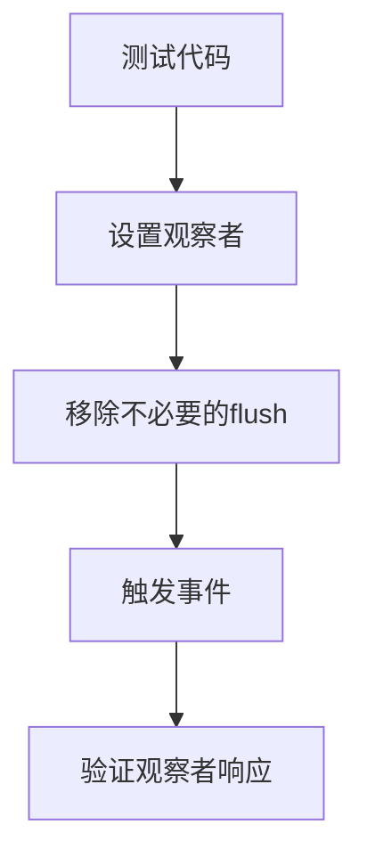

+++
title = "#21371 Remove unnecessary calls to `world.flush()`"
date = "2025-10-04T00:00:00"
draft = false
template = "pull_request_page.html"
in_search_index = false

[extra]
current_language = "zh-cn"
available_languages = {"en" = { name = "English", url = "/pull_request/bevy/2025-10/pr-21371-en-20251004" }, "zh-cn" = { name = "中文", url = "/pull_request/bevy/2025-10/pr-21371-zh-cn-20251004" }}
+++

# Title

## Basic Information
- **Title**: Remove unnecessary calls to `world.flush()`
- **PR Link**: https://github.com/bevyengine/bevy/pull/21371
- **作者**: WaterWhisperer
- **状态**: 已合并
- **标签**: D-Trivial, A-ECS
- **创建时间**: 2025-10-04T06:50:43Z
- **合并时间**: 2025-10-04T07:51:09Z
- **合并者**: mockersf

## 描述翻译
**目标**
修复 #20177

**解决方案**
移除观察者测试中不必要的 `world.flush()` 调用

**测试**
运行 `cargo test --package bevy_ecs --lib observer` 并且所有测试都通过


## 这个Pull Request的故事

这个PR解决了一个在Bevy ECS观察者测试中的简单但重要的问题。问题源于测试代码中不必要的 `world.flush()` 调用，这些调用虽然不会导致功能错误，但增加了代码的冗余和复杂性。

在Bevy的ECS系统中，`world.flush()` 方法用于强制立即处理所有待处理的实体操作，如实体创建、组件添加等。然而，在观察者测试的特定上下文中，这些调用实际上是不必要的。测试代码在设置观察者后立即调用 `world.flush()`，但观察者的注册和事件触发机制并不依赖于这些flush操作。

具体到代码变更，问题出现在 `entity_cloning.rs` 文件的测试模块中。在设置观察者系统后，代码不必要地调用了 `world.flush()`：

```rust
// 修改前：
world.spawn_empty()
    .observe(|_: On<E>, mut res: ResMut<Num>| res.0 += 1)
    .id();
world.flush();  // 不必要的调用
```

```rust
// 修改后：
world.spawn_empty()
    .observe(|_: On<E>, mut res: ResMut<Num>| res.0 += 1)
    .id();
// world.flush() 已被移除
```

从技术角度来看，这个变更体现了几个重要的工程原则：

1. **最小必要原则**：只保留真正需要的代码，移除不必要的操作
2. **测试简洁性**：测试代码应该尽可能清晰和直接，避免引入与测试目标无关的操作
3. **性能考虑**：虽然在这个测试场景中影响很小，但不必要的flush操作在更大规模的系统中可能会带来性能开销

这个变更的验证也很直接 - 作者运行了相关的观察者测试套件，确认所有测试仍然通过，证明这些flush调用确实是多余的。

从架构角度看，这个PR展示了Bevy ECS系统中观察者机制的稳定性。观察者的注册和事件处理在系统调度时自动处理，不需要手动调用flush来确保观察者能够正确接收事件。

## 可视化表示



## 关键文件变更

**文件**: `crates/bevy_ecs/src/observer/entity_cloning.rs` (+0/-1)

这个文件是Bevy ECS系统中处理实体克隆观察者逻辑的核心模块。变更很简单但重要：

**变更内容**：
- 移除了测试中不必要的 `world.flush()` 调用
- 保持了测试功能的完整性

**代码对比**：
```rust
// 修改前：
world.spawn_empty()
    .observe(|_: On<E>, mut res: ResMut<Num>| res.0 += 1)
    .id();
world.flush();  // 这一行被移除

// 修改后：
world.spawn_empty()
    .observe(|_: On<E>, mut res: ResMut<Num>| res.0 += 1)
    .id();
```

这个变更直接对应PR的目标 - 清理不必要的flush调用，使测试代码更加简洁和高效。

## 进一步阅读

- [Bevy ECS 观察者文档](https://docs.rs/bevy_ecs/latest/bevy_ecs/observer/index.html)
- [Bevy 测试最佳实践](https://bevyengine.org/learn/book/next-steps/testing/)
- [ECS 模式在游戏开发中的应用](https://en.wikipedia.org/wiki/Entity_component_system)

# Full Code Diff
```diff
diff --git a/crates/bevy_ecs/src/observer/entity_cloning.rs b/crates/bevy_ecs/src/observer/entity_cloning.rs
index 7af2d2129c594..d01d0caa6315d 100644
--- a/crates/bevy_ecs/src/observer/entity_cloning.rs
+++ b/crates/bevy_ecs/src/observer/entity_cloning.rs
@@ -95,7 +95,6 @@ mod tests {
             .spawn_empty()
             .observe(|_: On<E>, mut res: ResMut<Num>| res.0 += 1)
             .id();
-        world.flush();
 
         world.trigger(E(e));
 
```