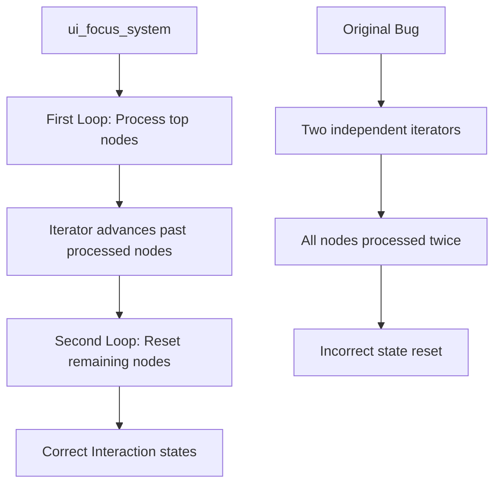

+++
title = "#21375 `Interaction::Hovered` fix"
date = "2025-10-05T00:00:00"
draft = false
template = "pull_request_page.html"
in_search_index = true

[taxonomies]
list_display = ["show"]

[extra]
current_language = "en"
available_languages = {"en" = { name = "English", url = "/pull_request/bevy/2025-10/pr-21375-en-20251005" }, "zh-cn" = { name = "中文", url = "/pull_request/bevy/2025-10/pr-21375-zh-cn-20251005" }}
labels = ["C-Bug", "A-UI", "D-Straightforward"]
+++

# Title

## Basic Information
- **Title**: `Interaction::Hovered` fix
- **PR Link**: https://github.com/bevyengine/bevy/pull/21375
- **Author**: ickshonpe
- **Status**: MERGED
- **Labels**: C-Bug, A-UI, S-Ready-For-Final-Review, D-Straightforward
- **Created**: 2025-10-04T11:38:52Z
- **Merged**: 2025-10-05T20:06:41Z
- **Merged By**: alice-i-cecile

## Description Translation
**Objective**

The `Interaction` component only gets set to `None` and `Pressed` atm.

fixes #21374

**Solution**

The second while loop through `hovered_nodes` needs to reuse the iterator from the first while loop. Instead it creates a new iterator and sets `Interaction::None` for all hovered nodes, not just the ones that are blocked.

## The Story of This Pull Request

This PR addresses a subtle but important bug in Bevy's UI focus system where the `Interaction` component wasn't being properly managed for hovered UI elements. The core issue was in how the system handled iterator state across multiple processing phases.

The problem manifested when users hovered over UI elements that had blocking focus policies. In the original implementation, the system would correctly process interactions for the top nodes but then incorrectly reset the interaction state for all hovered nodes in a subsequent pass. This occurred because the second loop created a fresh iterator rather than continuing from where the first loop left off.

Looking at the technical implementation, the `ui_focus_system` processes hovered nodes in two phases. The first phase sets nodes to either `Pressed` or `Hovered` state, stopping when it encounters a node with a blocking focus policy. The second phase is supposed to reset the remaining lower nodes to `None` state, but only those that weren't already processed in the first phase.

The bug occurred because both loops were using independent iterators:

```rust
// Original problematic code
let mut iter = node_query.iter_many_mut(hovered_nodes.iter());
// First loop processes top nodes...

let mut iter = node_query.iter_many_mut(hovered_nodes.iter());
// Second loop incorrectly processes ALL nodes again
```

The fix leverages iterator state persistence by storing the iterator and using it across both loops:

```rust
// Fixed code
let mut hovered_nodes = hovered_nodes.iter();
let mut iter = node_query.iter_many_mut(hovered_nodes.by_ref());
// First loop processes top nodes and advances the iterator...

let mut iter = node_query.iter_many_mut(hovered_nodes);
// Second loop continues from where first loop left off
```

The key insight here is that `hovered_nodes.by_ref()` in the first loop allows the iterator to be advanced, and then the same iterator state is passed to the second loop. This ensures that only the unprocessed nodes get their interaction state reset to `None`.

This is a classic example of iterator state management in Rust systems programming. The solution demonstrates understanding of how Rust iterators work and how to properly manage their state across multiple processing phases. The fix is minimal but precise - only three lines changed, with one line added and two modified.

The impact of this fix is that UI elements now correctly maintain their hover state when they're blocked by other elements with blocking focus policies. This prevents visual glitches where hover effects would disappear unexpectedly when interacting with complex UI hierarchies.

## Visual Representation



## Key Files Changed

**File: `crates/bevy_ui/src/focus.rs` (+3/-2)**

This file contains the UI focus system that manages interaction states for UI elements. The changes fix how hovered nodes are processed across multiple iteration phases.

**Key Changes:**

```rust
// Before:
let mut iter = node_query.iter_many_mut(hovered_nodes.iter());
// ... first loop processing
let mut iter = node_query.iter_many_mut(hovered_nodes.iter());
// ... second loop processing

// After:
let mut hovered_nodes = hovered_nodes.iter();
let mut iter = node_query.iter_many_mut(hovered_nodes.by_ref());
// ... first loop processing
let mut iter = node_query.iter_many_mut(hovered_nodes);
// ... second loop processing
```

The changes ensure that:
1. The iterator state is preserved between the two processing loops
2. Only unprocessed nodes get their interaction state reset
3. Nodes with blocking focus policies correctly capture and block interactions

## Further Reading

- [Bevy UI Interaction Documentation](https://docs.rs/bevy_ui/latest/bevy_ui/struct.Interaction.html)
- [Rust Iterator Documentation](https://doc.rust-lang.org/std/iter/trait.Iterator.html)
- [Bevy ECS Query Iteration Patterns](https://bevy-cheatbook.github.io/programming/iterating-entities.html)

# Full Code Diff

```diff
diff --git a/crates/bevy_ui/src/focus.rs b/crates/bevy_ui/src/focus.rs
index ed61ce9e3cb1e..41c133697f590 100644
--- a/crates/bevy_ui/src/focus.rs
+++ b/crates/bevy_ui/src/focus.rs
@@ -302,7 +302,8 @@ pub fn ui_focus_system(
 
     // set Pressed or Hovered on top nodes. as soon as a node with a `Block` focus policy is detected,
     // the iteration will stop on it because it "captures" the interaction.
-    let mut iter = node_query.iter_many_mut(hovered_nodes.iter());
+    let mut hovered_nodes = hovered_nodes.iter();
+    let mut iter = node_query.iter_many_mut(hovered_nodes.by_ref());
     while let Some(node) = iter.fetch_next() {
         if let Some(mut interaction) = node.interaction {
             if mouse_clicked {
@@ -329,7 +330,7 @@ pub fn ui_focus_system(
     }
     // reset `Interaction` for the remaining lower nodes to `None`. those are the nodes that remain in
     // `moused_over_nodes` after the previous loop is exited.
-    let mut iter = node_query.iter_many_mut(hovered_nodes.iter());
+    let mut iter = node_query.iter_many_mut(hovered_nodes);
     while let Some(node) = iter.fetch_next() {
         if let Some(mut interaction) = node.interaction {
             // don't reset pressed nodes because they're handled separately
```