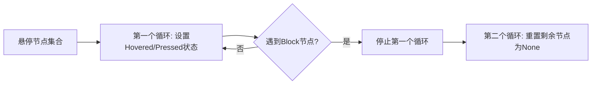

+++
title = "#21375 Interaction::Hovered` fix"
date = "2025-10-05T00:00:00"
draft = false
template = "pull_request_page.html"
in_search_index = false

[extra]
current_language = "zh-cn"
available_languages = {"en" = { name = "English", url = "/pull_request/bevy/2025-10/pr-21375-en-20251005" }, "zh-cn" = { name = "中文", url = "/pull_request/bevy/2025-10/pr-21375-zh-cn-20251005" }}
+++

# `Interaction::Hovered` fix

## 基本信息
- **标题**: `Interaction::Hovered` fix
- **PR链接**: https://github.com/bevyengine/bevy/pull/21375
- **作者**: ickshonpe
- **状态**: 已合并
- **标签**: C-Bug, A-UI, S-Ready-For-Final-Review, D-Straightforward
- **创建时间**: 2025-10-04T11:38:52Z
- **合并时间**: 2025-10-05T20:06:41Z
- **合并者**: alice-i-cecile

## 描述翻译

# 目标

`Interaction` 组件目前只会被设置为 `None` 和 `Pressed`。

修复 #21374

## 解决方案

第二个遍历 `hovered_nodes` 的 while 循环需要复用第一个 while 循环的迭代器。但当前它创建了一个新的迭代器，并为所有悬停节点设置 `Interaction::None`，而不仅仅是那些被阻塞的节点。

## 这个PR的故事

这个PR解决了一个UI交互系统中的关键bug。问题的核心在于焦点系统的实现逻辑存在缺陷，导致鼠标悬停状态无法正确更新。

在Bevy的UI系统中，`Interaction` 组件用于跟踪用户与UI元素的交互状态，包括悬停（Hovered）、按下（Pressed）和无交互（None）。系统需要正确处理鼠标悬停事件的传播，特别是在遇到具有阻塞（Block）焦点策略的节点时。

问题的根本原因在于两个循环处理同一个 `hovered_nodes` 集合时的迭代器使用方式。第一个循环负责设置悬停或按下状态，并在遇到阻塞节点时停止。第二个循环应该只重置那些被阻塞的节点（即第一个循环未处理的节点）的交互状态。

但是，在修复前的代码中，第二个循环创建了一个全新的迭代器，导致所有悬停节点都被重置为 `None`，而不仅仅是那些被阻塞的节点。这破坏了悬停状态的正确传播。

修复方案很直接：让第二个循环复用第一个循环使用的迭代器。通过将 `hovered_nodes.iter()` 存储为变量，并在第一个循环中使用 `by_ref()` 来借用这个迭代器，第二个循环可以继续使用同一个迭代器实例，从而只处理剩余的节点。

这个修复虽然代码改动很小（只有3行代码变化），但对UI交互的正确性至关重要。它确保了悬停状态能够正确地在UI层级中传播，并在遇到阻塞节点时适当地停止。

## 可视化表示



## 关键文件变更

**文件**: `crates/bevy_ui/src/focus.rs` (+3/-2)

这个文件包含了UI焦点系统的核心逻辑。主要的变更涉及两个处理悬停节点的循环：

```rust
// 修复前:
let mut iter = node_query.iter_many_mut(hovered_nodes.iter());
while let Some(node) = iter.fetch_next() {
    // 设置悬停或按下状态
    // 遇到Block节点时停止
}

let mut iter = node_query.iter_many_mut(hovered_nodes.iter());  // 错误：创建新迭代器
while let Some(node) = iter.fetch_next() {
    // 错误：重置所有悬停节点
}
```

```rust
// 修复后:
let mut hovered_nodes = hovered_nodes.iter();  // 存储迭代器
let mut iter = node_query.iter_many_mut(hovered_nodes.by_ref());  // 使用引用
while let Some(node) = iter.fetch_next() {
    // 设置悬停或按下状态
    // 遇到Block节点时停止
}

let mut iter = node_query.iter_many_mut(hovered_nodes);  // 复用同一个迭代器
while let Some(node) = iter.fetch_next() {
    // 正确：只重置剩余的节点
}
```

这个变更确保了：
1. 第一个循环处理节点直到遇到阻塞节点
2. 第二个循环只处理第一个循环未处理的节点
3. 悬停状态能够正确地在UI层级中传播

## 进一步阅读

- [Bevy UI 交互系统文档](https://docs.rs/bevy_ui/latest/bevy_ui/)
- [Rust 迭代器文档](https://doc.rust-lang.org/std/iter/trait.Iterator.html)
- [Bevy ECS 查询系统](https://bevy-cheatbook.github.io/programming/queries.html)

# 完整代码差异

```diff
diff --git a/crates/bevy_ui/src/focus.rs b/crates/bevy_ui/src/focus.rs
index ed61ce9e3cb1e..41c133697f590 100644
--- a/crates/bevy_ui/src/focus.rs
+++ b/crates/bevy_ui/src/focus.rs
@@ -302,7 +302,8 @@ pub fn ui_focus_system(
 
     // set Pressed or Hovered on top nodes. as soon as a node with a `Block` focus policy is detected,
     // the iteration will stop on it because it "captures" the interaction.
-    let mut iter = node_query.iter_many_mut(hovered_nodes.iter());
+    let mut hovered_nodes = hovered_nodes.iter();
+    let mut iter = node_query.iter_many_mut(hovered_nodes.by_ref());
     while let Some(node) = iter.fetch_next() {
         if let Some(mut interaction) = node.interaction {
             if mouse_clicked {
@@ -329,7 +330,7 @@ pub fn ui_focus_system(
     }
     // reset `Interaction` for the remaining lower nodes to `None`. those are the nodes that remain in
     // `moused_over_nodes` after the previous loop is exited.
-    let mut iter = node_query.iter_many_mut(hovered_nodes.iter());
+    let mut iter = node_query.iter_many_mut(hovered_nodes);
     while let Some(node) = iter.fetch_next() {
         if let Some(mut interaction) = node.interaction {
             // don't reset pressed nodes because they're handled separately
```