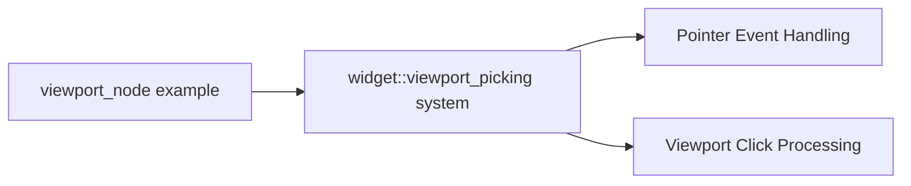

+++
title = "#21377 fix typo in viewport_node example"
date = "2025-10-04T00:00:00"
draft = false
template = "pull_request_page.html"
in_search_index = true

[taxonomies]
list_display = ["show"]

[extra]
current_language = "en"
available_languages = {"en" = { name = "English", url = "/pull_request/bevy/2025-10/pr-21377-en-20251004" }, "zh-cn" = { name = "中文", url = "/pull_request/bevy/2025-10/pr-21377-zh-cn-20251004" }}
labels = ["C-Docs", "D-Trivial", "C-Examples"]
+++

# Title
fix typo in viewport_node example

## Basic Information
- **Title**: fix typo in viewport_node example
- **PR Link**: https://github.com/bevyengine/bevy/pull/21377
- **Author**: df51d
- **Status**: MERGED
- **Labels**: C-Docs, D-Trivial, C-Examples, S-Needs-Review
- **Created**: 2025-10-04T13:23:52Z
- **Merged**: 2025-10-04T14:20:01Z
- **Merged By**: mockersf

## Description Translation
# Objective
Fix typo in viewport_node example 
## Solution
- the comment should point to [widget](https://docs.rs/bevy/latest/bevy/ui/widget/fn.viewport_picking.html) not widgets.

## The Story of This Pull Request

This pull request addresses a simple but important documentation issue in the Bevy game engine's UI examples. The problem was a typo in a code comment within the `viewport_node` example, where a reference to the `viewport_picking` system pointed to an incorrect module path.

The issue was straightforward: the comment referenced `bevy::ui::widgets::viewport_picking` when the actual system resides in `bevy::ui::widget::viewport_picking`. This is a common type of error that occurs when documentation comments drift out of sync with code changes during development.

From an engineering perspective, accurate documentation is crucial for several reasons. First, it helps developers understand the codebase and its architecture. Second, it prevents confusion when developers try to locate the referenced functionality. Third, it maintains the credibility of the codebase - if small errors like this exist, developers might question the accuracy of more complex documentation.

The solution implemented by df51d was minimal and surgical: a single character change from `widgets` to `widget` in the comment. While this change is small, it has practical implications for developers using this example as a reference for their own viewport node implementations.

The technical context here involves Bevy's UI system and viewport picking functionality. The `viewport_picking` system is responsible for handling pointer events on viewport nodes, ensuring that clicks pass through to the appropriate UI elements. When developers study this example to understand how to implement similar functionality, having accurate references to the underlying systems is essential for their learning and implementation process.

This fix demonstrates the importance of maintaining documentation accuracy even in small details. In complex systems like game engines, where multiple developers contribute code, these minor inconsistencies can accumulate and create confusion over time. The quick review and merge process (less than one hour from creation to merge) shows that the Bevy team recognizes the value of keeping documentation precise and up-to-date.

## Visual Representation



## Key Files Changed

- `examples/ui/viewport_node.rs` (+1/-1)

This file contains an example demonstrating viewport node functionality in Bevy's UI system. The change was a single-line comment correction that fixes a module path reference.

```rust
// File: examples/ui/viewport_node.rs
// Before:
// `bevy::ui::widgets::viewport_picking` system will take care of ensuring our viewport

// After:
// `bevy::ui::widget::viewport_picking` system will take care of ensuring our viewport
```

The correction changes the reference from the non-existent `widgets` module to the correct `widget` module where the `viewport_picking` function is actually located. This ensures that developers reading the example can correctly locate the referenced system in the Bevy codebase.

## Further Reading

- [Bevy UI Guide](https://bevy-cheatbook.github.io/ui.html) - Comprehensive guide to Bevy's UI system
- [Bevy Viewport Nodes Documentation](https://docs.rs/bevy/latest/bevy/ui/viewport/struct.ViewportNode.html) - Official documentation for viewport nodes
- [Rust Documentation Comments](https://doc.rust-lang.org/rustdoc/how-to-write-documentation.html) - Best practices for writing documentation in Rust

## Full Code Diff
```diff
diff --git a/examples/ui/viewport_node.rs b/examples/ui/viewport_node.rs
index b1623552d1e92..913ba765f4c5e 100644
--- a/examples/ui/viewport_node.rs
+++ b/examples/ui/viewport_node.rs
@@ -65,7 +65,7 @@ fn test(
             Shape,
         ))
         // We can observe pointer events on our objects as normal, the
-        // `bevy::ui::widgets::viewport_picking` system will take care of ensuring our viewport
+        // `bevy::ui::widget::viewport_picking` system will take care of ensuring our viewport
         // clicks pass through
         .observe(on_drag_cuboid);
```