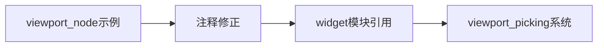

+++
title = "#21377 fix typo in viewport_node example"
date = "2025-10-04T00:00:00"
draft = false
template = "pull_request_page.html"
in_search_index = false

[extra]
current_language = "zh-cn"
available_languages = {"en" = { name = "English", url = "/pull_request/bevy/2025-10/pr-21377-en-20251004" }, "zh-cn" = { name = "中文", url = "/pull_request/bevy/2025-10/pr-21377-zh-cn-20251004" }}
+++

# 修复 viewport_node 示例中的拼写错误

## 基本信息
- **标题**: fix typo in viewport_node example
- **PR 链接**: https://github.com/bevyengine/bevy/pull/21377
- **作者**: df51d
- **状态**: 已合并
- **标签**: C-Docs, D-Trivial, C-Examples, S-Needs-Review
- **创建时间**: 2025-10-04T13:23:52Z
- **合并时间**: 2025-10-04T14:20:01Z
- **合并者**: mockersf

## 描述翻译
# 目标
修复 viewport_node 示例中的拼写错误
## 解决方案
- 注释应该指向 [widget](https://docs.rs/bevy/latest/bevy/ui/widget/fn.viewport_picking.html) 而不是 widgets。

## 这个 Pull Request 的故事

这个 pull request 展示了一个典型的文档维护场景：一个小但重要的拼写错误修正。在 Bevy 游戏引擎的示例代码中，开发者发现了一个模块路径的拼写错误。

问题的核心在于 `examples/ui/viewport_node.rs` 文件中的一行注释。该注释错误地将 `bevy::ui::widget::viewport_picking` 系统引用为 `bevy::ui::widgets::viewport_picking`，使用了复数形式的 "widgets" 而不是正确的单数形式 "widget"。

这种错误虽然看似微小，但在软件开发中却很重要。不准确的文档注释会导致开发者在使用 API 时产生困惑，特别是在查找相关函数和模块时。正确的模块路径引用对于维护代码的可读性和开发者的工作效率至关重要。

开发者 df51d 识别到这个问题并提供了一个简洁的解决方案：将注释中的 "widgets" 修正为 "widget"。这个修改确保了代码注释与实际 API 结构的一致性。

从技术角度看，这个修正涉及 Bevy 引擎的 UI 系统，特别是视口拾取（viewport picking）功能。视口拾取是处理用户界面交互的重要机制，正确的文档有助于开发者理解如何实现点击事件的处理和传递。

这个修改虽然简单，但体现了良好的代码维护实践。准确的文档注释降低了新开发者的学习成本，减少了因文档错误导致的开发时间浪费。在大型开源项目如 Bevy 中，这类细节维护对于项目的长期健康发展至关重要。

## 视觉表示



## 关键文件更改

**修改的文件**: `examples/ui/viewport_node.rs`

这个文件包含了 UI 视口节点的示例代码。修改的内容是一行注释，修正了模块路径的拼写错误。

```rust
// 修改前:
// `bevy::ui::widgets::viewport_picking` system will take care of ensuring our viewport

// 修改后:
// `bevy::ui::widget::viewport_picking` system will take care of ensuring our viewport
```

这个修改确保了代码注释与实际的 Bevy API 结构保持一致。`bevy::ui::widget` 是正确的模块路径，而之前的复数形式 `widgets` 是错误的。

## 进一步阅读

- [Bevy UI 系统文档](https://docs.rs/bevy/latest/bevy/ui/index.html)
- [Bevy 视口拾取功能文档](https://docs.rs/bevy/latest/bevy/ui/widget/fn.viewport_picking.html)
- [Bevy 示例代码库](https://github.com/bevyengine/bevy/tree/main/examples)

# 完整代码差异
```diff
diff --git a/examples/ui/viewport_node.rs b/examples/ui/viewport_node.rs
index b1623552d1e92..913ba765f4c5e 100644
--- a/examples/ui/viewport_node.rs
+++ b/examples/ui/viewport_node.rs
@@ -65,7 +65,7 @@ fn test(
             Shape,
         ))
         // We can observe pointer events on our objects as normal, the
-        // `bevy::ui::widgets::viewport_picking` system will take care of ensuring our viewport
+        // `bevy::ui::widget::viewport_picking` system will take care of ensuring our viewport
         // clicks pass through
         .observe(on_drag_cuboid);
```