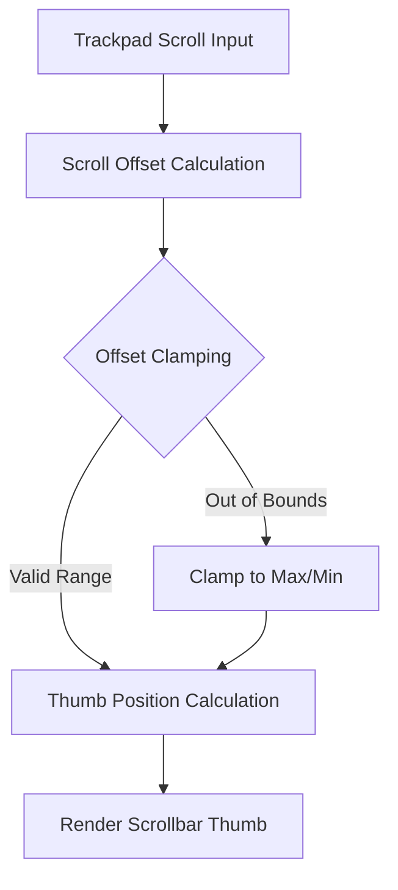

+++
title = "#21378 Clamp scroll offset to prevent scrollbar thumb from going out of bounds"
date = "2025-10-05T00:00:00"
draft = false
template = "pull_request_page.html"
in_search_index = true

[taxonomies]
list_display = ["show"]

[extra]
current_language = "en"
available_languages = {"en" = { name = "English", url = "/pull_request/bevy/2025-10/pr-21378-en-20251005" }, "zh-cn" = { name = "中文", url = "/pull_request/bevy/2025-10/pr-21378-zh-cn-20251005" }}
labels = ["C-Bug", "A-UI", "D-Straightforward"]
+++

# Title

## Basic Information
- **Title**: Clamp scroll offset to prevent scrollbar thumb from going out of bounds
- **PR Link**: https://github.com/bevyengine/bevy/pull/21378
- **Author**: sroauth
- **Status**: MERGED
- **Labels**: C-Bug, A-UI, S-Ready-For-Final-Review, D-Straightforward
- **Created**: 2025-10-04T13:24:58Z
- **Merged**: 2025-10-05T17:31:10Z
- **Merged By**: alice-i-cecile

## Description Translation
**Objective**

Fixes a bug where the scrollbar thumb could go outside the scrollbar area when scrolling very quickly on trackpads.

**Solution**

Clamp the scroll offset to the maximum valid range before calculating the thumb's position. This ensures the thumb never renders outside the scrollbar area bounds.

**Testing**

Manually verified that the scrollbar thumb stays within the scrollbar area when scrolling rapidly on a trackpad.

Tested on MacOS (MacBook Pro M1)

## The Story of This Pull Request

This PR addresses a specific UI bug that occurs during rapid scrolling with trackpad input. The issue manifests when inertial scrolling causes the scroll offset to exceed the valid bounds, resulting in the scrollbar thumb rendering outside its designated track area.

The core problem lies in the scrollbar thumb position calculation. When users scroll quickly on trackpads, the physics-based scrolling system can generate scroll offsets that exceed the maximum valid range (content_size - visible_size). This happens because trackpad scrolling often includes momentum or inertial scrolling effects that can temporarily push the offset beyond logical bounds.

The solution implements a straightforward clamping mechanism that ensures the scroll offset stays within valid boundaries before computing the thumb position. The key insight is that the offset clamping should occur early in the calculation pipeline, specifically within the `thumb_pos_and_size` function where the thumb geometry is determined.

The implementation adds offset validation immediately after calculating the thumb size but before computing the thumb position. This timing is crucial because it ensures that all subsequent calculations use a sanitized offset value. The clamping logic handles two cases:

1. When content exceeds the visible area, the offset is clamped between 0 and (content_size - visible_size)
2. When all content fits within the visible area, the offset is forced to 0 since no scrolling is possible

This approach maintains the existing calculation logic while adding a safety check that prevents visual artifacts. The solution is minimal and focused, addressing only the specific boundary condition without refactoring the broader scrolling system.

The fix demonstrates good defensive programming practices by validating input parameters (the scroll offset) before using them in calculations. This prevents cascading errors and ensures the UI remains visually consistent even when the underlying input data might be temporarily invalid due to physics simulation or user input quirks.

## Visual Representation



## Key Files Changed

### `crates/bevy_ui_widgets/src/scrollbar.rs` (+10/-1)

This file contains the core scrollbar widget implementation. The changes focus on the `thumb_pos_and_size` function, which calculates the position and dimensions of the scrollbar thumb element.

**Key Changes:**
1. Made the `offset` parameter mutable to allow clamping
2. Added offset validation logic before thumb position calculation
3. Maintained existing calculation logic for thumb size and position

```rust
// File: crates/bevy_ui_widgets/src/scrollbar.rs
// Before:
fn thumb_pos_and_size(
    content_size: f32,
    visible_size: f32,
    track_length: f32,
    min_size: f32,
    offset: f32,
) -> (f32, f32) {
    let thumb_size = if content_size > visible_size {
        (track_length * visible_size / content_size)
            .max(min_size)
            .min(track_length)
    } else {
        track_length
    };

    let thumb_pos = if content_size > visible_size {
        offset * (track_length - thumb_size) / (content_size - visible_size)
    } else {
        0.0
    };

    (thumb_pos, thumb_size)
}

// After:
fn thumb_pos_and_size(
    content_size: f32,
    visible_size: f32,
    track_length: f32,
    min_size: f32,
    mut offset: f32,  // Now mutable
) -> (f32, f32) {
    let thumb_size = if content_size > visible_size {
        (track_length * visible_size / content_size)
            .max(min_size)
            .min(track_length)
    } else {
        track_length
    };

    // New offset clamping logic
    if content_size > visible_size {
        let max_offset = content_size - visible_size;
        
        // Clamp offset to prevent thumb from going out of bounds during inertial scroll
        offset = offset.clamp(0.0, max_offset);
    } else {
        offset = 0.0;
    }

    let thumb_pos = if content_size > visible_size {
        offset * (track_length - thumb_size) / (content_size - visible_size)
    } else {
        0.0
    };

    (thumb_pos, thumb_size)
}
```

The changes ensure that the scrollbar thumb always remains within the visible track area by sanitizing the input offset before using it in position calculations.

## Further Reading

- [Bevy UI System Documentation](https://docs.rs/bevy_ui/latest/bevy_ui/)
- [Scrollbar Widget Implementation](https://github.com/bevyengine/bevy/tree/main/crates/bevy_ui_widgets)
- [Rust `clamp` Method Documentation](https://doc.rust-lang.org/std/primitive.f32.html#method.clamp)
- [UI Scrollbar Design Patterns](https://www.w3.org/WAI/ARIA/apg/patterns/scrollbar/)