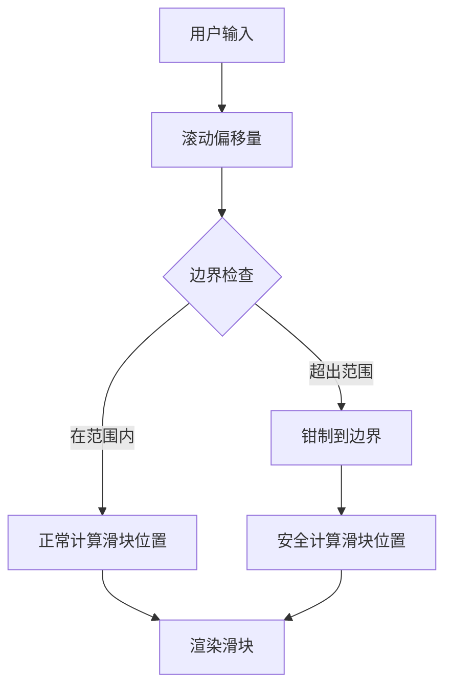

+++
title = "#21378 Clamp scroll offset to prevent scrollbar thumb from going out of bounds"
date = "2025-10-05T00:00:00"
draft = false
template = "pull_request_page.html"
in_search_index = false

[extra]
current_language = "zh-cn"
available_languages = {"en" = { name = "English", url = "/pull_request/bevy/2025-10/pr-21378-en-20251005" }, "zh-cn" = { name = "中文", url = "/pull_request/bevy/2025-10/pr-21378-zh-cn-20251005" }}
labels = ["C-Bug", "A-UI", "D-Straightforward"]
+++

# Title

## Basic Information
- **Title**: Clamp scroll offset to prevent scrollbar thumb from going out of bounds
- **PR Link**: https://github.com/bevyengine/bevy/pull/21378
- **Author**: sroauth
- **Status**: MERGED
- **Labels**: C-Bug, A-UI, S-Ready-For-Final-Review, D-Straightforward
- **Created**: 2025-10-04T13:24:58Z
- **Merged**: 2025-10-05T17:31:10Z
- **Merged By**: alice-i-cecile

## Description Translation
**目标**
修复了在触控板上快速滚动时，滚动条滑块可能超出滚动条区域的问题。

**解决方案**
在计算滑块位置之前，将滚动偏移量限制在最大有效范围内。这确保滑块永远不会在滚动条区域边界之外渲染。

**测试**
手动验证了在触控板上快速滚动时，滚动条滑块保持在滚动条区域内。
在 MacOS (MacBook Pro M1) 上进行了测试。

## The Story of This Pull Request

这个PR解决了一个UI组件中的边界条件问题。当用户在触控板上快速滚动时，由于惯性滚动(惯性滚动)的物理特性，滚动偏移量可能会超出有效范围，导致滚动条滑块(滚动条滑块)渲染到滚动条轨道(滚动条轨道)之外。

问题的核心在于`thumb_layout`函数中的偏移量处理。在修改之前，该函数接受一个`offset`参数，但没有验证这个偏移量是否在有效范围内。当惯性滚动导致偏移量超出内容边界时，滑块位置计算会产生无效值，使滑块显示在轨道外部。

解决方案采用了直接而有效的方法：在计算滑块布局之前先对偏移量进行钳制(钳制)。具体实现中，开发者将`offset`参数改为可变引用(`mut offset`)，然后添加了边界检查逻辑：

```rust
if content_size > visible_size {
    let max_offset = content_size - visible_size;
    
    // Clamp offset to prevent thumb from going out of bounds during inertial scroll
    offset = offset.clamp(0.0, max_offset);
} else {
    offset = 0.0;
}
```

这个修改确保了无论输入偏移量是多少，最终用于计算的偏移量都在`[0, content_size - visible_size]`的有效范围内。当内容尺寸不大于可见区域时，偏移量被强制设为0，因为在这种情况下不需要滚动。

从工程角度看，这个解决方案有几个优点：
1. **最小侵入性**：只在计算前添加了钳制逻辑，不改变现有的计算算法
2. **防御性编程**：在数据处理的早期阶段就处理了边界条件
3. **清晰的责任分离**：布局计算函数现在能够处理所有可能的输入情况

值得注意的是，这个修复专门针对触控板惯性滚动场景。在传统鼠标滚轮滚动中，通常不会出现这样的边界溢出问题，因为滚轮事件是离散的。但触控板的连续手势输入和物理模拟会产生连续的、可能超出边界的偏移值。

这个修改体现了UI组件开发中的一个重要原则：组件应该能够优雅地处理所有可能的输入状态，包括边界情况和异常值。通过在最底层的数据处理阶段添加保护，确保了整个滚动条系统的健壮性。

## Visual Representation



## Key Files Changed

**crates/bevy_ui_widgets/src/scrollbar.rs** (+10/-1)

这个文件包含了滚动条组件的核心实现。修改集中在`update_scrollbar_thumb`函数内部的`thumb_layout`辅助函数中。

**关键修改：**

```rust
// Before:
fn thumb_layout(
    content_size: f32,
    visible_size: f32,
    track_length: f32,
    min_size: f32,
    offset: f32,
) -> (f32, f32) {
    // 原有实现直接使用offset进行计算
}

// After:
fn thumb_layout(
    content_size: f32,
    visible_size: f32,
    track_length: f32,
    min_size: f32,
    mut offset: f32,  // 改为可变参数
) -> (f32, f32) {
    // 新增边界检查逻辑
    if content_size > visible_size {
        let max_offset = content_size - visible_size;
        
        // Clamp offset to prevent thumb from going out of bounds during inertial scroll
        offset = offset.clamp(0.0, max_offset);
    } else {
        offset = 0.0;
    }
    
    // 原有计算逻辑保持不变
}
```

这个修改确保了滚动条滑块位置计算始终使用有效的偏移量，防止了滑块渲染到滚动条轨道之外的问题。

## Further Reading

- [Bevy UI 系统文档](https://docs.rs/bevy_ui/latest/bevy_ui/)
- [防御性编程实践](https://en.wikipedia.org/wiki/Defensive_programming)
- [Rust 的 clamp 方法文档](https://doc.rust-lang.org/std/primitive.f32.html#method.clamp)

# Full Code Diff
```diff
diff --git a/crates/bevy_ui_widgets/src/scrollbar.rs b/crates/bevy_ui_widgets/src/scrollbar.rs
index 974264b0f2394..4d8b53cdb8de3 100644
--- a/crates/bevy_ui_widgets/src/scrollbar.rs
+++ b/crates/bevy_ui_widgets/src/scrollbar.rs
@@ -263,7 +263,7 @@ fn update_scrollbar_thumb(
             visible_size: f32,
             track_length: f32,
             min_size: f32,
-            offset: f32,
+            mut offset: f32,
         ) -> (f32, f32) {
             let thumb_size = if content_size > visible_size {
                 (track_length * visible_size / content_size)
@@ -273,6 +273,15 @@ fn update_scrollbar_thumb(
                 track_length
             };
 
+            if content_size > visible_size {
+                let max_offset = content_size - visible_size;
+
+                // Clamp offset to prevent thumb from going out of bounds during inertial scroll
+                offset = offset.clamp(0.0, max_offset);
+            } else {
+                offset = 0.0;
+            }
+
             let thumb_pos = if content_size > visible_size {
                 offset * (track_length - thumb_size) / (content_size - visible_size)
             } else {
```