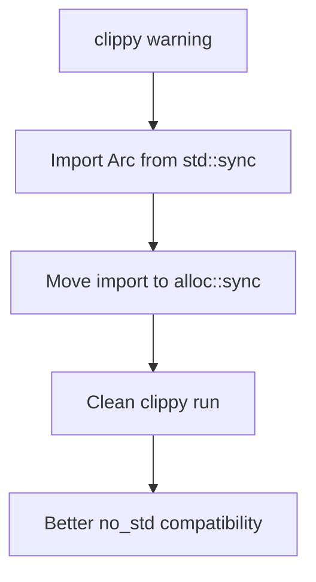

+++
title = "#21380 Fix clippy lint for importing `Arc` from `std` instead of `alloc`"
date = "2025-10-05T00:00:00"
draft = false
template = "pull_request_page.html"
in_search_index = true

[taxonomies]
list_display = ["show"]

[extra]
current_language = "en"
available_languages = {"en" = { name = "English", url = "/pull_request/bevy/2025-10/pr-21380-en-20251005" }, "zh-cn" = { name = "中文", url = "/pull_request/bevy/2025-10/pr-21380-zh-cn-20251005" }}
labels = ["D-Trivial", "C-Code-Quality"]
+++

# Title
Fix clippy lint for importing `Arc` from `std` instead of `alloc`

## Basic Information
- **Title**: Fix clippy lint for importing `Arc` from `std` instead of `alloc`
- **PR Link**: https://github.com/bevyengine/bevy/pull/21380
- **Author**: LeandroVandari
- **Status**: MERGED
- **Labels**: D-Trivial, C-Code-Quality, S-Ready-For-Final-Review
- **Created**: 2025-10-04T15:10:05Z
- **Merged**: 2025-10-05T06:58:31Z
- **Merged By**: james7132

## Description Translation
# Objective

Currently, when running `cargo clippy`, we get a warning from `bevy_diagnostic` that `Arc` is imported from `std::sync` instead of `alloc::sync`. That's the only clippy warning in the project.

## Solution

Change the offending file to import `Arc` from `alloc::sync` instead of `std::sync`.

## Testing

Since `alloc::sync::Arc` is the same as `std::sync::Arc`, there should be no differences in behavior.

## The Story of This Pull Request

This PR addresses a straightforward but important code quality issue in the Bevy engine. The problem surfaced during routine code quality checks when running `cargo clippy`, which identified that the `bevy_diagnostic` crate was importing `Arc` from `std::sync` instead of `alloc::sync`. While this might seem like a minor stylistic issue, it represented the last remaining clippy warning in the entire project, preventing the team from achieving a clean clippy run.

The core issue relates to Rust's module structure and when to use the `alloc` crate versus the `std` crate. In Rust, the `alloc` crate provides core memory allocation types that are available even in `no_std` environments, while `std` provides the full standard library that depends on operating system features. Since Bevy supports `no_std` environments in some configurations, using types from `alloc` where possible improves consistency and portability.

The solution implemented here is technically simple but strategically important. The developer moved the `Arc` import from the `std::sync` module to the `alloc::sync` module. This change maintains identical functionality because `alloc::sync::Arc` and `std::sync::Arc` are the same type - `std` simply re-exports `Arc` from `alloc` when the full standard library is available.

Here's the key technical insight: by using `alloc::sync::Arc`, the code becomes more consistent with Rust's best practices for crate organization. When working in contexts that might support `no_std` environments, importing from `alloc` rather than `std` ensures better compatibility and follows the principle of using the most fundamental available crate.

The implementation involved a simple import reorganization. The code removed `Arc` from the `std::sync` import block and added it to the existing `alloc` import block that was already present in the file. This demonstrates good attention to code organization - rather than just adding another import statement, the developer consolidated related imports logically.

From an engineering perspective, this change exemplifies the importance of maintaining zero clippy warnings in a codebase. Having a clean clippy run ensures that more serious issues don't get buried among trivial warnings, and it enables teams to use clippy as an effective quality gate in CI pipelines.

## Visual Representation



## Key Files Changed

**File**: `crates/bevy_diagnostic/src/system_information_diagnostics_plugin.rs`

This file contained the problematic import that was triggering the clippy warning. The changes involved reorganizing the import statements to use `alloc::sync::Arc` instead of `std::sync::Arc`.

**Before:**
```rust
use std::sync::{
    mpsc::{self, Receiver, Sender},
    Arc,
};
```

**After:**
```rust
use std::sync::mpsc::{self, Receiver, Sender};

use alloc::{
    format,
    string::{String, ToString},
    sync::Arc,
};
```

The key changes were:
1. Removed `Arc` from the `std::sync` import block
2. Added `sync::Arc` to the existing `alloc` import block
3. Maintained all other imports and functionality unchanged

This restructuring maintains the same functionality while following Rust's recommended import patterns for better compatibility with `no_std` environments.

## Further Reading

- [Rust alloc crate documentation](https://doc.rust-lang.org/alloc/)
- [Rust std vs alloc crate differences](https://doc.rust-lang.org/std/index.html#the-alloc-and-core-crates)
- [Clippy lint documentation](https://github.com/rust-lang/rust-clippy)
- [Bevy engine no_std support](https://bevyengine.org/learn/book/getting-started/setup/#no_std-support)

# Full Code Diff
```diff
diff --git a/crates/bevy_diagnostic/src/system_information_diagnostics_plugin.rs b/crates/bevy_diagnostic/src/system_information_diagnostics_plugin.rs
index 0f61d88720160..13009459f0408 100644
--- a/crates/bevy_diagnostic/src/system_information_diagnostics_plugin.rs
+++ b/crates/bevy_diagnostic/src/system_information_diagnostics_plugin.rs
@@ -74,14 +74,12 @@ mod internal {
         pin::Pin,
         task::{Context, Poll},
     };
-    use std::sync::{
-        mpsc::{self, Receiver, Sender},
-        Arc,
-    };
+    use std::sync::mpsc::{self, Receiver, Sender};
 
     use alloc::{
         format,
         string::{String, ToString},
+        sync::Arc,
     };
     use atomic_waker::AtomicWaker;
     use bevy_app::{App, First, Startup, Update};
```