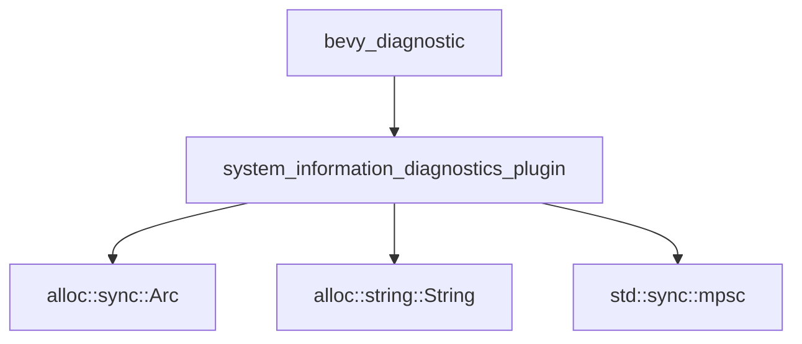

+++
title = "#21380 Fix clippy lint for importing `Arc` from `std` instead of `alloc"
date = "2025-10-05T00:00:00"
draft = false
template = "pull_request_page.html"
in_search_index = false

[extra]
current_language = "zh-cn"
available_languages = {"en" = { name = "English", url = "/pull_request/bevy/2025-10/pr-21380-en-20251005" }, "zh-cn" = { name = "中文", url = "/pull_request/bevy/2025-10/pr-21380-zh-cn-20251005" }}
+++

# 修复从 `std` 而非 `alloc` 导入 `Arc` 的 Clippy 警告

## 基本信息
- **标题**: Fix clippy lint for importing `Arc` from `std` instead of `alloc`
- **PR 链接**: https://github.com/bevyengine/bevy/pull/21380
- **作者**: LeandroVandari
- **状态**: 已合并
- **标签**: D-琐碎, C-代码质量, S-准备最终审查
- **创建时间**: 2025-10-04T15:10:05Z
- **合并时间**: 2025-10-05T06:58:31Z
- **合并者**: james7132

## 描述翻译
# 目标

目前，在运行 `cargo clippy` 时，我们会从 `bevy_diagnostic` 收到一个警告，提示 `Arc` 是从 `std::sync` 而非 `alloc::sync` 导入的。这是项目中唯一的 clippy 警告。

## 解决方案

将有问题的文件改为从 `alloc::sync` 而非 `std::sync` 导入 `Arc`。

## 测试

由于 `alloc::sync::Arc` 与 `std::sync::Arc` 相同，因此行为上不应有任何差异。

## 本次 PR 的技术分析

这个 PR 解决了一个看似简单但重要的代码质量问题。在 Rust 的 `no_std` 环境中，`alloc` crate 提供了堆分配功能，而 `std` crate 则依赖于操作系统功能。虽然 Bevy 目前使用 `std`，但保持与 `alloc` 的一致性对于潜在的 `no_std` 支持或代码质量维护都很重要。

问题的根源在于 `bevy_diagnostic` 模块中不一致的导入方式。该模块已经使用了 `alloc` crate 中的其他类型（如 `String` 和 `ToString`），但 `Arc` 却从 `std::sync` 导入。这种不一致性触发了 Clippy 的警告。

解决方案采用了最直接的方法：将 `Arc` 的导入从 `std::sync` 移到 `alloc::sync` 中。这种修改是安全的，因为在有 `std` 的环境中，`alloc::sync::Arc` 和 `std::sync::Arc` 是等价的。修改后的代码保持了原有的功能，同时消除了代码质量警告。

从工程角度看，这个 PR 体现了良好的代码维护实践：
1. 保持导入的一致性
2. 消除静态分析工具警告
3. 为潜在的 `no_std` 支持铺平道路
4. 不引入任何行为变更

## 组件关系图



## 关键文件变更

### `crates/bevy_diagnostic/src/system_information_diagnostics_plugin.rs` (+2/-4)

这个文件是本次 PR 中唯一修改的文件，主要涉及导入语句的重构。

**修改前：**
```rust
use std::sync::{
    mpsc::{self, Receiver, Sender},
    Arc,
};
```

**修改后：**
```rust
use std::sync::mpsc::{self, Receiver, Sender};

use alloc::{
    format,
    string::{String, ToString},
    sync::Arc,
};
```

**变更分析：**
- 从 `std::sync` 中移除了 `Arc` 的导入
- 在 `alloc` 的导入块中添加了 `sync::Arc`
- 保持了 `std::sync::mpsc` 的导入，因为 mpsc 通道是标准库特有的功能
- 保持了其他 `alloc` 导入的完整性

## 延伸阅读

- [Rust `alloc` crate 文档](https://doc.rust-lang.org/alloc/)
- [Rust `std` vs `alloc` 的区别](https://docs.rust-embedded.org/embedonomicon/smallest-no-std.html)
- [Clippy lint 文档](https://rust-lang.github.io/rust-clippy/master/)
- [Bevy 代码质量指南](https://github.com/bevyengine/bevy/blob/main/CODE_QUALITY.md)

# 完整代码差异
```diff
diff --git a/crates/bevy_diagnostic/src/system_information_diagnostics_plugin.rs b/crates/bevy_diagnostic/src/system_information_diagnostics_plugin.rs
index 0f61d88720160..13009459f0408 100644
--- a/crates/bevy_diagnostic/src/system_information_diagnostics_plugin.rs
+++ b/crates/bevy_diagnostic/src/system_information_diagnostics_plugin.rs
@@ -74,14 +74,12 @@ mod internal {
         pin::Pin,
         task::{Context, Poll},
     };
-    use std::sync::{
-        mpsc::{self, Receiver, Sender},
-        Arc,
-    };
+    use std::sync::mpsc::{self, Receiver, Sender};
 
     use alloc::{
         format,
         string::{String, ToString},
+        sync::Arc,
     };
     use atomic_waker::AtomicWaker;
     use bevy_app::{App, First, Startup, Update};
```