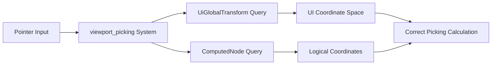

+++
title = "#21382 fix: query `UiGlobalTransform` instead of `GlobalTransform`"
date = "2025-10-04T00:00:00"
draft = false
template = "pull_request_page.html"
in_search_index = true

[taxonomies]
list_display = ["show"]

[extra]
current_language = "en"
available_languages = {"en" = { name = "English", url = "/pull_request/bevy/2025-10/pr-21382-en-20251004" }, "zh-cn" = { name = "中文", url = "/pull_request/bevy/2025-10/pr-21382-zh-cn-20251004" }}
labels = ["C-Bug", "A-Rendering", "A-UI", "D-Straightforward"]
+++

# fix: query `UiGlobalTransform` instead of `GlobalTransform`

## Basic Information
- **Title**: fix: query `UiGlobalTransform` instead of `GlobalTransform`
- **PR Link**: https://github.com/bevyengine/bevy/pull/21382
- **Author**: df51d
- **Status**: MERGED
- **Labels**: C-Bug, A-Rendering, A-UI, S-Ready-For-Final-Review, X-Uncontroversial, D-Straightforward
- **Created**: 2025-10-04T17:54:42Z
- **Merged**: 2025-10-04T23:25:13Z
- **Merged By**: alice-i-cecile

## Description Translation
# Objective
Fixes #21381 

## Solution

- Describe the solution used to achieve the objective above.

## Testing

- I tested the changes on examples/ui/viewport_node

## The Story of This Pull Request

This PR addresses a subtle but important bug in Bevy's UI picking system. The core issue was in the `viewport_picking` system, which handles input interaction with UI elements rendered to viewports. The system was incorrectly querying for `GlobalTransform` components when it should have been querying for `UiGlobalTransform` components.

The problem manifests when UI elements are rendered to viewports. In Bevy's architecture, UI elements use a specialized transform system that accounts for the UI's coordinate system and scaling factors. The `UiGlobalTransform` component is specifically designed for UI elements and handles the proper transformation between logical coordinates (used for input) and physical coordinates (used for rendering).

When the system used `GlobalTransform` instead of `UiGlobalTransform`, it was working with world-space coordinates rather than UI-space coordinates. This mismatch could cause incorrect picking calculations, particularly when dealing with scaled UI elements or viewports with non-standard configurations.

The fix involved two key changes:

1. **Import adjustment**: The import of `GlobalTransform` was moved inside the feature guard, and `UiGlobalTransform` was imported from the local crate instead.

2. **Query modification**: The system query was updated to request `&UiGlobalTransform` instead of `&GlobalTransform`.

Additionally, the code that creates the node rectangle for picking calculations was simplified. Previously, it used `global_transform.translation().truncate()` which calls a method, but with `UiGlobalTransform` it can directly access the `translation` field using `global_transform.translation.trunc()`.

This change ensures that UI picking calculations use the correct coordinate system and scaling factors, preventing misaligned or incorrect input detection on viewport-rendered UI elements.

## Visual Representation



## Key Files Changed

### `crates/bevy_ui/src/widget/viewport.rs` (+5/-7)

This file contains the viewport widget implementation for UI rendering. The changes fix the picking system to use the correct transform component.

**Key changes:**

```rust
// Before (imports):
#[cfg(feature = "bevy_ui_picking_backend")]
use bevy_transform::components::GlobalTransform;

// After (imports):
#[cfg(feature = "bevy_ui_picking_backend")]
use crate::UiGlobalTransform;
```

```rust
// Before (system parameter):
(
    &PointerId,
    &mut PointerLocation,
    &ComputedNode,
    &GlobalTransform,
)

// After (system parameter):
(
    &PointerId,
    &mut PointerLocation,
    &ComputedNode,
    &UiGlobalTransform,
)
```

```rust
// Before (rect calculation):
let node_rect = Rect::from_center_size(
    global_transform.translation().truncate(),
    computed_node.size(),
);

// After (rect calculation):
let node_rect =
    Rect::from_center_size(global_transform.translation.trunc(), computed_node.size());
```

These changes ensure that UI picking calculations use the specialized `UiGlobalTransform` component, which properly handles UI coordinate spaces and scaling factors.

## Further Reading

- [Bevy UI System Documentation](https://docs.rs/bevy_ui/latest/bevy_ui/)
- [Bevy Transform Components](https://docs.rs/bevy_transform/latest/bevy_transform/)
- [Coordinate Systems in Bevy UI](https://bevy-cheatbook.github.io/features/ui.html#coordinate-system)

## Full Code Diff
```diff
diff --git a/crates/bevy_ui/src/widget/viewport.rs b/crates/bevy_ui/src/widget/viewport.rs
index dbd457956073d..08b34ea5cb52f 100644
--- a/crates/bevy_ui/src/widget/viewport.rs
+++ b/crates/bevy_ui/src/widget/viewport.rs
@@ -28,10 +28,10 @@ use bevy_picking::{
 use bevy_platform::collections::HashMap;
 use bevy_reflect::Reflect;
 #[cfg(feature = "bevy_ui_picking_backend")]
-use bevy_transform::components::GlobalTransform;
-#[cfg(feature = "bevy_ui_picking_backend")]
 use uuid::Uuid;
 
+#[cfg(feature = "bevy_ui_picking_backend")]
+use crate::UiGlobalTransform;
 use crate::{ComputedNode, Node};
 
 /// Component used to render a [`Camera::target`]  to a node.
@@ -73,7 +73,7 @@ pub fn viewport_picking(
         &PointerId,
         &mut PointerLocation,
         &ComputedNode,
-        &GlobalTransform,
+        &UiGlobalTransform,
     )>,
     camera_query: Query<&Camera>,
     hover_map: Res<HoverMap>,
@@ -123,10 +123,8 @@ pub fn viewport_picking(
         };
 
         // Create a `Rect` in *physical* coordinates centered at the node's GlobalTransform
-        let node_rect = Rect::from_center_size(
-            global_transform.translation().truncate(),
-            computed_node.size(),
-        );
+        let node_rect =
+            Rect::from_center_size(global_transform.translation.trunc(), computed_node.size());
         // Location::position uses *logical* coordinates
         let top_left = node_rect.min * computed_node.inverse_scale_factor();
         let logical_size = computed_node.size() * computed_node.inverse_scale_factor();
```